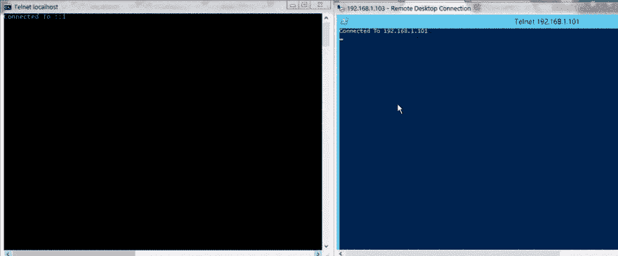

# 让我们通过 telnet 制作一个聊天应用程序

> 原文:[https://dev.to/sadick/lets-make-a-chat-over-telnet-f88](https://dev.to/sadick/lets-make-a-chat-over-telnet-f88)

#### 玩你的终端完全没问题

[T2】](https://res.cloudinary.com/practicaldev/image/fetch/s--r0WfhTHp--/c_limit%2Cf_auto%2Cfl_progressive%2Cq_66%2Cw_880/https://cdn-images-1.medium.com/max/960/1%2AyFPFek93DYHDwE5uvTSnbw.gif)

想法很简单。构建一个服务器，并使用 telnet 作为客户端来中继消息。我最近一直在玩围棋，我真的很享受这个过程。

只有一件事需要创建，那就是启用 telnet 通信的服务器。