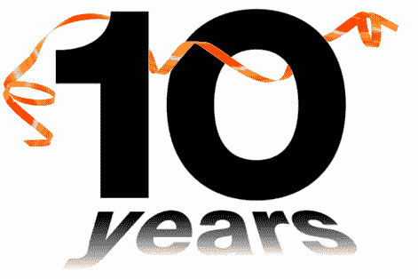

# 回顾十年

> 原文:[https://dev.to/funkysi1701/looking-back-ten-years-3dgc](https://dev.to/funkysi1701/looking-back-ten-years-3dgc)

[T2】](https://res.cloudinary.com/practicaldev/image/fetch/s--BcWb4TOq--/c_limit%2Cf_auto%2Cfl_progressive%2Cq_66%2Cw_880/https://storageaccountblog9f5d.blob.core.windows.net/blazor/wp-content/uploads/2016/09/10-year-term-life-insurance.gif%3Fresize%3D471%252C314)

下个月我将庆祝我在目前工作岗位上工作十周年，两周后我将在一家新公司开始我人生的新篇章。让我们借此机会回顾十年来我取得的一些伟大成就。

### 2006 年

2006 年，我没有任何 IT 经验。如果你问我在哪里可以找到事件日志，我不知道，DNS 对我来说没有任何意义。我很安静，害羞，但是很努力。我没有想过把它作为我的职业，这只是一份工作。

我最初的工作是做一线支持，用 HTML 将健康和安全文件编译成光盘(公司称之为 Eurofiles)。当时，该公司混合使用 Windows 2000 和 Windows XP，使用 MS Office 2003。服务器方面，我记不太清了，但我想是两个域控制器，一个数据库服务器和一个使用磁带机的备份服务器。在这一点上，我不认为我做了很多服务器，但我认为服务器运行 Windows Server 2005。

随着时间的推移，我对这家公司的业务和运作方式了解得越来越多。

### Nagios

我早期的成就之一是建立了 nagios 服务器。我以前写过关于 Nagios 的博客，但它是一个运行在 linux 上的服务器监控系统。我为自己在这里取得的成就感到非常自豪，公司里没有人比我更了解 nagios 的工作方式。最初我甚至尝试使用一个连接到串口的廉价手机(还记得个人电脑有这些吗？)发送短信提醒停机时间。然而，当我用光了这部手机上的所有点数后，这个功能就被放弃了。

Nagios 今天仍在使用，我当前的团队已经了解了如何随着业务的变化扩展系统。我的哲学一直是，如果我们有 nagios 没有警告我们的问题，我们需要额外的 Nagios 测试。现在 nagios web 界面在互联网上是公开可用的，所以可以从任何地方查看(假设办公室的互联网已经开通！)和一个移动应用程序取代了我们最初的短信想法。

### 2011 年

2010 年底，IT 经理辞职，然后是开发人员辞职，最后是首席开发人员辞职。我独自一人。我是 IT 经理。我通过谈判获得了加入公司以来的第一次加薪。我就是。

哇，那时候压力很大。我要学的东西太多了，但我还是设法做到了。我学会了如何面试，是的，我雇佣了一些犯错的人，但也有一些优秀的员工。除了内部员工，我还学会了与承包商打交道。我们有承包商帮助我们的内部系统，也有承包商做开发工作。我从承包商身上学到的一件事是，你总是不得不在某个时候追逐他们，以交付你付钱给他们的东西。

### 服务器迁移

大约在 2011 年初，我们的电子邮件服务器开始老化。Exchange 2003 对其信息存储的大小有一个硬性限制，我们正在迅速接近这个限制。我与一名 IT 承包商一起迁移到 Exchange 2010，这是一个巨大的项目，并引发了我们刚刚解决的各种问题。从那以后，我进行了其他迁移，例如 Windows Server 2012，并在 2013 年虚拟化了许多服务器。

### 带宽

我们基础设施的一个主要限制一直是互联网接入。有一段时间，我们试图平衡三个 ADSL 连接的负载，但是上传速度总是一个限制因素。在政府拨款的帮助下，我们在总部安装了一条租赁线路，这是我们网络简化的一大胜利。不满足于此，我又为我们的第二个纽约办公室做了同样的事情，包括免费安装。

### 学习发展

自从我开始以来，我一直在学习开发的东西。但在过去几年里，我学到了很多东西，主要得益于两件事。我的老板把我的许多责任推给了其他人，并把我的许多时间投入到开发任务中，同时也给了我们外包开发团队学习的机会。

### 整理完毕

自从我开始以来，有一些事情一直在进行中，我们一直想改变，我真的不能居功，因为它们还没有完成，但我很自豪，因为它们可能在未来几个月内完成。

该公司将日历信息存储在一个巨大的 excel 电子表格中，这正被 outlook 日历所取代。

我们最后一台 Windows Server 2003 服务器和磁带机即将退役。这是唯一一台我在这里的时候一直在运行的服务器。

公司跟踪工作的方式，以及谁做了什么被审查。多年来，许多人都试图修改其中一位主管多年前在 Access 中创建的旧数据库。我最近做了一次大的修改，删除了未使用的列，并增加了额外的发票功能。需要的是一个新鲜的系统，也许一个 CRM 就能做他们想做的一切。我祝他们好运，因为我知道这并不容易，但这是必须要做的。

### 2016

我还完成了许多其他项目和作品，我对此感到自豪。2016 年我将离开一个稳定的 IT 部门。所有客户端都是 Windows 10，使用 Office 2010。我们有运行 Server 2012 的虚拟服务器，并使用 Azure 的一些优秀服务来运行我们的 SaaS 网站。当然，有些事情是我希望实现的，有些事情是我希望自己以不同的方式去做的，但总的来说，现在感觉是继续前进的时候了，尤其是现在长期项目已经开始结束。