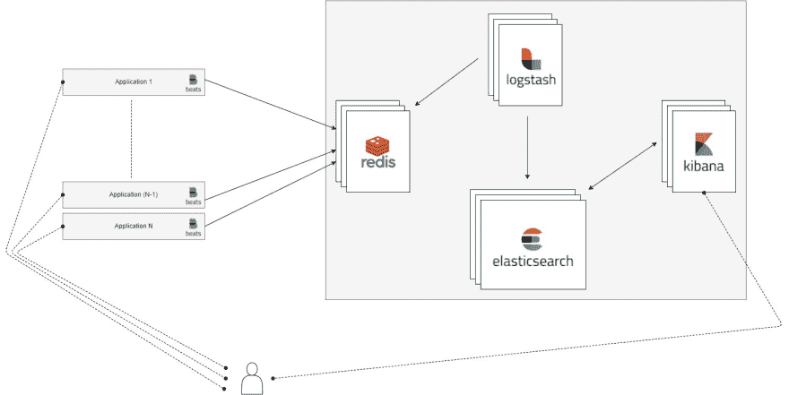

# 带有 docker 的暂存式 ELK 堆栈

> 原文:# t0]https://dev . to/d3rwan/un-stack-elk-from-scratch-with dock-5gp 6

或如何在几分钟内部署监控体系结构。

## 钼镍到 rer

在短短几年内，监测已成为信息技术领域的一项不可或缺的活动。无论是技术上还是功能上的，无论是提供指标、图表还是其他 KPI，对其系统的监控都已成为必然。

接下来，我们将讨论如何通过 docker 在几分钟内从零开始部署监控体系结构。

## 拉栈

首先，我们将依靠堆栈***【elk】***，这在几年内已成为其他监测解决方案(splunk，SAAS 解决方案……)的可信替代方案。

它由以下部分组成:

*   **E** 如*【弹性搜索】*、索引、搜索引擎&，
*   **L** 如*【logtash】*，这是一种 ETL，用于从异构数据源中检索数据，对其进行转换并将其发送到弹性搜索，
*   **K** 如 *Kibana* 等，一个可视化的 led 和交互仪表板的代代

我们还将补充:

*   **R** 作为*Redis，*用作上游中介，在系统延迟时用作缓冲区，同时避免在峰值时出现过大的拥塞，
*   **C** 作为*馆长*是一种索引管理工具
*   **B * *作为*Beats* ，客户端安装探测器以将日志/指标发送到我们的堆栈

 *圣德监控*

## 部署

我们将为堆栈中的每个组件使用 docker 容器。

*   [弹性搜索](https://hub.docker.com/_/elasticsearch/)在其 5.1.2 版中，
*   [日志速率](https://hub.docker.com/_/logstash/)，在其 5.1.2 版中，
*   [【kibana】](https://hub.docker.com/_/kibana/)在其 5.1.2 版中，
*   [再说一遍](https://hub.docker.com/_/redis/)，在其 3.2.6 版中，
*   [策展人](https://hub.docker.com/r/bobrik/curator/)，dans sa 版本 4.0.4

所有服务和交互都在 docker-compose.yml 文件中进行了说明: