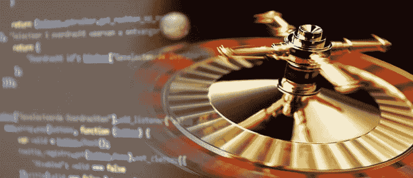

# 介绍评论轮盘赌

> 原文:[https://dev.to/moxio/introducing-review-roulette-57b8](https://dev.to/moxio/introducing-review-roulette-57b8)

[T2】](https://res.cloudinary.com/practicaldev/image/fetch/s--QzGCXQ6e--/c_limit%2Cf_auto%2Cfl_progressive%2Cq_auto%2Cw_880/https://cdn-images-1.medium.com/max/813/1%2Al0cszOg2FUShauNqL6dayA.png)

在 Moxio，我们最近开始了一个实验，我们称之为“审查轮盘”:一个随机代码审查的过程。我们相信这强调了代码评审是一种双向学习的方式，有助于初级开发人员的入职，从而改进了我们之前的评审“政策”。在这篇文章中，我想概述一下这个实验背后的背景，解释一下回顾轮盘赌的想法，并展示一些初步的结果。

### 我们的旧处境

在引入评审轮盘之前，我们已经做了相当多的代码评审。大约四年前，我们在本地网络上建立了一个 [ReviewBoard](https://www.reviewboard.org/) 服务器，并开始用它来讨论和评审代码。审查将在工具中完成，如果需要，可以离线讨论。到目前为止，我们还没有一个正式的关于审查什么和如何审查的政策:将变更提交审查是自愿的，作者选择审查者和时间(提交前或提交后)。有时一个评审请求只是一个粗略的讨论想法；在其他时候，需要验证完整的实现。

这种方法使得开始进行代码评审变得容易，并确保它们的引入或多或少是没有阻力的。它还保持了较低的审查负担和官僚管理费用，使得小的修复和改进变得容易(本着童子军规则的精神)而不必经过正式的审查过程。

然而，这种松散的结构也有其缺点。在实践中，选择加入代码审查意味着大多数提交审查的主题是更困难或“有争议”的变更，这必然会引发大量的讨论(他们经常这样做)。这给了代码评审太多繁琐的讨论和艰难的决定。此外，作者认为直截了当的更改通常不会被评审，即使团队中的其他人可能已经发现了一些被忽略的困难情况。此外，自由选择评审员导致大多数评审被分配给由 2-5 个更高级的开发人员组成的固定小组，创建了一种非正式的评审员层级。

### 为什么要做代码评审？

为了理解这种情况的不良影响，让我们后退一步，看看进行代码评审的原因。最明显的动机是发现并纠正 bug。正如 Steve McConnell 在他的书《Code Complete》中指出的，研究表明代码审查可以实现 45%-70%的缺陷检测率，比任何类型的自动化测试都要高。第二个原因是代码评审可以改进设计，从而使代码更易于维护。

受益于评审的不仅仅是代码。如果处理得当，代码评审还可以让团队成员相互学习，让他们熟悉他们不常使用的代码库部分。请注意，这是双向的:就像原作者可以从评审者给出的反馈中受益一样，评审者可以从作者处理手头问题的方式中学习，并发现他们不熟悉的方法和类。这一切都促进了共享代码所有权和持续学习，并使代码评审成为新的或初级开发人员的一种很好的方式。

我们的旧审查“政策”错过了一些知识共享方面的机会。*事实上的*审查层级意味着初级开发人员不经常有机会审查(从而学习)由更高级开发人员编写的代码。强调代码审查是一种双向学习的方式(相对于验证和监督)需要一种互惠感。不评审作者认为直截了当的变更也会错过知识交流的机会，因为评审者可能会看到作者没有考虑到的改进，或者(相反地)从作者的方法中学到一些新的东西。尽管我们认为审查*所有的*变更会耗费太多的时间，而且事与愿违，但我们决定所有的变更都应该让*有资格接受*审查。

### 回顾轮盘赌

以上考虑让我们想到了*重温轮盘*:

> 每个星期，每个开发人员都被分配一个随机提交(来自前一周)，由一个随机的同事编写，以尽可能地进行审查。

随机性方面消除了任何类型的固定评审者层级，并确保了互惠性，同时还确保了每个提交都有资格接受评审，排除了对其他团队成员可以学习或教授给定主题的任何假设。另一个重要方面是“尽可能”这一条款。使用审查轮盘赌，不可避免的是，迟早会有人被指派审查代码库中不熟悉部分的困难提交。虽然这个人可能不理解所有的东西，也不能像其他人一样彻底地检查变更，但他们通常仍然可以对变更的某些部分给出有用的评论，指出低级逻辑错误，并建议对命名和文档进行修改，以使代码更容易为“局外人”所理解。只需让他们指出哪些可以回顾，哪些不可以回顾。一双新鲜的眼睛通常会提供非常有用的见解，而那些埋头于代码库的人不会注意到这一点。这提供了每个开发人员都可以参与的环境:如果你写代码，你就参与了。

我们同意尝试这种方法作为实验，增加(而不是取代)我们已经做的代码审查。为了限制投入的时间，特别是对于分配给不熟悉该领域的审查者的较大提交，我们决定每周在审查轮盘上花费不超过一个小时。在几个小时内，我编写了一个简单的脚本来检索前一周的所有提交，过滤掉诸如合并提交之类的内容，生成提交的审查者的随机分配，并将审查请求发布到我们的 ReviewBoard 服务器。我们每周一运行脚本，并在接下来的一周进行审查。评估计划在实验两个月后进行，届时我们将决定是否继续审查轮盘赌，以及是否有必要进行任何调整。

### 初步结果

在撰写本文时，我们已经试用了 6 周的《回顾轮盘》，所以还没有真正的评估(我将在稍后写博客— **更新** : [我有](https://www.moxio.com/blog/15/review-roulette-everyone-is-a-winner))。尽管如此，此刻我还是想分享一些个人观察:

*   围绕《轮盘赌评论》的氛围似乎大多是积极的。人们热衷于做代码评审和分享关于开发的观点。
*   如果你(被迫)足够仔细地观察，大多数变化，甚至那些乍一看似乎相当琐碎的变化，最终会发现其中有一些有趣的东西。即使在简单的单行提交的评论中，我也看到了关于周围代码、UX 问题或测试风格的有用讨论。似乎团队成员真的把评论看作是学习和教授的机会，并试图从这种互动中获得最佳效果。
*   仍然需要对符合评审条件的提交列表进行某种过滤。我曾经见过有人被要求审查一个编译好的二进制文件的新导入。哎呀！
*   对我自己来说，我注意到做轮盘赌让我更加关注我写的提交信息。我经常发现自己在想“如果这个提交被选中进行评审，我的同事会理解吗？”并决定更多的上下文会有用。

总的来说，我强烈建议你和你的团队一起尝试一下轮盘赌！这是加深每个人对代码库的了解并让代码和开发人员都从双向学习中受益的好机会。

*最初发表于*[*【www.moxio.com】*](https://www.moxio.com/blog/8/introducing-review-roulette)*。*

* * *