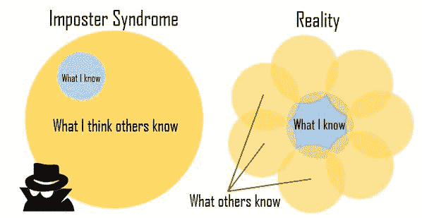

# 冒名顶替综合症

> 原文：<https://dev.to/funkysi1701/imposter-syndrome-d2c>

本周，我递交了一份工作的辞呈，这份工作我已经做了将近十年。几周后，我将开始一份全新的工作，成为一名 web 应用程序开发人员。

这对我来说是一个伟大的成就，也是一个学习和拓展我的开发技能的好机会。

然而，就在我递交辞呈后不久，一股巨大的不确定感包围了我。我读过这方面的报道，我想我正遭受着一场“冒名顶替综合症”的袭击。

尽管有外部证据证明他们的能力，但是那些患有这种综合症的人仍然坚信他们是骗子，不值得他们所获得的成功。成功的证据被认为是运气、时机或者是欺骗他人，让他们认为自己比想象中更聪明、更有能力的结果。

[T2】](https://res.cloudinary.com/practicaldev/image/fetch/s--PGJqsnc6--/c_limit%2Cf_auto%2Cfl_progressive%2Cq_auto%2Cw_880/https://storageaccountblog9f5d.blob.core.windows.net/blazor/wp-content/uploads/2016/09/1429677066685.rendition-medium.jpg%3Fw%3D598%26ssl%3D1)

我开始说服自己，我不能做我刚刚接受的工作，在我第一天到达的那一刻，我会被发现是一个骗子，并被扫地出门。

我的逻辑大脑不是骗子综合症的对手。被踢出这份新工作的大门后，我很快就会变得身无分文，没有雇主(甚至我以前的老板也不希望我回去)或招聘机构愿意和我说话。

好吧，让我们看看我们是否能战胜冒名顶替综合症，看看可能更糟糕的情况。我开始了我的新工作，这是一项非常艰苦的工作，大约一个月后，我不得不继续前进。

没有雇主会在我第一天就解雇我。我的第一天将是大量学习他们如何做事，看程序。我有很多学习新事物的经验，看程序，如果我投入工作，我能使这份新工作成功。我有很多新公司里没有的好主意和有用的经验。

我不知道解决冒名顶替综合征的办法是什么，除了通过积极地思考和认识到我在过去十年里做了惊人的事情，并且在未来十年里我还会做同样的事情，来试着忽略它。