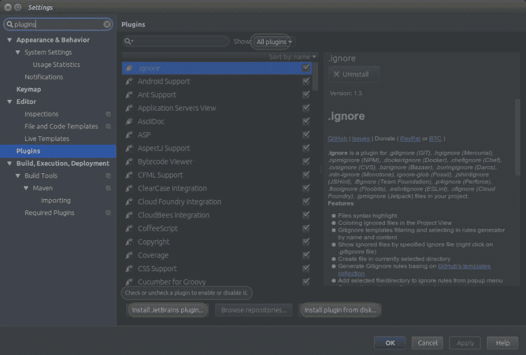

# Lombok 介绍(加速 Java 开发)

> 原文:[https://dev . to/Jeet MP3/introduction-to-lombok-speeding-up-Java-development-5 add](https://dev.to/jeetmp3/introduction-to-lombok-speeding-up-java-development-5add)

大家好，今天我要谈谈龙目岛项目。这篇博文分为三个部分:

1.  介绍
2.  设置(使用 IntelliJ idea)
3.  龙目注释

### 1。介绍

Lombok 是 java 库，有助于减少样板代码。以便您更专注于您的实际代码。例如，一个简单的 POJO 类由属性、Getter/setter(、构造函数)组成，所以在这里，Lombok 将通过添加一个注释来帮助您自动生成 Getter/setter(和构造函数)。

### 2。设置

1.  检查您的创意构建号。去**求助** - > **关于** 

2.  按照你的内部版本号下载 https://plugins.jetbrains.com/plugin/6317 的 Lombok 插件。

3.  转到**文件**->-**设置** - >在左上角的搜索文本框中键入插件。 

4.  现在点击**从磁盘**安装插件。按钮并选择下载的 Lombok 插件。

5.  你现在完成了

> 如果你正在使用 eclipse，请参考[这篇博文](https://standardofnorms.wordpress.com/2013/05/10/reducing-java-boilerplate-code-with-lombok-with-eclipse-installation/)。

### 3。龙目注释

Lombok 为不同的任务提供了许多不同类型的注释。您可以在此查看[注释的完整列表。在这篇博客中，我们将讨论以下注释。](https://projectlombok.org/features/index.html)

1.  @Getter/@Setter
2.  @ToString 和@EqualsAndHashCode
3.  @NonNull
4.  @NoArgsConstructor、@RequiredArgsConstructor 和@AllArgsConstructor
5.  @数据
6.  @值
7.  @Builder
8.  @清理

首先，需要在类路径中添加 Lombok 依赖项。如果你使用的是 maven，那么在 pom.xml 中添加 bellow 依赖项。