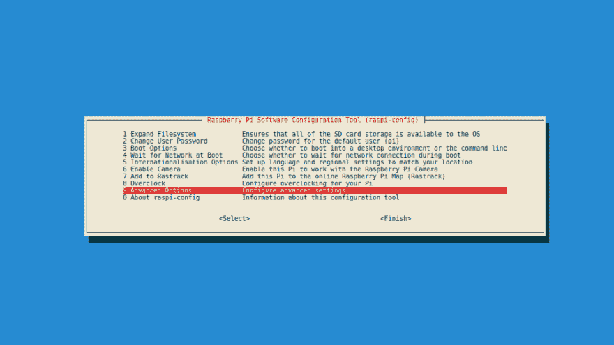
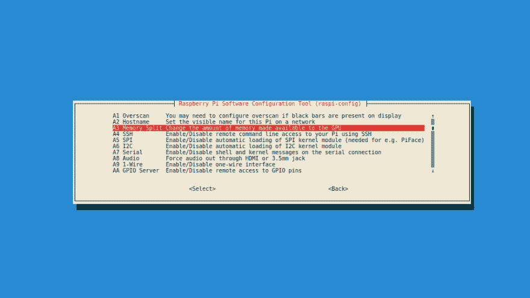
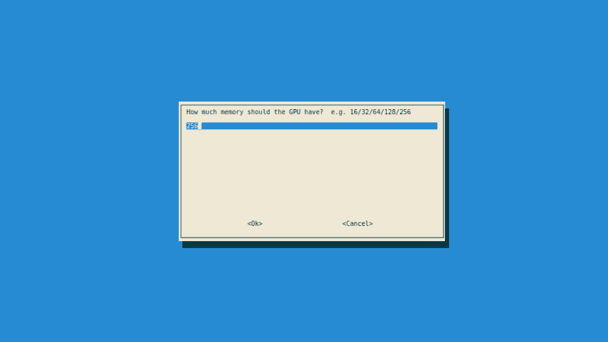

# Raspbian Jessie 上的 GPU 内存拆分

> 原文：<https://dev.to/caramelomartins/gpu-memory-splitting-on-raspbian-jessie-9cl>

最近，我在运行一个小的副业项目，目的是在我的一台破旧的笔记本电脑上建立一个自托管的软件阵列。

当我在做这件事的时候，我认为尝试建立一个我自己的家庭影院会很有用也很有趣——我选择了 Kodi T1 来做这项工作。

尽管它在 Raspbian 上只支持官方的 15.2 版本，但有一个[非官方的](https://mtantawy.com/quick-tip-how-to-update-to-latest-kodi-16-jarvis-on-raspberry-pi/)版本使用 16.1，这意味着我可以在 RPi 2 这样的低功耗硬件上使用 Kodi 的全部功能。

我开始使用它，不幸的是，当我试图播放视频时，它似乎总是会坏掉。我不明白为什么。我换了皮肤，插件，流媒体等等。我想不通为什么，有的视频断了，有的没有。

我去了谷歌。

我花了大约 10 到 15 分钟才明白可能是什么问题。GPU 处理能力已经达到极限。

在覆盆子[论坛](https://www.raspberrypi.org/forums/viewtopic.php?f=91&t=58245)上，我能够理解 GPU 没有自己的 RAM，GPU 负责视频播放和流传输中涉及的图形处理。

我对自己说，如果我试着看一些比高清低的东西…也许会有用。

我打开 Kodi，开始测试。比高清视频还低…效果非常好。比高清视频还高…崩溃。

找到问题的根源后，是时候去理解解决 GPU RAM 问题的方法了。

在 googling 了一些之后，我发现可以直接从`raspi-config`配置 Raspbian 内存分割:

`sudo raspi-config`

选择*高级选项*:

[T2】](https://res.cloudinary.com/practicaldev/image/fetch/s--gK28Bef5--/c_limit%2Cf_auto%2Cfl_progressive%2Cq_auto%2Cw_880/http://hugomartins.img/1473110638.png)

选择 *A3 内存拆分*:

[T2】](https://res.cloudinary.com/practicaldev/image/fetch/s--PBrr9sCP--/c_limit%2Cf_auto%2Cfl_progressive%2Cq_auto%2Cw_880/http://hugomartins.img/1473110890.png)

根据您的需求进行配置。我和 *265* 一起去的:

[T2】](https://res.cloudinary.com/practicaldev/image/fetch/s--ct0LZ0X9--/c_limit%2Cf_auto%2Cfl_progressive%2Cq_auto%2Cw_880/http://hugomartins.img/1473111017.png)

选择*确定*。选择*完成*，重启你的树莓 Pi。

这对我很有效，帮助我在 Raspbian 上实现了更好的图形性能。