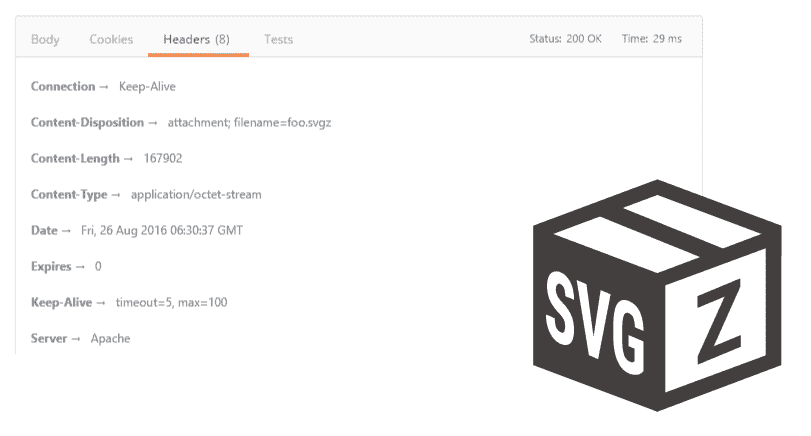

# 提供压缩的 SVG 文件

> 原文:[https://dev.to/moxio/serving-compressed-svg-files-1lnk](https://dev.to/moxio/serving-compressed-svg-files-1lnk)

[T2】](https://res.cloudinary.com/practicaldev/image/fetch/s--xpUUZ-pU--/c_limit%2Cf_auto%2Cfl_progressive%2Cq_auto%2Cw_880/https://cdn-images-1.medium.com/max/811/0%2AwHh61Ifp5OlcT_-p.png)

多年来，可缩放矢量图形(SVG)已经成为 web 上矢量图像事实上的标准。然而，它的一个缺点是冗长的基于 XML 的格式，结果文件相对较大。幸运的是，XML 的纯文本特性非常适合压缩。SVG 标准保留了。svgz-gzip 压缩的 SVG 文件的扩展名，通常可以达到原始文件大小的[大约 20–50%](http://calendar.perfplanet.com/2014/tips-for-optimising-svg-delivery-for-the-web/)。当不主动编辑它们时，将 SVG 文件保存为 svgz 是有意义的:它节省了磁盘空间，压缩是无损的，并且在通过 web 提供它们时节省了动态压缩所需的时间。然而，从 web 服务器正确地提供压缩的 SVG 文件需要一些小心。

### HTTP 头为。svgz 文件

符合标准的 SVG 查看器支持 svgz 文件，只要它们被提供了[正确的](https://www.w3.org/TR/SVG11/conform.html#ConformingSVGServers) HTTP 头:

```
Content-Type: image/svg+xml
Content-Encoding: gzip 
```

这看起来很奇怪。svg(明文 SVG)和。svgz(压缩 SVG)文件使用相同的 MIME 类型。不同之处在于[内容编码](https://tools.ietf.org/html/rfc7231#section-3.1.2.2)头，它与 Content-Type 一起描述所提供内容的类型。在这种情况下，他们区分“SVG，plain”和“SVG，gzipped”，即可读的 XML 格式或一堆二进制乱码。

### 内容编码与传输编码

还有一个 HTTP/1.1 头[传输编码](https://tools.ietf.org/html/rfc7230#section-3.3.1)，它看起来类似于内容编码，但实际上是根本不同的。内容编码表示内容的“自然”编码(存储和处理内容的方式)，而传输编码仅描述用于(更快或更可靠)传输的临时编码。接收带有
的 HTTP 响应的客户端

```
Content-Type: application/sql
Transfer-Encoding: gzip 
```

因此应该解压缩内容并向用户提供明文 SQL。然而，当响应报头是

```
Content-Type: application/sql
Content-Encoding: gzip 
```

服务器实际上打算呈现 gzip 压缩的 SQL。客户端不应该解压缩这样的内容，可能会将二进制数据保存为. sql.gz 文件。因为。svgz 文件，这意味着客户端在收到内容时不会立即解压缩，而是将压缩的字节流传递给 SVG 查看器(然后由查看器自己解码)。

混淆的部分原因是传输编码是一个 HTTP/1.1 概念，而浏览器对 gzip 传输编码的支持(应该在 [TE-header](https://tools.ietf.org/html/rfc7230#section-4.3) 中指出)非常有限。结果，人们开始寻找一种有效的方法来传输他们的 JavaScript、CSS 和 HTML，并为这些文件提供一个压缩的主体和一个内容编码头(在 HTTP/1.0 中已经存在)来指示所使用的编码。浏览器通过解压缩这些内容，甚至在下载到磁盘时，很高兴地促成了这种混乱的广泛传播，因为用户肯定没有想到在保存这样压缩的 JavaScript 文件的源代码时，会在磁盘上发现二进制乱码。这使我们处于一种广泛滥用内容编码头作为传输编码的替代品的状态，这种情况在 HTTP 1 中可能不会再得到解决。

### 提供压缩文件供下载

这给上菜带来了问题。svgz-供下载的文件(带有 Content-Disposition: attachment)，例如，提供给在类似 filemanager 的应用程序中单击下载按钮的用户。在这种情况下，用户可能希望以。svgz-磁盘上的文件，而不是扩展名为. svgz 的明文文件。然而，由于上述内容编码头的滥用，用户希望以可读的明文保存其他压缩文件类型，因此客户端很难决定该做什么。为了摆脱这种困境，大多数浏览器都实现了某种猜测逻辑，包括下载文件的扩展名。然而，这个逻辑[并不总是](https://bugzilla.mozilla.org/show_bug.cgi?id=233047#c23)[产生](https://bugzilla.mozilla.org/show_bug.cgi?id=986924)期望的结果，尤其是当在内容处置报头中有定制的文件名参数时。

为了解决这些问题，如果文件有附件内容处置，我们应该防止提供带有内容编码头的“自然”压缩的内容。只留下内容编码头。svgz 文件不是一个选项，因为它会让我们看起来像是在提供明文 SVG。一个简单的解决方案是用应用程序/八位字节流(“任意二进制数据；请将这些字节保存到磁盘上”)并且没有内容编码:

```
Content-Type: application/octet-stream
Content-Disposition: attachment; filename="image.svgz" 
```

上菜时。用于内联目的的 svgz 文件(在查看器中显示)我们仍然发送推荐的标题以允许正确的呈现:

```
Content-Type: image/svg+xml
Content-Encoding: gzip
Content-Disposition: inline 
```

### 结论

*   将 SVG 内容保存和提供为。svgz-files 是值得的，但是需要一些小心
*   了解内容编码和传输编码的区别
*   为下载提供带有内容编码头的自然压缩内容是不可靠的，而是将其作为未编码的八位字节流

*最初发表于*[*【www.moxio.com】*](https://www.moxio.com/blog/6/serving-compressed-svg-files)*。*

* * *