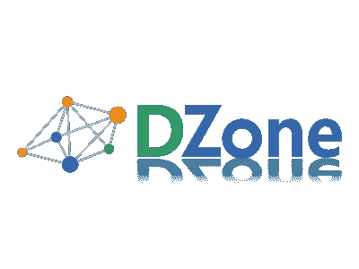

# DZone

> 原文：<https://dev.to/funkysi1701/dzone-434m>

一段时间以来，我一直在 Dzone 网站上分享我的一些博文。

[T2】](https://res.cloudinary.com/practicaldev/image/fetch/s--9ENzG8T8--/c_limit%2Cf_auto%2Cfl_progressive%2Cq_auto%2Cw_880/https://storageaccountblog9f5d.blob.core.windows.net/blazor/wp-content/uploads/2016/08/dzone_02.png%3Fw%3D400%26ssl%3D1)

Dzone 网站允许用户提交内容链接，我一直在提交我在这个网站上创建的内容。Dzone 是这样描述他们自己的:

拥有超过 100 万会员的 DZone.com 是网络上最大的社区之一，也是软件专业人士技术内容的发布者。来自世界各地的开发人员来到 DZone 寻找最新最好的内容，以磨练他们的技能，促进他们的职业发展。

本周，我被邀请参加 MVB 最有价值博客项目。我希望更多的读者能从 DZone 网站上找到我的内容。

DZone 团队将很快开始在 DZone 网站上分享我的内容，我希望这将导致更多的人阅读我要说的话。

如果没有别的，这清楚地告诉我，我的博客正在发挥作用，人们注意到了我和我要说的话。我需要继续前进，继续写文章，更加稳定。