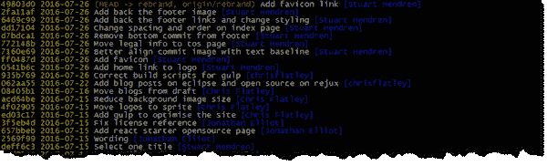
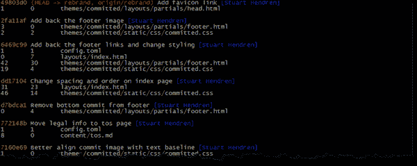
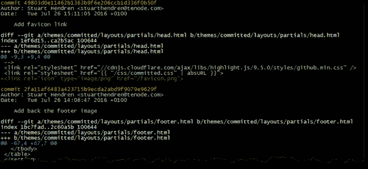

# 有用的 Git 别名

> 原文:[https://dev.to/committedsw/useful-git-alias-47in](https://dev.to/committedsw/useful-git-alias-47in)

Git 是 Committed Software 事实上的版本控制系统，甚至可能影响了我们的名字。仅仅学习几个命令可以让你走得更远，但是如果你使用它一段时间，你会发现自己使用一些命令比其他命令更多，并且可能一些更有用的选项很难记住。幸运的是，Git 有一个内置的丰富别名系统，可以让您更容易记住最常用的命令，并更快地输入。以下是一些我们最喜欢的别名。

你可以在这个[要点](https://gist.github.com/stuarthendren/7a3b5e29cc0c1e1076ea7e43395a606f)中找到所有这些别名，以及一些其他简单的缩写和我发现的奇怪的额外内容。

## 列出别名

第一个别名用于列出您的所有别名，帮助您记住它们。

```
la = "!git config -l | grep alias | cut -c 7-" 
```

Git 的别名通常将命令解释为 git 命令(有效地将`git`添加到开头),但以`!`开始会改变这种行为，并将其余部分作为 bash 命令运行，允许您使用 bash 脚本、管道和所有其他 bash 命令，如上面别名中的 *grep* 和 *cut* 。

## 清单

`git log`非常强大，有很多配置选项。这些日志别名越来越详细地列出了提交`l, ll, lll`。

```
l = log --pretty=format:"%C(yellow)%h\\ %ad%Cred%d\\ %Creset%s%Cblue\\ [%cn]" --decorate --date=short 
```

[](///static/l-05682be5967a236947250ae3504d3929-edc9a.png)T3】

```
ll = log --pretty=format:"%C(yellow)%h%Cred%d\\ %Creset%s%Cblue\\ [%cn]" --decorate --numstat 
```

[](///static/ll-a1f7c71ae63f755151bb454838e9dc33-edc9a.png)T3】

```
lll = log -u 
```

[T2】](///static/lll-7721aaaeae2a78eafcc5abdcf8f04083-edc9a.png)

## 差异

一个简单的比较，显示自上次提交以来发生了什么变化。

```
diffc = diff --cached HEAD^ 
```

## 暂存

以下一组别名有助于为提交快速暂存文件。

首先，显示修改文件的编号列表:

```
st = "!git status -s | cat -n" 
```

由此给出:

```
$ git st
     1 ?? content/blog/201608/git-alias.md
     3 ?? static/img/blog/git/ 
```

然后，您可以使用数字:
进行暂存和取消暂存

```
s = "!stage() { git add `git st | sed -n $1p | awk -F' ' '{ print $2 }'`; git st; }; stage"
u = "!unstage() { git reset HEAD `git st | sed -n $1p | awk -F' ' '{ print $2 }'`; git st; }; unstage" 
```

例如:

```
$ git s 1
    1 A content/blog/201608/git-alias.md
    2 ?? static/img/blog/git/

$ git u 1
    1 ?? content/blog/201608/git-alias.md
    2 ?? static/img/blog/git/ 
```

或者，您可以只使用:
暂存所有更改

```
aa = !git add -u && git add . && git st 
```

这些演示了如何在别名声明中定义一个函数，然后调用它。这允许您引用传递给命令的参数。

## 快速提交

使用所提供的消息进行提交，例如`git cm "Best work ever"`

```
cm = "!cm() { git commit -m \"$1\"; }; cm" 
```

或者修改上次提交的`git ca`或

```
ca = commit --amend --no-edit 
```

## 分支

要在当前提交时创建一个新的分支，或者移动一个现有的分支，`git mb new-branch`

```
mb = checkout -B 
```

从不同的分支`git cb other-branch /file/to/checkout`
中签出特定文件

```
cb = "!cb() { git checkout $1 -- $2; }; cb" 
```

## 重置

重置一次提交`git re1`，重置硬`git reh`或重置硬并清除以确保`git rec` :

```
re1 = reset HEAD^
reh = reset --hard
rec = !git reh && git clean -fd 
```

## Rebase

交互地从多个提交返回`git ri 5` :

```
ri = "!ri() { git rebase -i HEAD~$1; }; ri" 
```

## 搜索

因为 git 的别名允许你重新定义命令，所以如果你发现你总是使用它们，你可以添加选项作为缺省值。此处用于搜索时包括文件名并忽略大小写:

```
grep = grep -Ii 
```

此别名用于搜索文件:

```
f = "!git ls-files | grep --color -i" 
```

## 奖金

一个有用的别名，如果你在 Windows 上工作，使脚本在签出时可运行:

```
addx = update-index --chmod=+x 
```

如果你使用 [gerrit](https://gerriycodereview.com) 和以下别名，你可以推送评论`git review myBranch`或草稿`git draft myBranch` :

```
review = "!review() { git push origin HEAD:refs/for/$1; }; review"
draft = "!draft() { git push origin HEAD:refs/drafts/$1; }; draft" 
```

这是一个很方便的工具，可以捕捉到我犯的一个常见的错误`git k`

```
k = !gitk 
```

最后，用一个小别名来看看不同作者提交了多少次:

```
who = shortlog -n -s --no-merges 
```

## 学分

这些别名中有许多来自于本文或受本文启发[http://durdn . com/blog/2012/11/22/must-have-git-aliases-advanced-examples/](https://www.durdn.com/blog/2012/11/22/must-have-git-aliases-advanced-examples/)