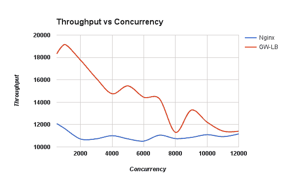
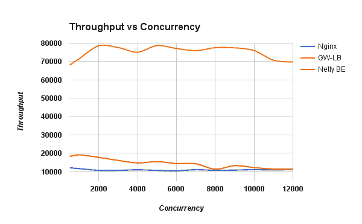
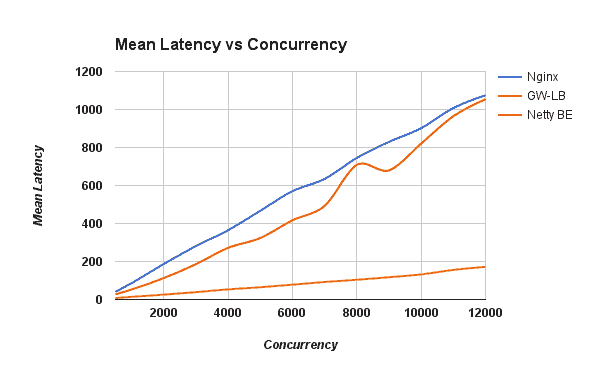
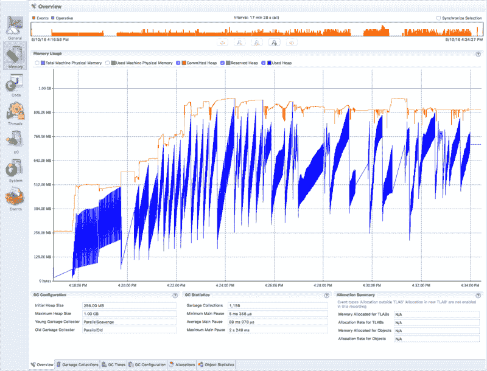

# WSO2 网关上的 HTTP 负载平衡器—第 2 部分:性能基准

> 原文:[https://dev . to/venkat 2811/http-load-balancer-on-top-of-wso2-gateway-part-2-performance-benchmarks-638](https://dev.to/venkat2811/http-load-balancer-on-top-of-wso2-gateway-part-2-performance-benchmarks-638)

 在我的 [**上一篇**](https://venkat2811.blogspot.in/2016/08/http-load-balancer-on-top-of-wso2.html) 中，我讨论了负载均衡引擎的架构及其特性。在这篇文章中，我将讨论性能基准。

请注意，潜在的碳网关框架正在开发中。因此，更多的功能将被开发，即兴创作将在这个 LB 中完成。

### 性能基准

在这个性能测试中，使用了使用 Netty 框架创建的五个简单服务实例。每个实例都是一个**快速后端(0 秒延迟)**，具有 1KB 大小的**响应。**

**一百万(1，000，000)个请求**以不同的**并发级别(500 到 12，000)** 通过自动化脚本使用 apache bench 发送到 Netty backend、Nginx(开源版本)和 GW-LB。

基准测试是在循环算法模式下进行的，没有持久性策略。

更多详情可以在 [**这里**](https://github.com/wso2-incubator/HTTP-Load-balancer/tree/master/performance-benchmark#performance-test-using-high-performance-netty-back-end) 找到。

### 试验台

这些是基准测试期间使用的配置。

#### 虚拟机详细信息

*   `**Guest OS :**` Ubuntu 64 位 16.04 虚拟机
*   `**RAM :**` 8 GB
*   `**CPU cores :**` 4
*   `**JVM Version :**`91 年 8 月 1 日
*   `**Java Runtime :**` Java(TM) SE 运行时环境(内部版本 1.8.0_91-b14)
*   `**Java HotSpot :**` Java HotSpot(TM) 64 位服务器虚拟机(内部版本 25.91-b14，混合模式)

#### 主机详细信息

*   `**Host OS :**` OS X EI 队长版本 10 . 11 . 5(15f 34)MacBook Pro(2015 年中)
*   `**Hypervisor :**` VMware Fusion Professional 版本 8.1.1 (3771013)
*   `**Processor :**` 2.5 GHz Intel Core i7
*   `**Memory :**` 16 GB 1600 MHz DDR3

**注意:****WSO2 网关**顶部的 HTTP 负载均衡器简称为 **GW-LB** 。

### 吞吐量测试

测试进行了两次。计算并绘制每个并发级别的平均吞吐量的平均值。

**图 1** 显示了开源 Nginx 和 GW-LB 之间的吞吐量比较，**图 1.1** 显示了 Netty 后端的吞吐量比较。

[T2】](https://res.cloudinary.com/practicaldev/image/fetch/s--DG4lAKGm--/c_limit%2Cf_auto%2Cfl_progressive%2Cq_auto%2Cw_880/https://cdn.hashnode.com/res/hashnode/image/upload/v1668355838343/g4AHVA72J.png)

**图 1 : Nginx 开源版 vs GW-LB**

[T2】](https://res.cloudinary.com/practicaldev/image/fetch/s--N85aP-1T--/c_limit%2Cf_auto%2Cfl_progressive%2Cq_auto%2Cw_880/https://cdn.hashnode.com/res/hashnode/image/upload/v1668355839793/n_1zahJDN.png)

**图 1.1 : Nginx 开源版本与 GW-LB 以及 Netty 后端**

### 潜伏期测试

测试进行了两次。计算并绘制每个并发级别的平均延迟。

[T2】](https://res.cloudinary.com/practicaldev/image/fetch/s--1o1zPGUF--/c_limit%2Cf_auto%2Cfl_progressive%2Cq_auto%2Cw_880/https://cdn.hashnode.com/res/hashnode/image/upload/v1668355840902/tQkvfshSr.png)

**图 2: Nginx 开源版本 vs GW-LB 以及 Netty BE**

### 记忆测试

**启动 LB 服务器时启用 Java 飞行记录器(JFR)** ，负载测试结束后停止记录。所获得的 JFR 录音具有存储器使用细节。

**图 3** 显示了**提交、保留和使用的堆**值。

[T2】](https://res.cloudinary.com/practicaldev/image/fetch/s--2m9dnAFT--/c_limit%2Cf_auto%2Cfl_progressive%2Cq_auto%2Cw_880/https://cdn.hashnode.com/res/hashnode/image/upload/v1668355842109/4WVeCjdak.png)

**图 3:GW-LB**的提交、保留和使用的堆内存值

花了三次代码审查和几轮性能基准测试才得到这些结果。我的导师和社区成员的指导和建议非常有帮助。我喜欢和我的导师讨论，这也是一次很好的学习！我热爱我的 GSoC 项目的这一阶段，因为我们的讨论非常好，我可以感觉到我的导师也像我一样渴望和激励我取得良好的业绩。

我还记录了我们正在做的即兴表演，把它作为一个问题，以便有一天会有所帮助。你可以在这里找到**。**

 **### 样本配置

*   你可以在 这里找到一个配置 [**的样本。**](https://github.com/wso2-incubator/HTTP-Load-balancer#sample-configuration)
*   还可以在这里找到更多样品**。**

 **请注意，DSL 和底层网关框架正在发展，它将随着时间的推移而改变。

### Javadoc

*   你可以在这里找到 javadoc [**。**](https://github.com/wso2-incubator/HTTP-Load-balancer/blob/master/docs/javadoc_http_load_balancer.zip)

感谢阅读和快乐编码！

*最初发布于 2016 年 8 月 18 日*[WSO2 gateway 之上的 HTTP 负载平衡器第二部分:性能基准](https://venkat.eu/http-load-balancer-on-top-of-wso2-gateway-part-2-performance-benchmarks-e06cc63e256d) *。*****