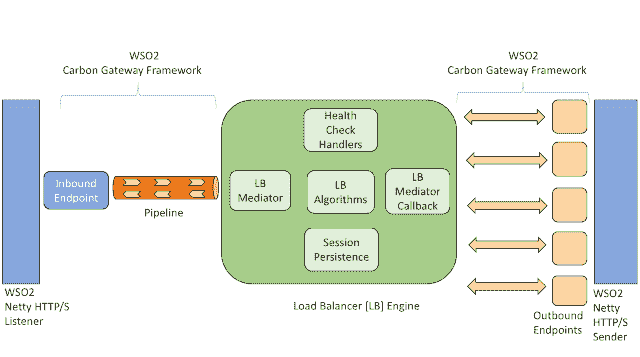
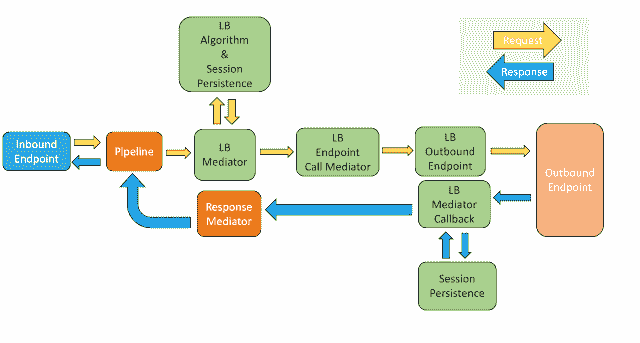
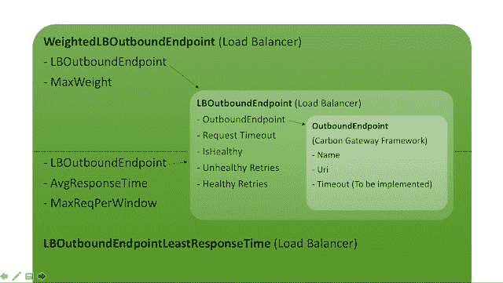

# WSO2 网关上的 HTTP 负载平衡器—第 1 部分:项目存储库、架构和特性

> 原文：<https://dev.to/venkat2811/http-load-balancer-on-top-of-wso2-gateway-part-1-project-repository-architecture-and-features-bm8>

 快四个月了，这是一段令人惊奇的旅程！在此，我要感谢我的导师 [** Isuru Ranawaka **](https://github.com/isururanawaka) 和 [** Kasun Indrasiri **](https://github.com/kasun04) 以及 WSO2 社区成员，特别是 [** Senduran **](https://github.com/bsenduran) 和 [** Isuru Udana **](https://github.com/isudana) 在整个项目中对我的持续指导、支持和指导。

谷歌宣布了被接受的指导组织名单，我正在寻找与网络和 Java 相关的项目。我偶然看到 WSO2s [**想法列表**](https://docs.wso2.com/display/GSoC/Project+Proposals+for+2016#ProjectProposalsfor2016-Proposal8:%5BESB/GW%5DHTTPLoadbalancerontopofWSO2Gateway) ，看到 HTTP 负载平衡器作为一个项目想法，我非常兴奋。我对负载平衡器有很好的想法，并渴望了解它的内部结构并开发一个。所以我联系了我的导师，他们给了我开始使用 WSO2 stack 的想法。他们让我想出一套我愿意作为这个项目的一部分开发的功能。从撰写提案开始，我就从 WSO2 社区成员那里获得了巨大的帮助和指导。在他们的指导和建议下，我能够提出基本的架构、功能集和暂定的时间表。

一旦选定的项目提案被宣布，我的导师就清楚地给出了项目的预期和如何进行的想法。以下是我之前关于**和 [**中期评估**](https://venkat2811.blogspot.in/2016/07/gsoc-mid-term-evaluation.html) 的博文。我已经完成了我在项目提案中承诺的所有功能。根据我所做的性能基准测试(将在下一篇文章 中讨论),这个**负载平衡器的性能优于 Nginx(开源版本**)。我的导师也对结果感到满意。要将这种 LB 投入生产，还有很多工作要做，比如即兴表演，在多层次模式下发挥作用的能力等等。此外，基础碳门户框架也在不断发展。即使过了 GSoC 期，我也会为这个项目做贡献，让它做好生产准备。**

 **在这篇文章中，我将讨论高级架构、引擎架构、消息流和负载平衡器的特定功能。

**注意:****WSO2 网关**顶部的 HTTP 负载均衡器简称为 **GW-LB** 。

### 项目资源库

该 GSoC 项目已被添加到 [**WSO2 孵化器**](https://github.com/wso2-incubator/HTTP-Load-balancer) 中，并且我已成为 WSO2 孵化器组织:D 的会员！

因为 GW-LB 有独立的运行时，所以它是作为一个单独的项目来开发和管理的。您也可以在我的 [**个人存储库**](https://github.com/Venkat2811/product-http-load-balancer) 中找到该项目，它已经从这里被添加到 WSO2 孵化器中。

支持 LB 的 ANTLR 语法的 Carbon Gateway 框架可以在 [**这里**](https://github.com/Venkat2811/carbon-gateway-framework-with-LB) 找到。随着 DSL 和网关框架的发展，将来语法会有一些变化。**请在这里** 找到我处理 LB 特定配置和 ANTLR 语法支持的提交 [**。**](https://github.com/Venkat2811/carbon-gateway-framework-with-LB/commits/master?author=Venkat2811)

[**自述文件**](https://github.com/wso2-incubator/HTTP-Load-balancer#building-product) 文件中有构建和使用产品的说明。你也可以简单地提取这个 [**文件**](https://github.com/Venkat2811/HTTP-Load-Balancer-Zip-File/blob/master/wso2gwlbserver-1.0.0-SNAPSHOT.zip) 并试用它！

### 高层建筑

[**WSO2 网关框架**](http://wso2.com/blogs/thesource/2016/07/gateway-server-framework/) 是一个基于标准网关模式的高性能、轻量级、低延迟的消息框架。其**基于 Netty 的非阻塞 IO 和中断器(环形缓冲区)架构**使其成为最快的开源网关。基准测试[1]表明，与其他解决方案相比，gateway 的性能非常高，接近于直接基于 netty 的后端(没有任何中间网关)。

GW-LB 使用 WSO2s [**碳网关框架**](https://github.com/wso2/carbon-gateway-framework)[**碳传输**](https://github.com/wso2/carbon-transports/) 和 [**碳消息**](https://github.com/wso2/carbon-messaging) 。这些是高度模块化和易于扩展的，因为它们是 OSGi 捆绑包，并且是[**WSO2 Carbon Platform**](http://wso2.com/products/carbon/)的一部分。这个 LB 本身就是一个 OSGi 捆绑包，它是建立在碳门户框架之上的。当所有这些包与 [**碳内核**](https://github.com/wso2/carbon-kernel) 捆绑在一起时，就形成了 **GW-LB 服务器**。

*   Carbon gateway 框架提供了**配置管理和基本的中介功能**。
*   碳传输充当 WSO2 堆栈内的**传输层**。
*   在 WSO2 堆栈中，消息(请求/响应)以**碳消息**的形式传递。

当请求到达**Carbon Transports(WSO 2-Netty Listener)**时，中介所需的附加层被添加，并成为 Carbon 消息。类似地，在中介之后，当 Carbon 消息到达**Carbon Transports(WSO 2-Netty Sender)**时，所有 Carbon 消息相关的细节将被移除，并且消息被发送到相应的端点。当来自后端的响应到达时，它以类似的方式工作。该流程在**图 1** 中清晰显示。

[T2】](https://res.cloudinary.com/practicaldev/image/fetch/s--zXYY0vf4--/c_limit%2Cf_auto%2Cfl_progressive%2Cq_auto%2Cw_880/https://cdn.hashnode.com/res/hashnode/image/upload/v1668355861612/wn6ShKcui.png)

**图 1:高层架构**

### 引擎架构

这个 LB 是在牢记 WSO2 产品堆栈的模块化和可扩展本质的基础上构建的。WSO2 使用 [**ANTLR4**](http://www.antlr.org/) 为其碳网关框架开发领域特定语言 **(DSL)** 。这个 DSL 将用于为使用这个框架(包括这个 LB)构建的各种产品配置和定义中介规则。

网关框架和 DSL 在不断发展，LB 引擎与 DSL 完全分离。此外，开发人员可以轻松开发自己的 LB 算法和持久性策略，并将其插入到这个 LB 中。

**图 2** 清楚地描述了 LB 发动机、Carbon Gateway 框架和 Carbon Transports 的具体模块。

[T2】](https://res.cloudinary.com/practicaldev/image/fetch/s--E9j-X_zg--/c_limit%2Cf_auto%2Cfl_progressive%2Cq_auto%2Cw_880/https://cdn.hashnode.com/res/hashnode/image/upload/v1668355863156/YZVZ6qWQv.png)

**图 2:引擎架构**

### 消息流

如上所述，WSO2 堆栈中的模块通过 Carbon 消息进行通信。参考**图 3** 以清楚地了解消息如何流经各种 LB 模块。

### 请求流:来自客户端- > LB - >后端

*   当**客户端请求**到达 **WSO2-Netty 监听器**时，它被转换成**碳消息**。然后，此 carbon 消息到达入站端点。
*   这个**碳信息**然后通过管道流向**并到达 **LB 中介**。**
*   每个 **LB 出站端点**都有自己的 **LB 端点调用中介**。LB 中介使用这个 LB 端点调用中介将请求转发到相应的 LB 出站端点。
*   **如果没有持久性策略，LB 算法**返回 LB 出站端点的**名称，LB 中介器必须将请求转发到该端点。**
*   如果有任何持久性策略，LB 中介器 **采取适当的动作**(稍后讨论)并找到 LB 出站端点的**名称。**
*   **LB 中介**然后将碳消息传递给 **LB 端点呼叫中介**。
*   这个 **LB 端点调用中介**创建一个 **LB 中介回调**并将 carbon 消息转发给 **LB 出站端点**，后者又将消息转发给**出站端点**。
*   **出站端点**然后将 carbon 消息转发给**后端服务**。
*   当 **carbon 报文**到达 **WSO2-Netty 发送方**时，将 carbon 报文转换回**原始客户端请求**，并发送给**对应的后端服务**。

[T2】](https://res.cloudinary.com/practicaldev/image/fetch/s--Y84OMex2--/c_limit%2Cf_auto%2Cfl_progressive%2Cq_auto%2Cw_880/https://cdn.hashnode.com/res/hashnode/image/upload/v1668355864408/2wymPWgw4.png)

**图 3:消息流**

### 响应流程:从后端- > LB - >客户端

*   当来自后端的**响应到达 **WSO2-Netty 发送方**时，它被转换成**碳消息**，然后它对应的 **LB 中介回调**被调用。**
*   根据配置的**会话持续策略** , **LB 中介回调**采取会话持续所需的相应动作，并将 carbon 消息转发给**响应中介。**
*   然后，**响应中介器**将消息转发给**管道**，后者又将消息转发给**入站端点**。
*   **入站端点**然后将消息转发给相应的**客户端**。
*   当 **carbon 报文**到达 **WSO2-Netty 监听器**时，将 carbon 报文转换回**原始后端响应**，并发送给**对应的客户端**。

### 出站端点

后端服务端点被映射为 Carbon Gateway 框架中的出站端点。LB 引擎需要很少的附加属性来对这些出站端点进行负载平衡。**图 4** 清楚地解释了出站端点、LB 出站端点、加权 LB 出站端点和 LB 出站端点对于最小响应时间算法的区别。

[T2】](https://res.cloudinary.com/practicaldev/image/fetch/s--xACjNcxb--/c_limit%2Cf_auto%2Cfl_progressive%2Cq_auto%2Cw_880/https://cdn.hashnode.com/res/hashnode/image/upload/v1668355865588/WEMTZ-9zS.png)

**图 4:GW-LB 中不同的出站端点**

### 特性

这个 LB 支持各种负载平衡算法、会话持续策略、健康检查和重定向。

### 算法

这个 LB 支持加权和非加权算法。在非加权算法中，所有出站端点都被视为具有相同的权重。在加权算法中，可以为每个出站端点配置权重。如果没有为端点指定权重，则默认值 1 将作为其权重。

### 非加权(简单)算法

#### 1)循环赛

LB Mediator 以循环方式将请求转发到出站端点。如果有任何持久性策略，LB Mediator 会根据它将请求转发到出站端点。

#### 2)随机

LB Mediator 以随机方式将请求转发到出站端点。如果有任何持久性策略，LB Mediator 会根据它将请求转发到出站端点。

#### 3)严格的客户端 IP 哈希

LB 在传入请求报头中查找客户端 IP 地址(请求报头将在 Carbon 消息中提供)。到目前为止，LB 查找以下头:

**a)** X-Forwarded-For

**b)** 客户端-IP

**c)** 远程地址

但是这些总是可配置的，如果需要，可以添加更多的头来查找。如果 LB 无法检索客户端 IP，或者该 IP 不是有效 IP，LB 将向客户端发送内部服务器错误响应。**在这种算法模式下，持久性策略应该是 NO_PERSISTENCE，只有当有效的客户端 IP 可用时，才会对请求进行负载平衡**。

此外，LB 使用可扩展且高效的 [**一致性哈希**](http://www.tom-e-white.com/2007/11/consistent-hashing.html) 而不是简单的模哈希。

使用一致哈希的优势在于，如果某个特定节点出现故障，只有那些与该节点保持会话的客户端才会被重新映射到其他节点。其他客户端的会话持久性或相似性不受影响。当该节点启动并恢复正常状态时，只有那些重新映射的客户端才会映射回该节点。但是，如果我们使用模哈希，所有的客户端将被重新映射，会话将丢失，这造成了糟糕的用户体验。

#### 4)最少响应时间

为每个请求的端点计算运行平均值。在一个固定的窗口数量的请求过去之后，端点的负载分布将根据它们的响应时间来决定。**端点的响应时间越长，其上的负载就越高**。因此，LB 总是通过向端点转发较少数量的请求和以最短的响应时间向端点转发更多的请求来尝试减少端点的响应时间。通过这样做，LB 实现了基于端点响应时间的均匀负载分布。

### 加权算法

#### 1)加权循环法

LB Mediator 通过考虑端点权重，以循环方式将请求转发到出站端点。例如，如果端点 A、B、C 分别具有 3、2、5 的权重。在总共 10 项请求中..

**a)** 前 3 个请求发送到端点 A、B、c。

**b)** 第二个 3 个请求也发送到端点 A、B、c。现在，2 个请求已被转发到端点 B。因此，在总共 10 个请求过去之前，不会考虑它。

端点 A 接收下一个请求。现在，3 个请求已经被转发到端点 a。因此，在总共 10 个请求过去之前，不会考虑它。

**d)** 剩余的 3 个请求将被转发到端点 c。

循环又开始了。

因为端点是加权的，而权重代表处理能力，所以基于持久性策略转发到端点的请求也将被考虑在内。

#### 2)随机

类似于加权循环法，但端点的顺序是随机选择的。

### 易于扩展的性质

通过实现相应的接口，可以很容易地编写定制的负载平衡算法(简单的或加权的)。

### 会话持久性

到目前为止，客户机 IP 散列、应用程序 cookie 和 LB 插入 Cookie 是该 LB 支持的三种持久性策略。

### 1)客户端 IP 哈希

类似于严格的 IP 哈希算法，但唯一的区别是，如果 LB 在请求报头中找不到有效的客户端 IP，请求仍然会基于配置的负载平衡算法进行负载平衡。它还使用可扩展的**一致性哈希**替代模哈希。

### 2)应用 Cookie

LB 在应用服务器插入的 cookie 中插入它自己的 cookie。因此，当客户端发送请求时，LB 将寻找指定格式的 cookie(LB 插入的 cookie ),并且基于 cookie 值，请求将被转发到相应的后端，并且保持持久性。并且 LB 还在将请求转发到出站端点之前删除由其插入的 cookie。

Cookie 到期值由后端应用程序而不是 LB 控制。如果后端发送的响应中没有可用的 cookie，为了保持持久性，LB 将插入自己的 cookie。该 cookie 将是一个会话 cookie。即，会话持续将被保持，直到客户端浏览器打开。一旦关闭，坚持就会失去。此外，LB 插入的这个定制 cookie 将在请求转发到客户机之前被删除。

### 3) LB 插入饼干

当后端应用程序服务不插入 cookie 但必须维护持久性时，这种持久性策略会很方便。它的工作方式类似于应用程序 cookie，但唯一的区别是插入的 cookie 是一个会话 cookie。

### 健康检查和重定向

该 LB 支持主动和被动健康检查模式。如果不需要运行状况检查，也可以将其禁用。被动健康检查是默认模式，因为它不会给后端服务或网络带来任何额外的开销。无论是主动还是被动健康检查，都需要以下参数。

**a)请求超时:**时间间隔，在此时间间隔之后，如果没有收到响应，请求必须标记为超时。

**b)健康检查间隔:**两次健康检查之间的时间间隔

**c)不正常重试:**在将端点标记为不正常之前，请求必须连续失败(超时)的次数。

**d)正常重试次数:**在将 LB 重新标记为正常之前，LB 应该能够成功建立到服务器端口的连接的次数。

*   对于每个超时请求，LB 将发送 **HTTP 状态代码:504，网关超时**。
*   如果所有出站端点都不正常且不可用，LB 将发送 **HTTP 状态代码:503，服务不可用**。

### 被动健康检查

在这种模式下，LB 不会发送任何额外的连接探测来检查端点是否正常。它只是跟踪对端点的连续失败(超时)请求。如果达到不正常重试次数，该端点将被标记为不正常，并且在该端点恢复正常状态之前，不会再向其转发任何请求。

### 主动健康检查

LB 将定期发送连接探测以检查端点是否正常。在这种情况下，对端点的连续失败的请求和连续失败的连接探测都将被考虑。如果达到不正常重试次数，该端点将被标记为不正常，并且在该端点恢复正常状态之前，不会再向其转发任何请求。

### backtohealthhandler

BackToHealthyHandler 是一个线程，它被调度为在每经过一个**健康检查间隔**的时间间隔后运行。它向不正常的端点发送连接探测，并尝试建立连接。如果它成功地建立了多次正常重试的连接，该端点将被再次标记为正常，请求将被转发到该端点。

在我的 [**下一篇**](https://venkat2811.blogspot.in/2016/08/http-load-balancer-on-top-of-wso2_18.html) 中，我将讨论这个负载均衡器的性能基准测试结果。

感谢阅读！

*最初发布于 2016 年 8 月 18 日*[https://venkat . eu/http-load-balancer-on-top-of-WSO 2-gateway-part-1-project-repository-architecture-and-features-d4df 775 af 48 e](https://venkat.eu/http-load-balancer-on-top-of-wso2-gateway-part-1-project-repository-architecture-and-features-d4df775af48e)*。***