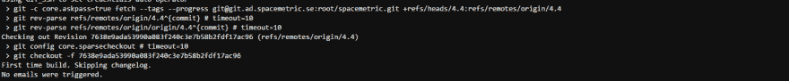

# 用 Git SVM 设置在 Jenkins 中克隆一个工作区不会检出正确的分支。

> 原文:[https://dev . to/jlengrand/cloning-a-workspace-in-Jenkins-with-a-git-SVM-setup-does-check out-the-correct-branch-30a 3](https://dev.to/jlengrand/cloning-a-workspace-in-jenkins-with-a-git-svm-setup-does-not-checkout-the-correct-branch-30a3)

[T2】](https://res.cloudinary.com/practicaldev/image/fetch/s--9zcxzZMV--/c_limit%2Cf_auto%2Cfl_progressive%2Cq_auto%2Cw_880/https://images.unsplash.com/photo-1536796714710-561061a7a4cb%3Fixlib%3Drb-1.2.1%26q%3D80%26fm%3Djpg%26crop%3Dentropy%26cs%3Dtinysrgb%26w%3D1080%26fit%3Dmax%26ixid%3DeyJhcHBfaWQiOjExNzczfQ)

你好，

这是我最近在使用 Jenkins 时注意到的一个奇怪行为，在我们意识到发生了什么之前，这让我们有些头疼。

在 [Spacemetric](http://www.spacemetric.com/) ，我们同时使用 Gitlab 和 Jenkins 进行 CI。

*   Gitlab 用于存储源代码，对于每次提交，我们都要确保所有的 jar 都能构建得很好。
*   [Jenkins](http://jenkins.io/) 用于创建我们的版本，生成我们的前端产品，并执行每日/每周集成和一组更完整的测试，以及生成测试报告。

与 Jenkins 相比，Gitlab 的一个主要优点是，只要分支包含神奇的 **gitlab-ci.yml** 文件，所有分支都会被自动测试，而无需创建新的作业。

为了让 Jenkins 在一个新的分支上开始集成测试，我们实际上必须克隆用于 master 的作业，并根据新的分支设置它。我们只对即将发布的分支这样做。

这是我们发现奇怪行为的地方。

假设我设置了一个针对主分支运行的作业，我希望针对我们的 4.4 分支运行相同的作业

我将使用**新任务**特性，并从现有任务中选择**克隆。**

然后，我将进入新工作的 SCM 部分，并将分支从**主**更改为 **4.4**

我将运行构建。

现在，我希望我的工作能达到 4.4。事实是，它将继续检查 Gitlab 上主分支的**最后一次提交。您可以通过检查相关 git 提交的散列来轻松验证这一点**

T2】

<figure> 

<figcaption>复制部分詹金斯单片机上传</figcaption>

</figure>

非常麻烦，因为它与作业配置中显示的内容不匹配。

现在，解决这个问题实际上非常容易:**简单地清除新任务的工作空间，并重新启动任务**。

有了一个干净的工作区，作业将从头开始克隆 git repo，并将按预期运行。

希望这对你们有些人有所帮助。

欢呼，

举枪