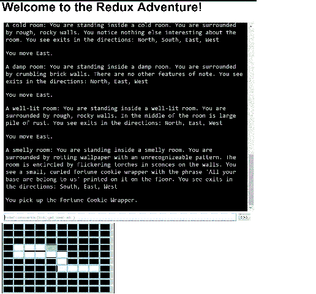

# Redux 中的冒险:构建 Redux-冒险

> 原文：<https://dev.to/jeremylikness/an-adventure-in-redux-building-redux-adventure-28d4>

Redux 是一个“JavaScript 应用的可预测状态容器”如果你像我一样，阅读关于一项新技术的文章是很好的，但是需要一个好的项目来真正理解它。出于某种原因，当我听到“状态机”时，我立即想到了“1979 年在匹兹堡的咖啡桌上”创造的 [Z-machine](http://inform-fiction.org/zmachine/standards/z1point1/index.html) ，它通过将基于文本的冒险游戏引入无数平台，在 80 年代初彻底改变了计算机游戏。

[T2】](https://res.cloudinary.com/practicaldev/image/fetch/s--VVMtbEAu--/c_limit%2Cf_auto%2Cfl_progressive%2Cq_auto%2Cw_880/https://cdn-images-1.medium.com/max/516/0%2Aa-VN4WlCwrJj8gEG.)

我原本想重新分解我的 6502 模拟器来使用 Redux，但意识到这将是一个更大的任务，所以我决定从头开始构建。借用我为几年前出版的一本书写的一个应用程序，我用 [Angular 2](https://angular.io/) 和 [TypeScript](http://www.typescriptlang.org/) 和 [Angular-CLI](http://developer.telerik.com/featured/rapid-cross-platform-development-angular-2-cli/) 构建了 [redux-adventure](https://github.com/JeremyLikness/redux-adventure) 。

### 还原概念

网上有很多介绍 Redux 的教程。我发现的一个问题是，很多人倾向于使描述过于复杂，并抛出图表，使其看起来比实际情况复杂得多。与其重新发明轮子，我将在这里分享一个简单的描述，然后浏览使用它的应用程序。

Redux 是一个简单的状态管理工具。您的应用程序可能会经历多种状态。在任何给定的时间，你都可以引发一个事件，或者创建一个动作，导致一个新的状态。状态是不可变的，所以动作永远不会修改代表状态的现有模型，而是会生成一个新模型。这就是有时候很难理解的概念。

Redux 为您跟踪状态，并提供三个关键服务(还有其他 API，但我保持简单)。

*   能够*分派*一个动作，指示状态的转换
*   一组通过提供新状态来响应动作的*减速器*
*   一个*订阅*，它在状态改变时接收通知

### 游戏

redux-adventure 游戏相当简单。你被放在一个地牢的随机房间里，必须探索地牢找到各种文物。你可以在四个罗盘方向寻找或旅行，如果有一个项目，你可以得到它，把它放入你的库存。你通过取回所有可用的物品来赢得游戏。

### 状态

状态本身实际上只是一个由普通 JavaScript 对象(POJO)表示的域模型。一个“东西”或人工制品有一个名字和一个描述。有些房间看起来像这样:

[https://medium . com/media/0c 484 e 300 e 31 fa 31 e abde 30 b 25 Fe 4 af 5/href](https://medium.com/media/0c484e300e31fa31eabde30b25fe4af5/href)

请注意，一个房间可能包含多个库存项目。它还根据指南针方向和没有房间可导航的墙壁来跟踪其他房间。

世界本身由一个*地牢*类表示，该类包含房间、玩家的库存、他们必须获得的物品总数、当前房间、一个包含向用户显示的文本的控制台，以及一个指示玩家是否获胜的标志。

[https://medium . com/media/5316017 ECC cef 3c 8186635863 FB 08 add/href](https://medium.com/media/5316017ecccef3c8186635863fb08add/href)

还有一个 [dungeonMaster](https://github.com/JeremyLikness/redux-adventure/blob/master/src/app/world/dungeonMaster.ts) 用一些种子信息生成世界，随机生成墙壁。任何具有行为的类或服务都有自己的[测试](https://github.com/JeremyLikness/redux-adventure/blob/master/src/app/world/dungeonMaster.spec.ts)。现在我们已经定义了世界，我们能做什么？

### 动作

用户可以输入由[动作列表](https://github.com/JeremyLikness/redux-adventure/blob/master/src/app/actions/ActionList.ts)表示的任意数量的命令。虽然一个动作可能以这些命令开始，但基于当前状态，它们最终会被转换成四个关键动作:

*   *Move* :将当前房间更新为用户导航到的房间，并更新控制台以指示移动并显示新房间的描述
*   *Get* :将当前房间的库存转移给用户
*   *Text* :向控制台添加一行文本
*   *赢了*:将库存的最后一件物品转移给用户，设置赢了标志，并更新控制台以指示用户已经赢了

[createAction](https://github.com/JeremyLikness/redux-adventure/blob/master/src/app/actions/createAction.ts) 方法负责这个逻辑。TypeScript 允许我编写接口来更清楚地说明一个动作检查什么。以下是“获取”操作的界面:

[https://medium . com/media/88c 2108 b 710101 c 640 eee 8213 e 25 F3 c 9/href](https://medium.com/media/88c2108b710101c640eee8213e25f3c9/href)

下面是将原始动作转换成内部动作的代码:

[https://medium . com/media/bccf 89 A8 b 6474 e 79748 EB 105 ad 931 Fe 5/href](https://medium.com/media/bccf89a8b6474e79748eb105ad931fe5/href)

请注意，一个“传入”动作可以转化为三个“内部”动作:当没有东西可获取时，带有尖刻评论的文本，将库存转移给用户的动作，以及表明用户已经获胜的动作。

动作的翻译是完全可测试的。请注意，到目前为止，我们一直在纯 TypeScript/JavaScript 中工作——这些代码都不依赖于任何外部框架。

### 减速器

Reducers 可能需要一段时间来适应，但本质上它们只是基于一个动作返回一个新状态，并确保现有状态不会发生变化。处理 reducers 的最简单的方法是从“自下而上”,即获取较低级别的属性或嵌套对象并处理它们的状态，然后将它们组合到较高级别。

例如，一个房间包含一组库存项目。“get”动作将库存转移给用户，因此房间的 things 属性用一个不再包含该物品的新数组进行更新。以下是打字稿代码:

[https://medium . com/media/778411 d3d 7 D4 B4 ce 9627658 b 26 F8 f/href](https://medium.com/media/7778411d3d7d4b4ce9627658b26f8f4f/href)

如果省略号令人困惑，那么它是一个新规范的一部分，该规范允许对项目进行组合。它实际上代表了数组的一部分。返回的是一个不再包含该项的新数组。下面是 JavaScript 代码:

[https://medium . com/media/5478 cc 37312 b 233 AE 05 e 654 ad 3 f 39 f 37/href](https://medium.com/media/5478cc37312b233ae05e654ad3f39f37/href)

你可以在这里查看用 TypeScript [编写的相应测试。注意，在测试中，我使用 Object.freeze 来确保原始实例不会发生变化。我冻结了单个项目和列表，然后测试项目是否被成功删除。](https://github.com/JeremyLikness/redux-adventure/blob/master/src/app/reducers/reducer.things.spec.ts)

另一个缩减器将对玩家的库存物品阵列进行操作。它将返回一个新的数组，将该物品添加到玩家的物品清单中，而不是将该物品从房间中移除。

房间的缩减器调用 things 属性的缩减器，并返回一个复制了属性的新房间(在导航到房间的情况下，设置 visited 标志)。

[https://medium . com/media/E4 f 54 ca 5e 45d 932 fc 2 DAC 4c 7 DD 7d 814d/href](https://medium.com/media/e4f54ca5e45d932fc2dac4c7dd7d814d/href)

您可以查看 [main reducer](https://github.com/JeremyLikness/redux-adventure/blob/master/src/app/reducers/reducer.main.ts) 代码，以了解处理各种动作的逻辑，以及调用其他 reducer 的逻辑(即 main 调用房间列表的 reducer，而 rooms 调用单个房间的 reducer)。

最后，[测试](https://github.com/JeremyLikness/redux-adventure/blob/master/src/app/reducers/reducer.main.spec.ts)只是验证状态是否基于一个动作发生了适当的变化，而不会改变现有的状态。

在这个阶段，整个游戏逻辑已经完成——所有的状态转换都已经完成，我们可以编写一些简单的人工智能来让机器人玩游戏并输出结果。一切都是可测试的，我们还没有依赖任何框架(包括 Redux)。

这是一种构建软件的强大方法，因为现在无论您决定使用 Angular、React、普通 JavaScript 还是任何其他框架，主要的业务逻辑和领域都是相同的。代码不会改变，测试都是有效的，并且与框架无关，唯一的决定是如何呈现它。

### Redux 商店

Redux 的目的是在处理动作和应用 reducers 的存储中维护状态。我们已经完成了所有的跑腿工作，剩下的就是创建商店，响应状态变化，并在它们发生时调度操作。

Angular 应用程序的根组件处理所有这些:

[https://medium . com/media/70f 247078 CBA 1447 C5 b 06 e 8187 c 148 b 7/href](https://medium.com/media/70f247078cba1447c5b06e8187c148b7/href)

请注意组件是多么简单！它不需要处理任何业务逻辑。它只是创建存储，在状态改变时刷新属性，并调度操作。

模板也很简单。它列出了控制台，提供了一个解析器来接收用户输入(如果游戏还没有赢的话),并呈现了房间的地图。

[https://medium . com/media/024 b 81 e 58 ff 956114070 b 745763 CD 73d/href](https://medium.com/media/024b81e58ff956114070b745763cd73d/href)

使用这种方法，组件本身根本没有业务逻辑，只是简单地响应绑定的数据。让我们再深入一点看看。

### 组件

以这种方式处理应用程序使得构建组件变得非常容易。例如，这是控制台组件。它只做两件事:公开文本列表，并通过设置 div 元素的属性来响应更改，以便它总是将最新的信息滚动到视图中:

[https://medium . com/media/6 fa 8 ea 84 bb 1 e 2 EB 19 c 30 fac f1 ea 8 b 262/href](https://medium.com/media/6fa8ea84bb1e2eb19c30facf1ea8b262/href)

如果您担心看到 HTML 元素混杂在组件中，不要担心！没有浏览器，它们是完全可测试的:

[https://medium . com/media/1 B2 E5 ff 386697 a9 bb 232701 d0c 5 BC 26 f/href](https://medium.com/media/1b2e5ff386697a9bb232701d0c5bc26f/href)

解析器组件的存在只是为了执行输入和调度操作。主组件监听解析器，并使用事件发射器将动作分派给 Redux store(前面列出了该代码)。解析器本身有一个发出输入的动作，还有一个当用户在输入框中点击 ENTER 时自动提交的动作:

[https://medium . com/media/a6b 72766067 b 8 b 285 b 20 ce 21 a4 f 959 ba/href](https://medium.com/media/a6b72766067b8b285b20ce21a4f959ba/href)

玩了这个游戏后，我意识到如果我有一张地图，测试起来会容易得多，所以我创建了地图组件来渲染网格和跟踪进度。[地图组件](https://github.com/JeremyLikness/redux-adventure/blob/master/src/app/map/map.component.spec.ts)本身只是将房间列表转换成一个矩阵来呈现单元。对于每个[单元](https://github.com/JeremyLikness/redux-adventure/blob/master/src/app/cell/cell.component.ts)，绿色方块表示用户所在的位置，白色方块表示被访问过的单元(标明了墙壁)，黑色单元表示地图上尚未被探索的地方。

尽管需要大量的样式操作来指示背景颜色和墙壁，这个组件也是完全可测试的，不依赖于浏览器。

### 结论

你可以在 GitHub 上查看[完整源代码](https://github.com/JeremyLikness/redux-adventure/tree/master/src)，在这里玩游戏。总的来说，建造这个对我来说是一次很好的学习经历。我读过的许多文章让我有点困惑，并让我觉得事情过于复杂，但经历了这个过程后，我可以清楚地看到为应用程序利用 Redux 的好处。

总的来说，它使我能够使用普通的 TypeScript/JavaScript 构建一个域，并通过寻址 actions 和 reducers 以一致的方式在客户机上声明任何必要的逻辑。这些都是完全可测试的，所以我能够在不依赖任何第三方框架的情况下设计和验证游戏逻辑。

链接 Redux 是一个简单的步骤，它使我的组件的逻辑更加简单。我不用封装服务来驱动应用程序，而是能够创建一个存储，响应存储中的状态变化，并将每个组件构建为一个完全可测试的独立单元。

你怎么想呢?你在你的应用中使用 Redux 吗？如果你是，请在下面的评论中分享你的想法。

[T2】](https://res.cloudinary.com/practicaldev/image/fetch/s--eXFav4LJ--/c_limit%2Cf_auto%2Cfl_progressive%2Cq_66%2Cw_880/https://cdn-images-1.medium.com/max/197/0%2A7sKYh5YwKCs6xIOV.gif)

*原载于 2016 年 7 月 30 日*[*【csharperimage.jeremylikness.com】*](https://csharperimage.jeremylikness.com/2016/07/an-adventure-in-redux-building-redux.html)*。*

* * *