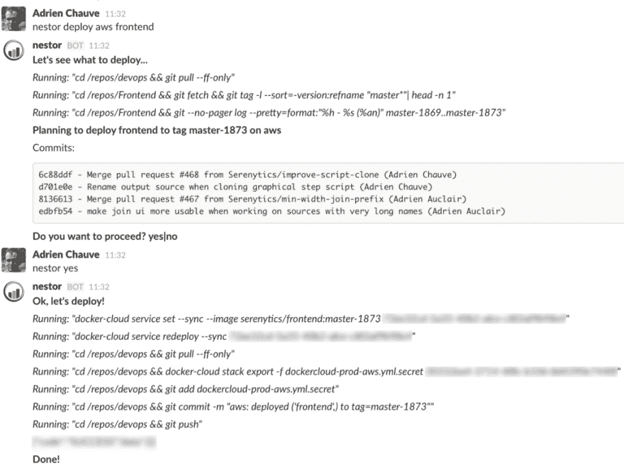

# 使用 Slack bot 部署您的应用程序

> 原文:[https://dev . to/adrienchauve/use-a-slack-bot-to-deploy-your-app-347](https://dev.to/adrienchauve/use-a-slack-bot-to-deploy-your-app-347)

部署您的 web 应用程序肯定不是您一天中最有趣的活动。但是如果它简单、可靠、有趣呢？

使用一个 Slack bot 来部署你的应用程序实际上很有趣，而且它会带来很多好处。

### 为什么？

除了通过你喜欢的聊天应用程序与你的机器人交谈的乐趣之外，主要的好处是**你的部署终于有了单一的信任来源**。如果您正在使用软件工程良好实践，您的代码应该被版本化，您的数据库模式应该被版本化，您的基础设施应该被版本化…因此您确切地知道什么代码被部署在什么基础设施上。但是部署其余代码(无论是什么:shell 脚本、fabric、ansible、salt、puppet、chef，任何东西……)的代码呢？当然它也是有版本的。但是这段代码不是部署在您的服务器上，而是在 developer|ops|devops 机器上执行。代码被修改了吗？工作目录脏吗？这是最新的可用版本吗？世事难料。除非所有的部署都在一台不能通过 SSH 访问的机器上执行(只部署到),并且每个人都使用这台机器。是的，我说的是你的懒虫。

除了确切了解您的部署是如何进行的，另一个要点是**沟通**。团队中的每个人都需要知道部署何时开始，何时结束，以及部署了什么。每个人还需要知道部署历史。目前部署了什么？有人执行了回滚吗？只需使用一个 Slack 机器人，你就可以免费获得所有这些。

还有其他一些较小的额外津贴。为了**紧急支援**，你不需要带着你的电脑。你可以重启一个 Docker 容器或者从你的手机上执行一个回滚操作**。你只需要移动 Slack 应用程序！处理**部署权限**也真的很简单。只需邀请合适的人到授权渠道！**

我有没有说过写一个 Slack 机器人很有趣？

### 为什么是 bot，为什么不只是斜线命令？

Slack 定制[斜杠命令](https://api.slack.com/slash-commands)是通过 web 钩子触发事件并在 Slack 中打印结果的好方法。例如，我给我们的 Serenytics 团队添加了一个命令 */srn-active-users* ，它返回我们的 web 应用程序上最近的活跃用户。我们可以用它来部署我们的堆栈。但是机器人实际上是一个更好的解决方案，有两个主要原因。

你可以和机器人进行对话。你不能用斜线命令进行对话。我认为这是执行部署的杀手锏。为什么？因为你首先要求你的机器人部署你的应用。它会给出自上次部署以来可用的新提交列表，并询问您是否要继续。然后，您可以在继续之前验证更改。这太棒了。

从技术上来说，使用 bot 的另一个好处是，您不需要在某个地方部署一个新的服务器，包括一个域、一个 API、一个 SSL 证书、身份验证……一个简单的守护程序脚本就足够了。

### 松弛状态下的实际部署情况

这是我们自己的一次实际部署的松散抄本。我们的机器人叫做 Nestor，我正在我们的 AWS 服务器上部署我们的前端应用程序。

[T2】](https://res.cloudinary.com/practicaldev/image/fetch/s--CPJ8aja3--/c_limit%2Cf_auto%2Cfl_progressive%2Cq_auto%2Cw_880/https://cdn-images-1.medium.com/max/1024/1%2A2dW9zIlDQoepDEmXvmwDzA.png)

### 示例 bot 代码

这是我们在 [Serenytics](https://www.serenytics.com) 使用的 Slack 机器人的框架。这是一个完整的运行脚本，您只需填写空白:您的 slack 令牌和实际的部署代码。在我们的例子中，我使用 shell 命令和 [Docker Cloud](https://cloud.docker.com) python 客户端。

如果你想了解更多关于 Slack 机器人的信息，请去那里。