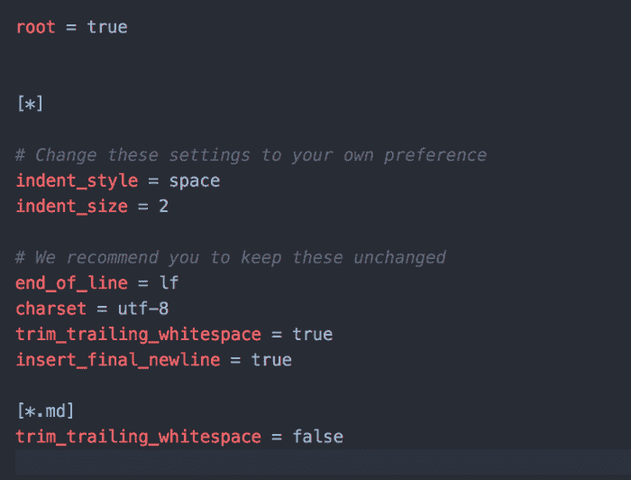
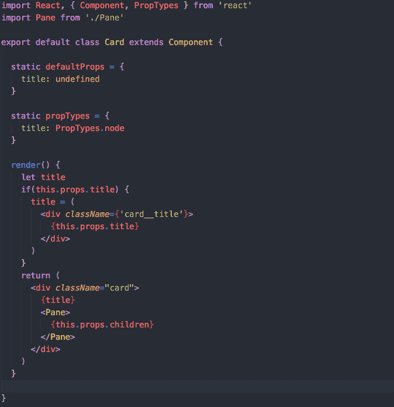
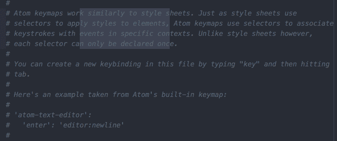
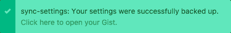
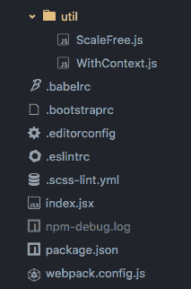

# 必须有 Atom 插件

> 原文：<https://dev.to/committedsw/must-have-atom-plugins-349e>

Atom 是一个很棒的文本编辑器——它是我们的 Go、Javascript/React IDE——部分归功于它的插件支持和社区的努力。

## editorconfig

帮助开发人员在不同的编辑器之间保持一致的编码风格。

[T2】](///static/editor-config-69add82ceabbf6595ea6a65a8edde6c4-3f248.png)

## 语言-巴别塔

对所有 ES6 和 ESNext 的一流支持。它对 JSX 也有适当的支持，这使得它非常适合 React 开发。

[T2】](///static/babel-f262542c91f9c9b9faf758f8de5ceb56-0b77d.png)

## 崇高-风格-栏目-选择

启用列选择的简单方法。选择时只需按住“alt ”,或者使用鼠标中键进行选择。

[T2】](///static/column-selection-ec27048e374bf95b6a057a0c62ef9cb9-5304d.png)

## 同步-设置

将设置、按键映射、用户风格和已安装的软件包同步到一个要点。

[T2】](///static/sync-settings-0514e1c731a725effec97f57ec76afcc-dea29.png)

## 文件-图标

为 atom 添加特定于文件的图标，以改善视觉效果。使用树状视图、模糊查找器和选项卡。

[T2】](///static/fileicons-e9c98db505160e8c3a44451a44433ad8-53da3.png)