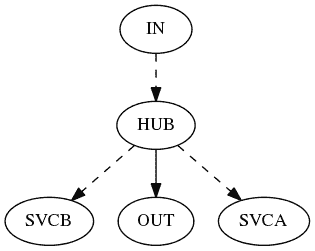

# DIY Tuxedo 监控- ULOG 和 TMTRACE

> 原文：<https://dev.to/aivarsk/diy-tuxedo-monitoring-ulog-and-tmtrace-31hj>

我毫不费力地编写了一个 Python 脚本，用于分析 Oracle Tuxedo 用户日志条目并从中提取跟踪信息。这很容易做到，不需要为特定平台编译一些 C 代码，用户日志可以在我的笔记本电脑上离线分析，而不是在服务器上。这样做的缺点是编写冗长的跟踪文件，既占用磁盘空间又耗费时间。

因此，默认情况下，每个用户日志条目都有一个低至秒的粗粒度时间戳。要获得以毫秒为单位的时间戳，您必须在启动应用程序之前导出环境变量。

```
 ULOGMILLISEC=Y; export ULOGMILLISEC 
```

Enter fullscreen mode Exit fullscreen mode

然后，在应用程序仍在运行时，可以使用 tmadmin:
来打开和关闭 Oracle Tuxedo 跟踪

```
 # on
echo 'chtr "*:ulog:dye"' | tmadmin
# off
echo 'chtr off' | tmadmin 
```

Enter fullscreen mode Exit fullscreen mode

如果您有调用服务器应用程序的 Tuxedo 客户端应用程序，您还应该导出环境变量:

```
 TMTRACE=on; export TMTRACE 
```

Enter fullscreen mode Exit fullscreen mode

到目前为止，我已经找到了两种有用的输出格式。第一个是带有服务调用图的图表，它给出了应用程序有多复杂的印象:

```
 python ulog-trace.py log/ULOG.040516 -G -O callgraph.png 
```

Enter fullscreen mode Exit fullscreen mode

给出如下输出(对于我简化的演示应用程序):

[T2】](https://res.cloudinary.com/practicaldev/image/fetch/s--oeoscCyk--/c_limit%2Cf_auto%2Cfl_progressive%2Cq_auto%2Cw_880/http://aivarsk.com/public/callgraph.png)

第二种输出格式类似于文本模式探查器输出。但是它显示的是 Tuxedo 服务，而不是函数和服务被调用的次数以及累计时间。它还显示服务的直接被调用者、被调用者的次数和累计调用时间。需要记住的一点是，由于调用和所涉及的队列的异步性质，调用服务所花费的时间将比执行服务所花费的时间更长(甚至可能更长)。

```
 python ulog-trace.py log/ULOG.040516 -T 
```

Enter fullscreen mode Exit fullscreen mode

对于相同的演示应用给出:

```
 HUB 40 3.458000
    tpcall(OUT) 40 1.746000
    tpacall(SVCB) 40 0.008000
    tpacall(SVCA) 40 0.006000
IN 40 2.769000
    tpacall(HUB) 40 0.007000
OUT 40 1.734000
SVCA 40 1.710000
SVCB 40 1.682000 
```

Enter fullscreen mode Exit fullscreen mode

如果这对你来说听起来很有趣，那么[试一试](https://github.com/fuxedo/tuxtrace)。对于图表输出，您必须安装 Graphviz 二进制文件和 Python 模块“pydot”。