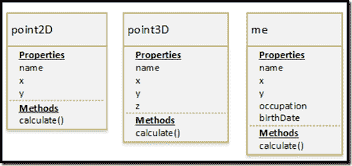

# 鸭子打字

> 原文:[https://dev.to/bardev/duck-typing-84l](https://dev.to/bardev/duck-typing-84l)

在这篇文章中，我将从动态语言(JavaScript、PHP、Python、Ruby)的角度描述 Duck Typing。

如果你读过或听说过鸭子打字，你可能会看到下面的引用:

> 如果它走路像鸭子，叫起来像鸭子，那它一定是鸭子。

如果没有上下文，这个引用没有多大意义。希望在这篇文章的最后，之前的引用会更有意义。

以下是维基百科的摘录。不了解鸭式打字，下面的节选也没有太大意义。

> Duck Typing 要求类型检查推迟到运行时，并通过动态类型或反射来实现。
> 
> Duck typing 关心的是为某种目的建立一个对象的适用性。对于普通类型，适用性假定仅由对象的类型决定。在 duck 类型化中，对象的适用性是由某些*方法和属性*(具有适当的含义)的存在决定的，而不是由对象的实际类型决定的。

[https://en.wikipedia.org/wiki/Duck_typing](https://en.wikipedia.org/wiki/Duck_typing)

### JavaScript 鸭式打字——动态语言

在下面的例子中，我们将在 JavaScript 中创建以下 3 个不同的对象

*   点 2D
*   点 3D
*   我

这三个对象都包含属性:name、x 和 y，它们还包含一个 calculate()函数。Me 对象将包括属性职业和出生日期。请参见下图，了解对象模型的可视化效果。

[T2】](http://www.bardev.com/wp-content/uploads/2016/06/image-14.png)

在下面的代码中，我创建了三个对象(point2D，point3d，me)。我还为每个对象创建了一个名为 calculate()的函数。所有对象的 calculate()函数返回一个字符串。

定义了 displayPoint()函数。这个函数可以被称为 display()。函数 displayPoint()有一个名为“Point”的参数。函数签名如下所示:

功能显示点(点)

参数名“点”没有任何意义。我可以称之为“obj”。我将函数称为“displayPoint ”,将参数称为“Point ”,因为在上下文中，该函数是为处理点而创建的。尽管我创建了 displayPoint(point)函数来处理点，但是我可以将任何类型的对象作为参数传递给该函数。

在函数 displayPoint(Point)中，代码访问对象“point”的属性“name”和方法“calculate()”。传递给函数“displayPoint”的是什么类型的对象并不重要，但是该对象必须具有属性“name”和方法“calculate()”才能无错误地运行。

这是鸭子打字。

“我”的对象是什么？是一个人还是一个点——都是，都不是？属性 x 和 y 代表什么？属性 x 和 y 可以表示一个点，但是它们也可以是指向 XY 染色体的指针(引用)。但是在方法“displayPoint”的上下文中，对象“me”以及属性 x 和 y 是点，并且被视为点。

下面这段话是有上下文的。我希望它现在更有意义。

> 如果它走路像鸭子，叫起来像鸭子，那它一定是鸭子。
> 
> ### 资源

*   【Duck Typing 如何让 C#开发者受益——Phil Haack
*   [维基百科–鸭子打字](https://en.wikipedia.org/wiki/Duck_typing)
*   [为什么是 TypeScript](https://basarat.gitbooks.io/typescript/content/docs/why-typescript.html)–参见章节:类型是结构性的

鸭子打字这个帖子最早出现在[的迈克·巴洛(巴德夫)](http://www.bardev.com)上。