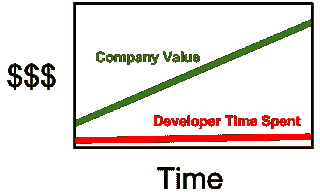

# 技术债务

> 原文：<https://dev.to/pbeekums/technical-debt>

技术债务是软件开发中经常出现的话题。从项目的角度来看，做某事宜早不宜迟。然而，这是假设所有的事情都是平等的，这是很少的情况。开发人员通常会有一个选择:短期路径或长期路径。例如，一次实施可以在 2 小时内完成一项任务。不同的实施将需要 6 个小时。然而，2 小时的实现将导致开发人员每 2 个月额外执行 10 小时的维护(以 bug 或其他开发人员混淆的形式),而 6 小时的实现则让开发团队自由而明确。技术债务之所以如此命名，是因为在开发时间支付的“利率”。

我认识一个开发人员，他试图在开始一个新项目时为自己节省 2 个小时。这种快捷方式要求在用户可以与之交互之前加载整个 web 应用程序。一开始是 30 秒(你能想象吗？！)并随着新特性的增加而稳步增长(更多的代码意味着更大的应用程序)。不仅如此，它还依赖于一个单一的二进制文件，在一个 6 人的团队中，只有一个人可以在任何时间点上工作。这是一个严重的生产力杀手。你可能会问“为什么不花两个小时来修复它？”想想一家建筑公司在摩天大楼的地基上偷工减料。然后，他们试图在整栋建筑建成后进行修复。没那么容易吧？在 6 个月的开发之后，我估计那个修复对那个团队来说是整整一个月。所有这一切都是因为一个开发人员偷懒，试图节省 2 个小时。

这可能看起来很极端，但也更接近于技术债务糟糕程度的下限。一个完整的团队可以由这样的开发人员组成，随着时间的推移，他们会迅速增加越来越多的债务。许多公司最终发现，他们必须在某一点上重建整个系统。他们的技术债务正在进行以下一项或多项操作:

*   大量的 bug，修复每个 bug 的时间非常长(例如 1 天而不是 15 分钟)
*   新功能的实施时间非常慢(几周/几个月而不是几天)
*   不能处理这么多用户，所以网站经常宕机

比你的竞争对手多花十倍的时间来开发新功能并不是成功之路，但花六个月来重建一切也不是。在这两种情况下，一家正在颠覆其行业的公司很容易被另一家公司颠覆。

出于这个原因，许多开发人员主张零技术债务，并从一开始就花尽可能多的时间来做好事情。在开始时花费在构建某个东西上的任何额外时间都将被未来节省的时间所证明是完全合理的。看到上面的案例，怎么会有人有别的想法呢？

这种观点的问题在于，它对技术债务采取了非黑即白的观点。像金融债务一样，技术债务也有各种形式和规模。有些其实挺有用的。为什么今天还有人承担金融债务？通常这是因为他们可以从债务中获得比他们支付的利息更多的钱。技术债务也是如此。以一个有 100 万美元资金的创业公司和一个每年花费 10 万美元的开发者为例。那个开发者是创业公司营运资金的 10%。现在拿一个项目来说，它可能需要 2 周时间，有很多技术债务，或者 6 周时间，几乎没有技术债务。如果 2 周的解决方案导致整个项目需要用 6 周的解决方案在一年内重做，那么公司就“浪费”了大约 12，000 美元。然而，如果一年后公司获得了 1000 万美元的资金，该怎么办？那个开发者现在是营运资本的 1%,重建特性是 0.12%。下图说明了这一点:

[T2】](https://res.cloudinary.com/practicaldev/image/fetch/s--EqVE0QPW--/c_limit%2Cf_auto%2Cfl_progressive%2Cq_auto%2Cw_880/https://2.bp.blogspot.com/-gRCR0hiGpT0/V3BEgAC-dvI/AAAAAAAAKtk/ydrBuqB7fKUDEzN9j8UpI-N7DJBKBz5fgCLcB/s320/techDebt.png)

如果这项技术有助于公司实现新的估值，那么它就成了一笔划算的交易。公司和开发人员面临的挑战是监控何时需要重新构建该特性。他们需要确保重建的成本永远不会高于从头开始构建系统的成本(就像我前面提到的情况)。如果这都是真的，该公司可以利用其增加的估值来雇佣更多的开发人员。这些开发人员可以继续快速构建功能。这弥补了分配一个开发人员在 6 周内重新构建某些东西的需要。不仅如此，最初的开发人员有 4 周的时间从最初的开发中解脱出来工作。那是花在公司不同机会上的时间。这些机会还可能进一步提高公司的估值。

另一个需要考虑的事实是，并非所有的功能都是成功的。这就是公司进行 A/B 测试的原因(一半用户看到产品的“A”版本，另一半用户看到“B”版本)。A/B 测试的目的是在向所有人推出新版本的产品之前，看看用户是否真的会更喜欢它。如果测试结果不支持新版本，那么要么有新的修订，要么就被抛弃。花大量的工程时间去润色一些可能会被扔掉的东西有什么意义呢？这些时间可以用来进行更多的 A/B 测试或其他项目。当一个开发团队知道它将会成功时，就是完善构建一个特性的技术的时候了。

关于技术债务，我能说的最后也是最重要的一点是: **工程师写的每一行代码都是某种形式的技术债务。**

技术债务是指写出来的代码没有想象中的那么好。然而，什么定义了“尽善尽美”？这是否意味着开发人员在编写它一年后仍然对它 100%满意？我认为，如果开发人员想不出更好的解决方案，他们在那一年里没有学到多少东西。这是发展中不可避免的事实。无论开发人员在编写代码时投入了多少精力，他们最终都会不满意。那是学习的标志。许多开发人员，包括我自己，在他们职业生涯的早期花费了太多的时间试图让事情变得“完美”。几个月后失望接踵而至，因为我们已经成长为开发人员。那些“完美”的代码突然看起来像垃圾。任何复杂的代码在很长一段时间内被认为是原始的唯一方法是代码的作者停止思考改进的方法。编写尽可能好的代码只在某个时刻有价值。当那一刻过去时，这些代码将成为技术债务。