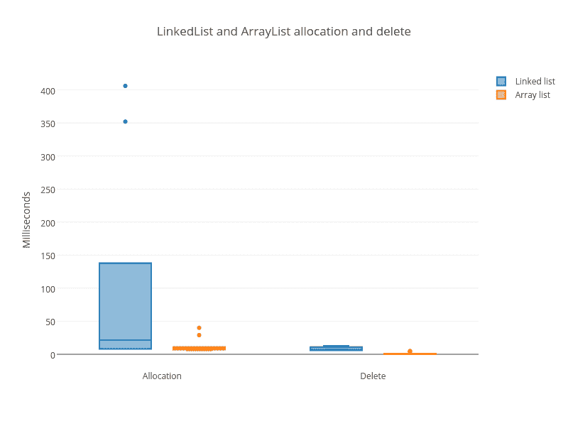
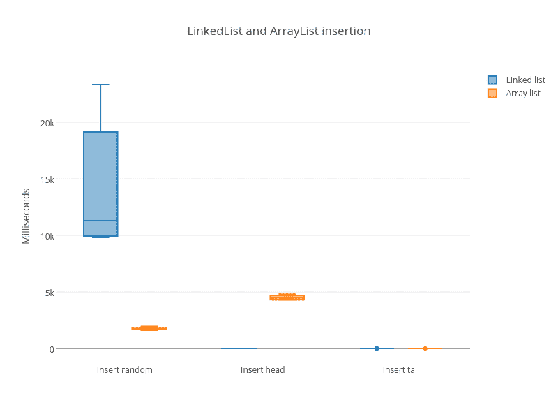
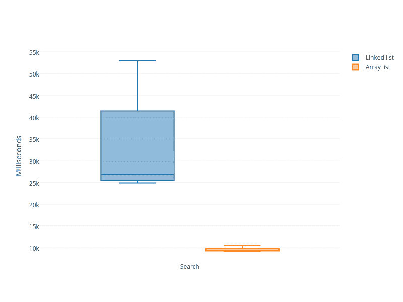

# 关于动态数组

> 原文:[https://dev.to/dzeban/on-dynamic-arrays-11kf](https://dev.to/dzeban/on-dynamic-arrays-11kf)

我在读 Skiena 的《算法设计手册》，顺便说一下，这是一本很棒的书，我碰到了链表和数组的比较(第 3.1.3 章):

```
The relative advantages of linked lists over static arrays include:
• Overflow on linked structures can never occur unless the memory is actually full
• Insertions and deletions are simpler than for contiguous (array) lists.
• With large records, moving pointers is easier and faster than moving the items themselves.

while the relative advantages of arrays include:
• Linked structures require extra space for storing pointer fields.
• Linked lists do not allow efficient random access to items.
• Arrays allow better memory locality and cache performance than random pointer jumping. 
```

<svg width="20px" height="20px" viewBox="0 0 24 24" class="highlight-action crayons-icon highlight-action--fullscreen-on"><title>Enter fullscreen mode</title></svg> <svg width="20px" height="20px" viewBox="0 0 24 24" class="highlight-action crayons-icon highlight-action--fullscreen-off"><title>Exit fullscreen mode</title></svg>

斯基纳先生给出了一个全面的比较，但不幸的是没有足够强调最后一点。作为一名系统程序员，我知道内存访问模式、有效的缓存和利用 CPU 管道是可以的，而*是*游戏规则的改变者，我想在这里说明一下。

让我们做一个简单的测试，比较链表和动态数组数据结构在插入和搜索等基本操作上的性能。

我将使用 Java 作为完美的计算机科学游乐场工具。在 Java 中，我们有`LinkedList`和`ArrayList`——分别对应实现链表和动态数组的类，并且都实现了同一个`List`接口。

我们的测试将包括:

1.  通过插入一百万个随机元素来分配。
2.  在任意位置插入 10 000 个元素。
3.  在头部插入 10 000 个元素。
4.  在尾部插入 10 000 个元素。
5.  寻找一万个随机元素。
6.  删除所有元素。

来源是我在 [`ds/list-perf`方向](https://github.com/dzeban/cs/tree/master/ds/list-perf)的 CS 游乐场。有 Maven 项目，你只要做`mvn package`就能得到一个 jar。测试非常简单，例如，这里是随机插入测试:

```
package com.dzyoba.alex;

import java.util.List;
import java.util.Random;

public class TestInsert implements Runnable {
    private List<Integer> list;
    private int listSize;
    private int randomOps;

    public TestInsert(List<Integer> list, int randomOps) {
        this.list = list;
        this.randomOps = randomOps;
    }

    public void run() {
        int index, element;
        int listSize = list.size();
        Random randGen = new Random();
        for (int i = 0; i < randomOps; i++) {
            index = randGen.nextInt(listSize);
            element = randGen.nextInt(listSize);
            list.add(index, element);
        }
    }
} 
```

<svg width="20px" height="20px" viewBox="0 0 24 24" class="highlight-action crayons-icon highlight-action--fullscreen-on"><title>Enter fullscreen mode</title></svg> <svg width="20px" height="20px" viewBox="0 0 24 24" class="highlight-action crayons-icon highlight-action--fullscreen-off"><title>Exit fullscreen mode</title></svg>

它使用`List`接口工作(耶，多态！)，所以我们可以不做任何改变就通过`LinkedList`和`ArrayList`。它按照上面提到的顺序(分配- >插入- >搜索- >删除)运行几次测试，并计算所有测试结果的最小值/中值/最大值。

好了，说够了，我们开始吧！

```
$ time java -cp target/TestList-1.0-SNAPSHOT.jar com.dzyoba.alex.TestList
Testing LinkedList
Allocation: 7/22/442 ms
Insert: 9428/11125/23574 ms
InsertHead: 0/1/3 ms
InsertTail: 0/1/2 ms
Search: 25069/27087/50759 ms
Delete: 6/7/13 ms
-----------------------

Testing ArrayList
Allocation: 6/8/29 ms
Insert: 1676/1761/2254 ms
InsertHead: 4333/4615/5855 ms
InsertTail: 0/0/2 ms
Search: 9321/9579/11140 ms
Delete: 0/1/5 ms

real 10m31.750s
user 10m36.737s
sys 0m1.011s 
```

<svg width="20px" height="20px" viewBox="0 0 24 24" class="highlight-action crayons-icon highlight-action--fullscreen-on"><title>Enter fullscreen mode</title></svg> <svg width="20px" height="20px" viewBox="0 0 24 24" class="highlight-action crayons-icon highlight-action--fullscreen-off"><title>Exit fullscreen mode</title></svg>

你可以用肉眼看到`LinkedList`输了。但是让我给你看一些漂亮的方框图:

[T2】](https://res.cloudinary.com/practicaldev/image/fetch/s--Y0HtVuR_--/c_limit%2Cf_auto%2Cfl_progressive%2Cq_auto%2Cw_880/https://alex.dzyoba.com/img/dynamic-array/allocation_delete.png)

[T2】](https://res.cloudinary.com/practicaldev/image/fetch/s--Kal-xNt6--/c_limit%2Cf_auto%2Cfl_progressive%2Cq_auto%2Cw_880/https://alex.dzyoba.com/img/dynamic-array/insert.png)

[T2】](https://res.cloudinary.com/practicaldev/image/fetch/s--X3OB1hVl--/c_limit%2Cf_auto%2Cfl_progressive%2Cq_auto%2Cw_880/https://alex.dzyoba.com/img/dynamic-array/search.png)

这里是[所有测试组合](https://plot.ly/~dzeban/2/linked-list-vs-array-list/)的链接

在所有操作中，`LinkedList`烂得可怕。唯一的例外是对头部的插入，但这是对动态数组最差情况的一种玩法——它每次都必须复制整个数组。

为了解释这一点，我们将稍微深入一下实现。我将使用 Java 8 的 OpenJDK 源代码。

所以，`ArrayList`和`LinkedList`源码在[src/share/classes/Java/util](http://code.metager.de/source/xref/openjdk/jdk8/jdk/src/share/classes/java/util/)中

Java 中的`LinkedList`通过 [`Node`内部类](http://code.metager.de/source/xref/openjdk/jdk8/jdk/src/share/classes/java/util/LinkedList.java#969) :
实现为双向链表

```
private static class Node<E> {
    E item;
    Node<E> next;
    Node<E> prev;

    Node(Node<E> prev, E element, Node<E> next) {
        this.item = element;
        this.next = next;
        this.prev = prev;
    }
} 
```

<svg width="20px" height="20px" viewBox="0 0 24 24" class="highlight-action crayons-icon highlight-action--fullscreen-on"><title>Enter fullscreen mode</title></svg> <svg width="20px" height="20px" viewBox="0 0 24 24" class="highlight-action crayons-icon highlight-action--fullscreen-off"><title>Exit fullscreen mode</title></svg>

现在，让我们看看在简单分配测试中发生了什么。

```
for (int i = 0; i < listSize; i++) {
    list.add(i);
} 
```

<svg width="20px" height="20px" viewBox="0 0 24 24" class="highlight-action crayons-icon highlight-action--fullscreen-on"><title>Enter fullscreen mode</title></svg> <svg width="20px" height="20px" viewBox="0 0 24 24" class="highlight-action crayons-icon highlight-action--fullscreen-off"><title>Exit fullscreen mode</title></svg>

调用 [`add`](http://code.metager.de/source/xref/openjdk/jdk8/jdk/src/share/classes/java/util/LinkedList.java#329) 方法，调用 [`linkLast`](http://code.metager.de/source/xref/openjdk/jdk8/jdk/src/share/classes/java/util/LinkedList.java#137) 方法在 JDK:

```
public boolean add(E e) {
    linkLast(e);
    return true;
}

void linkLast(E e) {
    final Node<E> l = last;
    final Node<E> newNode = new Node<>(l, e, null);
    last = newNode;
    if (l == null)
        first = newNode;
    else
        l.next = newNode;
    size++;
    modCount++;
} 
```

<svg width="20px" height="20px" viewBox="0 0 24 24" class="highlight-action crayons-icon highlight-action--fullscreen-on"><title>Enter fullscreen mode</title></svg> <svg width="20px" height="20px" viewBox="0 0 24 24" class="highlight-action crayons-icon highlight-action--fullscreen-off"><title>Exit fullscreen mode</title></svg>

本质上，`LinkedList`中的分配是一个**恒定时间操作**。`LinkedList`类维护尾指针，所以要插入它只需分配一个新对象并更新 2 个指针。它**不应该那么慢**！但是为什么会这样呢？我们来对比一下 [`ArrayList`](http://code.metager.de/source/xref/openjdk/jdk8/jdk/src/share/classes/java/util/ArrayList.java#207) 。

```
public boolean add(E e) {
    ensureCapacityInternal(size + 1);  // Increments modCount!!
    elementData[size++] = e;
    return true;
}

private void ensureCapacityInternal(int minCapacity) {
    if (elementData == EMPTY_ELEMENTDATA) {
        minCapacity = Math.max(DEFAULT_CAPACITY, minCapacity);
    }

    ensureExplicitCapacity(minCapacity);
}

private void ensureExplicitCapacity(int minCapacity) {
    modCount++;

    // overflow-conscious code
    if (minCapacity - elementData.length > 0)
        grow(minCapacity);
}

private void grow(int minCapacity) {
    // overflow-conscious code
    int oldCapacity = elementData.length;
    int newCapacity = oldCapacity + (oldCapacity >> 1);
    if (newCapacity - minCapacity < 0)
        newCapacity = minCapacity;
    if (newCapacity - MAX_ARRAY_SIZE > 0)
        newCapacity = hugeCapacity(minCapacity);
    // minCapacity is usually close to size, so this is a win:
    elementData = Arrays.copyOf(elementData, newCapacity);
} 
```

<svg width="20px" height="20px" viewBox="0 0 24 24" class="highlight-action crayons-icon highlight-action--fullscreen-on"><title>Enter fullscreen mode</title></svg> <svg width="20px" height="20px" viewBox="0 0 24 24" class="highlight-action crayons-icon highlight-action--fullscreen-off"><title>Exit fullscreen mode</title></svg>

`ArrayList`在 Java 中确实是一个动态数组，它的大小以 1.5 递增，每递增一次初始容量为 10。还有这个`//overflow-conscious code`其实挺搞笑的。你可以在这里[读到为什么会这样](http://stackoverflow.com/questions/33147339/difference-between-if-a-b-0-and-if-a-b)

调整大小本身是通过 [`Arrays.copyOf`](http://code.metager.de/source/xref/openjdk/jdk8/jdk/src/share/classes/java/util/Arrays.java#3260) 完成的，T3 调用 [`System.arraycopy`](http://code.metager.de/source/xref/openjdk/jdk8/jdk/src/share/classes/java/lang/System.java#480) ，T5 是一个 Java *本机*方法。本地方法的实现不是 JDK 的一部分，它是一个特殊的 JVM 功能。让我们抓取 Hotspot 源代码并研究它。

长话短说——是在 [`TypeArrayKlass::copy_array`](http://code.metager.de/source/xref/openjdk/jdk8/hotspot/src/share/vm/oops/typeArrayKlass.cpp#128) 方法中调用 [`Copy::conjoint_memory_atomic`](http://code.metager.de/source/xref/openjdk/jdk8/hotspot/src/share/vm/utilities/copy.cpp#29) 。这是一个寻找对齐，即有长，整型，短和字节(未对齐)副本变量。我们来看看普通的 int 变体- [`conjoint_jints_atomic`](http://code.metager.de/source/xref/openjdk/jdk8/hotspot/src/share/vm/utilities/copy.hpp#137) ，它是 [`pd_conjoint_jints_atomic`](http://code.metager.de/source/xref/openjdk/jdk6/hotspot/src/os_cpu/linux_x86/vm/copy_linux_x86.inline.hpp#229) 的包装器。这是特定于操作系统和 CPU 的。寻找 Linux 变种我们会找到一个调用 [`_Copy_conjoint_jints_atomic`](http://code.metager.de/source/xref/openjdk/jdk8/hotspot/src/os_cpu/linux_x86/vm/linux_x86_32.s#420) 。最后一个是组装兽！

```
 # Support for void Copy::conjoint_jints_atomic(void* from,
        #                                              void* to,
        #                                              size_t count)
        # Equivalent to
        #   arrayof_conjoint_jints
        .p2align 4,,15
    .type    _Copy_conjoint_jints_atomic,@function
    .type    _Copy_arrayof_conjoint_jints,@function
_Copy_conjoint_jints_atomic:
_Copy_arrayof_conjoint_jints:
        pushl    %esi
        movl     4+12(%esp),%ecx      # count
        pushl    %edi
        movl     8+ 4(%esp),%esi      # from
        movl     8+ 8(%esp),%edi      # to
        cmpl     %esi,%edi
        leal     -4(%esi,%ecx,4),%eax # from + count*4 - 4
        jbe      ci_CopyRight
        cmpl     %eax,%edi
        jbe      ci_CopyLeft 
ci_CopyRight:
        cmpl     $32,%ecx
        jbe      2f                   # <= 32 dwords
        rep;     smovl
        popl     %edi
        popl     %esi
        ret
        .space 10
2:      subl     %esi,%edi
        jmp      4f
        .p2align 4,,15
3:      movl     (%esi),%edx
        movl     %edx,(%edi,%esi,1)
        addl     $4,%esi
4:      subl     $1,%ecx
        jge      3b
        popl     %edi
        popl     %esi
        ret
ci_CopyLeft:
        std
        leal     -4(%edi,%ecx,4),%edi # to + count*4 - 4
        cmpl     $32,%ecx
        ja       4f                   # > 32 dwords
        subl     %eax,%edi            # eax == from + count*4 - 4
        jmp      3f
        .p2align 4,,15
2:      movl     (%eax),%edx
        movl     %edx,(%edi,%eax,1)
        subl     $4,%eax
3:      subl     $1,%ecx
        jge      2b
        cld
        popl     %edi
        popl     %esi
        ret
4:      movl     %eax,%esi            # from + count*4 - 4
        rep;     smovl
        cld
        popl     %edi
        popl     %esi
        ret 
```

<svg width="20px" height="20px" viewBox="0 0 24 24" class="highlight-action crayons-icon highlight-action--fullscreen-on"><title>Enter fullscreen mode</title></svg> <svg width="20px" height="20px" viewBox="0 0 24 24" class="highlight-action crayons-icon highlight-action--fullscreen-off"><title>Exit fullscreen mode</title></svg>

重点是**不是**VM 语言更慢，而是随机内存访问会降低性能。`conjoint_jints_atomic`的本质是`rep;
smovl`。如果 CPU 真的喜欢某样东西，那就是`rep`指令。为此，CPU 可以进行流水线操作、预取、缓存，并完成它的所有功能——流式计算和可预测的内存访问。只需阅读令人惊叹的[“现代微处理器。90 分钟指南！”](http://www.lighterra.com/papers/modernmicroprocessors/)。

这意味着对于应用程序来说,`rep smovl`并不是一个真正的线性操作，而是一个常数。让我们来说明最后一点。对于包含 1 000 000 个元素的列表，让我们在列表的开头插入 1 00、1 000 和 1 000 0 个元素。在我的机器上，我有下面的样本:

*   100 个测试头:[41，42，42，43，46]
*   1000 次测试头:[409，409，411，411，412]
*   10000 次测试[4163，4166，4175，4198，4204]

每增加 10 倍都会导致操作增加 10 倍，因为它是“10 * O(1)”。

有经验的开发人员是工程师，他们知道[计算机科学不是软件工程](http://www.stevemcconnell.com/psd/04-senotcs.htm)。理论上好的东西在实践中可能是错误的，因为你没有考虑到所有的因素。要在现实世界中取得成功，关于底层系统及其工作原理的知识非常重要，而且可能会改变游戏规则。

这不仅仅是我的观点，几年前 Reddit 上有一个链接- [比雅尼·斯特劳斯特鲁普:为什么你应该避免 LinkedLists](https://www.reddit.com/r/programming/comments/25xpre/bjarne_stroustrup_why_you_should_avoid_linked/) 。我同意他的观点。但是，当然要理智，不要盲目相信任何人任何事——衡量，衡量，衡量。

在这里，我想把我一直最喜欢的詹姆斯·米肯斯的《守夜人》留给你们。