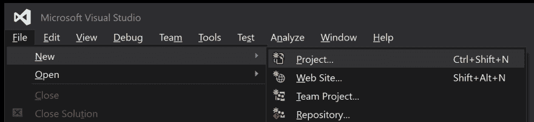
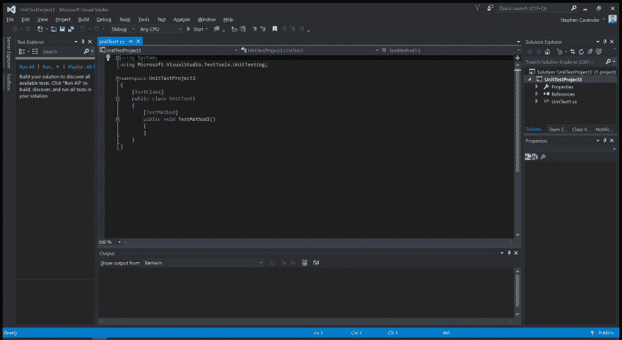
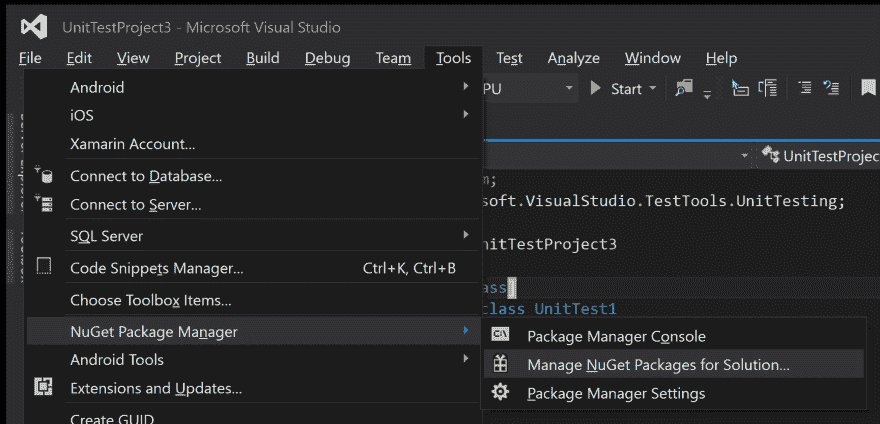

# C# Selenium MSTest 快速入门指南

> 原文：<https://dev.to/stephencavender/c-selenium-mstest-quickstart-guide-31p9>

## c#、Selenium、MSTest 入门！

在本文中，我们将使用 MSTest 和 Selenium 为 web 应用程序编写测试。这将是一个起步项目，我们可以为各种项目和未来的文章。

### 要求

在我们开始之前，以下是一些要求:

*   [Visual Studio](https://www.visualstudio.com/en-us/downloads/download-visual-studio-vs.aspx) (微软集成开发环境或 IDE)
*   nu get(Visual Studio 的一个包管理器)
*   [Selenium C#语言绑定](http://docs.seleniumhq.org/download/)(但是我们将使用 NuGet 来获取它们)
*   您想要测试的任何安装的浏览器[支持的平台](http://docs.seleniumhq.org/about/platforms.jsp)

### 硒制剂

如果你还没有通读我对 Selenium 的快速概述，你现在应该通读了。Selenium 需要配置一些东西才能发挥它的魔力！

### 创建项目

首先，我们需要一个新项目。

**文件>新建>项目**

[](https://res.cloudinary.com/practicaldev/image/fetch/s--aGNmWmnM--/c_limit%2Cf_auto%2Cfl_progressive%2Cq_auto%2Cw_880/https://www.cavender.io/asseimg/dotnet-selenium-mstest/new-project.png) 选择单元测试项目模板(**Templates>Visual c#>Test**，给它命名并配置一些选项。按“确定”创建项目。Visual Studio 将创建项目并打开您的第一个 UnitTest 类。 [](https://res.cloudinary.com/practicaldev/image/fetch/s--BMIBWHYq--/c_limit%2Cf_auto%2Cfl_progressive%2Cq_auto%2Cw_880/https://www.cavender.io/asseimg/dotnet-selenium-mstest/new-project-first-view.png)

### 导入/安装硒

现在我们需要获取 Selenium DLLs 并让我们的项目访问它们。

**工具> NuGet 包管理器>管理解决方案的 NuGet 包**

[](https://res.cloudinary.com/practicaldev/image/fetch/s--7yMrBO2s--/c_limit%2Cf_auto%2Cfl_progressive%2Cq_auto%2Cw_880/https://www.cavender.io/asseimg/dotnet-selenium-mstest/open-nuget.png) 选择浏览，搜索‘硒’，安装两个硒。WebDriver 和 Selenium。支持你的新项目。

### 写测试

现在好戏开始了；我们可以写第一个硒测试！我们将针对互联网 <sup id="fnref:theinternet">[1](#fn:theinternet)</sup> 编写我们的测试。

下面是一些放在 **TestMethod1()**
中的代码

```
//var driver = new OpenQA.Selenium.Firefox.FirefoxDriver
//var driver = new OpenQA.Selenium.Edge.EdgeDriver
//var driver = new OpenQA.Selenium.IE.InternetExplorerDriver
var driver = new OpenQA.Selenium.Chrome.ChromeDriver
{
Url = "http://the-internet.herokuapp.com/"
};
Assert.IsTrue(driver.Title == "The Internet");
driver.Dispose(); 
```

Enter fullscreen mode Exit fullscreen mode

1.  获取网络驱动程序
2.  设置 URL 属性(告诉驱动程序转到该 URL)
3.  坚持司机的头衔
4.  处理掉司机

### 运行测试

现在我们有了一个功能测试，我们可以运行它。首先，如果测试浏览器没有显示，我们需要添加它。

**测试>视窗>测试浏览器**

我们的测试结果还没出来。我们需要为它构建一个解决方案，让它认识到我们已经编写了一个它可以运行的测试。在解决方案资源管理器中右击该解决方案，并构建或重新构建该解决方案。如果构建成功，我们应该会在测试浏览器中看到我们的测试。现在，我们可以右键单击我们的测试，并告诉它运行。如果一切按计划进行，我们应该会看到一个 Chrome 窗口弹出，导航到谷歌的主页，然后关闭。

这是硒如何工作的一个基本而脆弱的例子。如果我们的断言返回 false，测试将报告一个失败，但是浏览器窗口仍然是活动的。这个测试是脆弱的，因为如果断言返回 false，它就不能在断言之后运行任何代码。我们将在以后的文章中介绍一个更好的测试方法来避免这样的事情！这绝不是最佳实践的例子。这是给你一个硒元素的例子。请继续关注更多关于如何使用 Selenium 的帖子、自动化测试的最佳实践和视频教程！

感谢阅读！如果你觉得这篇文章有帮助，一定要分享，不要犹豫，和我聊聊吧！

1.  归功于戴夫·海夫纳。↩

最初发布于 [cavender.dev](https://cavender.dev/selenium/dotnet-selenium-mstest-quickstart/)