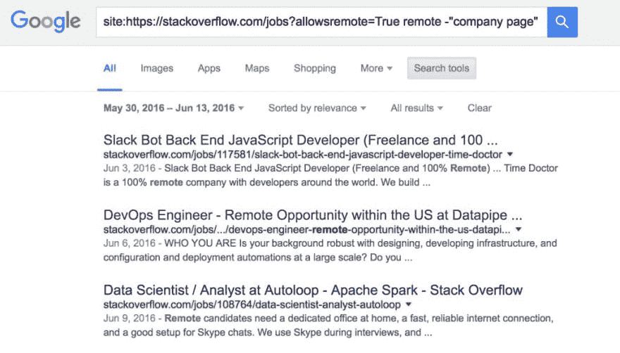
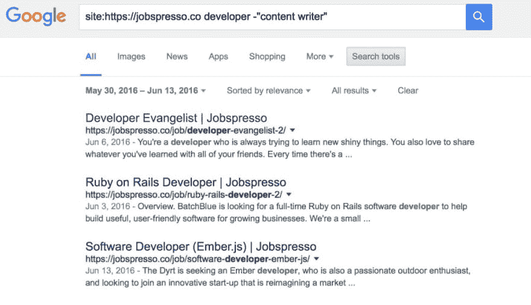

# 寻找远程开发工作的五个黑仔自定义搜索

> 原文：<https://dev.to/codingremote/five-killer-custom-searches-for-finding-remote-development-jobs>

如果你正在寻找一份远程开发工作，你可以使用谷歌的网站搜索功能，在创纪录的时间内提供有针对性的最新线索，从而节省大量时间和精力。在这个信息过载的时代，我们都不得不花费大量的时间将信号从噪音中分离出来。

通过使用我们在下面创建的自定义搜索，并根据您当前搜索的具体情况进行调整，您可以轻松跟踪最相关的线索，而不会因为定期查看多个网站而筋疲力尽。

## 为什么我要穿着睡衣工作？

一方面，它大大减少了工作中出现衣橱故障的机会。但说真的，远程工作代表着职业前景的巨大转变。随时随地工作的机会是一种奢侈，直到最近，只有某些非常成功的企业家才有。

能够跳过无聊的会议、长途通勤和不必要的办公室闲聊只是冰山一角。我们已经在我们的博客上写了很多关于这个话题的文章，但是总结一下，远程工作有可能解放人们生活中的时间和空间，这是我们每个人都拥有的最珍贵的两种商品。

## 那么它是如何工作的呢？

一旦设置了搜索字符串参数，您就可以每周运行一次搜索，并准确地查看最新的目标机会。对于那些喜欢与招聘人员一起工作的人来说，这可能是一个很好的帮助，为你提供关于市场情况的有价值的信息，不是对一般的开发者，而是对你特定的利基市场。

这能让你对求职的各个方面有更深刻的了解，比如薪资谈判，其中各种微妙的因素都会发挥作用。如果你是一个中等水平的 Rubyist，目前没有住在大城市地区，希望能够旅行和工作，这种类型的工作动态开放的角色数量应该成为你决策的重要因素。此外，通过自己的努力获得工作机会可以让你在谈判招聘人员给你提供的职位时发挥杠杆作用(反之亦然)。

## 重量级人物

下面是一个栈溢出的自定义搜索，显然是软件开发职位的最主要的工作板。我们从工作目录的站点搜索开始，使用站点自己的内部查询字符串参数来过滤远程职位。

```
site:https://stackoverflow.com/jobs?allowsremote=True remote -"company page" -"no remote" -"business intelligence" -platform
```

令人惊讶的是，这仍然导致一些非远程演出被显示，所以我们继续前进，并抛出了关键字“远程”。“公司页面”和“非远程”上的附加负面关键词匹配排除了不是工作列表页面的搜索结果。最后两次阴性匹配排除了不相关的线索。

我们之前谈到了调整这些自定义搜索的搜索参数，以符合您自己的标准。在像 Stack Overflow Jobs 这样的大型平台上，很容易深入到 Ruby、Rails、JavaScript 或 Angular 这样的术语。

[T2】](https://res.cloudinary.com/practicaldev/image/fetch/s--njLTuN5O--/c_limit%2Cf_auto%2Cfl_progressive%2Cq_auto%2Cw_880/http://www.remotecoder.net/wp-goodness/uploads/2016/06/Stack-Overflow-Remote-Best-1024x584.jpg)

## 真实的重要性

```
site:https://authenticjobs.com -intitle:"Web, Design" remote -"tech lead" -marketing -animator -"social media marketing" -"art director"
```

对于真实的工作，我们从一个“intitle:”参数的负匹配开始，删除标题中带有“Web，Design”的页面，因为这些结果是非工作列表页面。从那里，我们搜索术语“远程”,并添加几个负面匹配来区分小麦和谷壳。

[T2】](https://res.cloudinary.com/practicaldev/image/fetch/s--_nWSYS7_--/c_limit%2Cf_auto%2Cfl_progressive%2Cq_auto%2Cw_880/http://www.remotecoder.net/wp-goodness/uploads/2016/06/Authentic_Remote-1024x596.jpg)

## 我要一份咖啡和丹麦点心

```
site:https://jobspresso.co developer -"content writer"
```

接下来的三个网站专门从事远程工作，使他们更容易搜索。第一个是 Jobspresso，它把自己定位为一个求职平台，以高质量和手工策划的远程信息为特色。这表明候选人不太可能碰到已经有人的职位。

我们不确定 Jobspresso 的具体筛选过程是什么，但任何不想浪费时间的求职者都可以理解求职公告板删除已有职位的想法！

[T2】](https://res.cloudinary.com/practicaldev/image/fetch/s--uhGM0DJU--/c_limit%2Cf_auto%2Cfl_progressive%2Cq_auto%2Cw_880/http://www.remotecoder.net/wp-goodness/uploads/2016/06/expresso_remote-1024x589.jpg)

## 如果你不能 100%棒

```
site:https://www.remotelyawesomejobs.com/ developer
```

接下来，我们搜索了 Remotely Awesome Jobs，它充当了几个网站的聚合器，所有这些网站都专注于远程职位线索。聚合器可以很好地完善你的搜索，并确保没有任何相关线索被遗漏。关于高级别的远程职位，他们可能会出现在上面列出的某个招聘栏中，但是对于初级到中级的程序员来说，撒一个稍微大一点的网是有意义的。

[T2】](https://res.cloudinary.com/practicaldev/image/fetch/s--7BZqC6BT--/c_limit%2Cf_auto%2Cfl_progressive%2Cq_auto%2Cw_880/http://www.remotecoder.net/wp-goodness/uploads/2016/06/RemotelyAwesome_Remote-1024x594.jpg)

## 偏僻一点没关系...事实上

```
site:https://remoteok.io/ developer intitle:at
```

我们搜索的最后一个网站是 RemoteOK。这里，所有职务列表页面的标题中都有单词“at ”,因此有“intitle:at”参数。

[T2】](https://res.cloudinary.com/practicaldev/image/fetch/s--SJkgd1jk--/c_limit%2Cf_auto%2Cfl_progressive%2Cq_auto%2Cw_880/http://www.remotecoder.net/wp-goodness/uploads/2016/06/RemoteOk_Remote-1024x595.jpg)

## 这只是时间问题

以上所有搜索都使用了 Google 的搜索工具来选择过去 15 天的自定义日期范围。此功能只允许提供最近的列表。您可以通过单击“搜索工具”按钮，然后选择“自定义范围...”来选择自定义范围从下拉列表中。

[T2】](https://res.cloudinary.com/practicaldev/image/fetch/s--a_UHAUBL--/c_limit%2Cf_auto%2Cfl_progressive%2Cq_auto%2Cw_880/http://www.remotecoder.net/wp-goodness/uploads/2016/06/Custom-Date-1024x615.jpg)

我们希望您喜欢学习使用目标搜索来过滤远程工作机会！如果您对谷歌定制搜索或求职有任何疑问，请发送@ coding remote tweet，我们很乐意与您交谈。