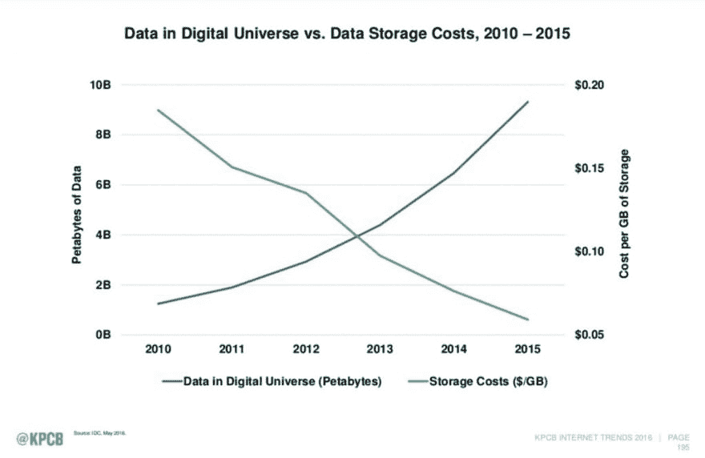
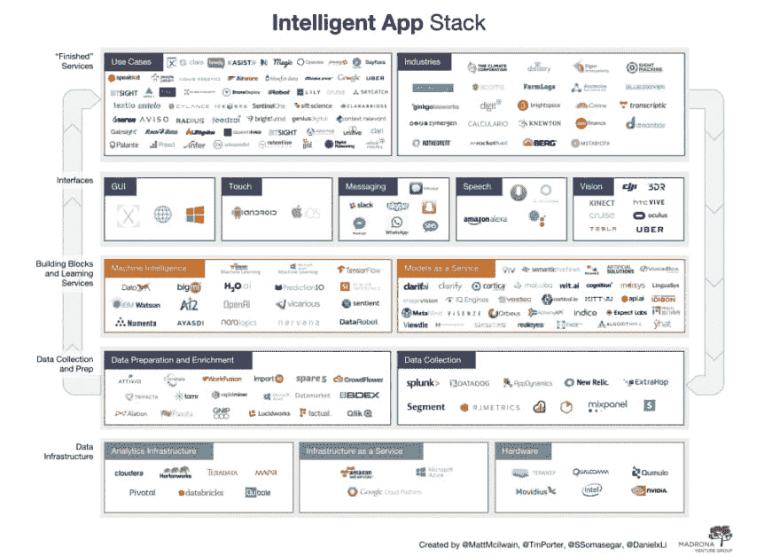
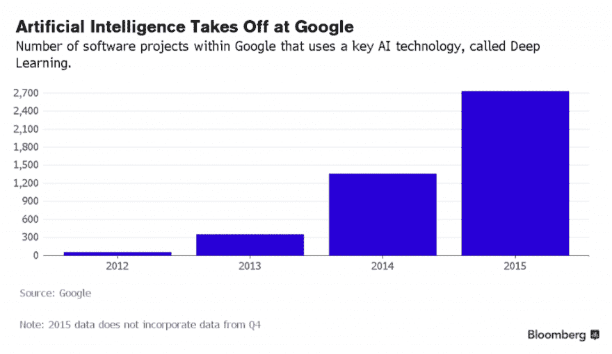

# 机器学习趋势和人工智能的未来

> 原文：<https://dev.to/algorithmia/machine-learning-trends-and-the-future-of-artificial-intelligence-2016>

每家公司现在都是数据公司，能够在云中使用机器学习来大规模部署智能应用，这要归功于三种机器学习趋势:**数据飞轮**、**、T3】算法经济** 和**云托管智能。**

这是首届机器学习/人工智能峰会的要点，该峰会由 [Madrona Venture Group](http://www.madrona.com/) *于上月在西雅图举办，100 多名专家、研究人员和记者齐聚一堂，讨论人工智能的未来、机器学习的趋势以及如何构建更智能的应用程序。

借助托管机器学习模型，公司现在可以快速分析大型复杂数据，并提供更快、更准确的见解，而无需部署和维护机器学习系统的高成本。

Madrona Venture Group 的风险合伙人 Soma Somasegar 说:“今天开发的每一个成功的新应用都将是智能应用。智能构建模块和学习服务将成为应用背后的大脑。

下面是三个机器学习趋势的概述，这些趋势导致了一个新的范式，即每个应用程序都有可能成为智能应用程序。

* * *

## 数据飞轮

数字数据和云存储遵循[摩尔定律](https://en.wikipedia.org/wiki/Moore%27s_law):世界数据每两年翻一番，而存储数据的成本以大致相同的速度下降。如此丰富的数据支持创建更多功能和更好的机器学习模型。

“在智能应用的世界里，数据将是王道，能够生成最高质量数据的服务将从其数据飞轮中获得不公平的优势——更多的数据导致更好的模型，导致更好的用户体验，导致更多的用户，导致更多的数据，” [Somasegar 说](http://techcrunch.com/2016/05/24/the-intelligent-app-ecosystem-is-more-than-just-bots/)。

 例如，[特斯拉已经收集了 7.8 亿英里的驾驶数据](http://qz.com/694520/tesla-has-780-million-miles-of-driving-data-and-adds-another-million-every-10-hours/)，并且他们每 10 小时增加 100 万英里。

这些数据被输入到 Autopilot 中，这是一个辅助驾驶程序，使用超声波传感器，雷达和摄像头来转向，改变车道，并在几乎没有人类干预的情况下避免碰撞。最终，这些数据将成为他们计划在 2018 年发布的自动驾驶汽车的基础。

相比之下，谷歌的自动驾驶程序已经积累了[刚刚超过 150 万英里的驾驶数据](https://www.google.com/selfdrivingcar/)。特斯拉的数据飞轮正在全力运转。

* * *

## 算法经济

如果你不能利用这些数据，那么世界上所有的数据都没有多大用处。算法是您有效扩展业务流程的人工管理的方式。

“这个世界上任何有规模的东西都将由算法和数据来管理，”微软数据集团和机器学习部门的首席副总裁约瑟夫·西罗什(Joseph Sirosh)表示。在不久的将来，“每一项业务都是算法业务。”

这创造了一个[算法经济](http://www.forbes.com/sites/gartnergroup/2015/08/14/big-data-fades-to-the-algorithm-economy/#15bfcbc85114)，算法市场作为研究人员、工程师和组织的全球聚会场所，大规模地创造、分享和混合算法智能。作为[可组合的积木](http://blog.algorithmia.com/2016/02/algorithm-economy-containers-microservices/)，算法可以堆叠在一起操纵数据，并提取关键见解。

 在算法经济中，[最先进的研究成果被转化为功能性的、运行的代码](http://blog.algorithmia.com/2016/03/algorithms-as-microservices/)，并提供给他人使用。智能应用程序堆栈展示了抽象层，这些抽象层构成了创建智能应用程序所需的构建模块。

“算法市场类似于创造了‘应用经济’的移动应用商店，”Gartner 的研究主管 Alexander Linden 说。“应用经济的本质是允许各类个人在全球范围内分发和销售软件，而无需向投资者推销自己的想法，或者建立自己的销售、营销和分销渠道。”

* * *

## 云托管智能

对于一家公司来说，要发现关于他们业务的见解，使用算法机器智能从他们的数据中迭代学习是唯一可扩展的方式。从历史上看，这是一项昂贵的前期投资，无法保证可观的回报。

“今天的分析和数据科学就像 40 年前的裁缝，”西罗什说。"这需要很长的时间和巨大的努力."

例如，一个组织需要首先收集定制数据，雇用一个数据科学家团队，不断开发模型，并对其进行优化，以跟上快速变化和增长的数据量—这只是开始。

 随着越来越多的数据变得可用，存储数据的成本下降，机器学习开始转向云，在那里一个可扩展的 web 服务就是一个 API 调用。数据科学家将不再需要管理基础设施或实施定制代码。系统将为他们扩展，动态生成新模型，并提供更快、更准确的结果。

“当构建和部署机器学习模型的努力变得少得多时——当你可以‘大规模制造’它时——那么做的数据就会在云中广泛可用，” [Sirosh 说](http://www.geekwire.com/2016/future-machine-learning-5-trends-watch-around-algorithms-cloud-iot-big-data/)。

托管预先训练的机器学习模型即服务的新兴机器智能平台将使公司易于开始使用 ML，允许他们快速将其应用程序从原型投入生产。

“随着公司采用微服务开发范式，即插即用不同机器学习模型和服务来提供特定功能的能力变得越来越有趣，” [Somasegar 说](http://techcrunch.com/2016/05/24/the-intelligent-app-ecosystem-is-more-than-just-bots/)。

当开源机器学习和深度学习框架在云中运行时，如 [Scikit-Learn](http://developers.algorithmia.com/algorithm-development/guides/scikit-guide/) 、 [NLTK](http://developers.algorithmia.com/algorithm-development/guides/nltk-guide/) 、Numpy、Caffe、TensorFlow、Theano 或 Torch，公司将能够轻松利用预先训练好的托管模型来标记图像、推荐产品和执行一般的自然语言处理任务。

* * *

## 机器学习趋势概述

“我们的世界观是，今天的每一家公司都是数据公司，每一个应用都是智能应用，” [Somasegar 说](http://www.geekwire.com/2016/seattle-poised-epicenter-machine-learning-artificial-intelligence/)。“公司如何从海量数据中获得洞察力并从中学习？这是世界上每个组织都必须面对的问题。”

随着数据飞轮开始转动，获取、存储和计算数据的成本将继续下降。

这创造了一种算法经济，其中机器智能的构建模块生活在云中。这些预先训练的托管机器学习模型使每个应用程序都有可能大规模利用算法智能。

数据飞轮、算法经济和云托管智能的融合意味着:

*   每个公司现在都可以成为数据公司
*   每个公司现在都可以访问算法智能
*   每个应用程序现在都可以成为智能应用程序

Madrona Venture Group 董事总经理马特麦克韦恩(Matt McIlwain)表示:“我们已经走过了漫长的道路。“但我们还有很长的路要走。”

* * *

**披露: [Madrona Venture Group 是 algorithm ia](http://www.madrona.com/portfolio-companies/algorithmia/)T3 的投资者*