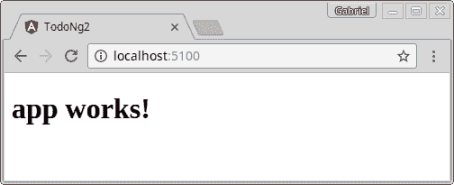

# TODO 应用程序 em Angular 2-part 1

> 原文：<https://dev.to/gabrielaraujof/todo-app-em-angular-2-parte-1-3187>

**【2016 年 9 月 16 日更新】**

[T2】](///static/f60690fc44490c25ed99369541abe0c4/6a068/asset-1.jpg)

第一次公布大约两年后，角网框架 2 作为稳定版正式推出。而且，即使在这短短的时间里，它已经占据了整个移动和桌面开发生态系统——这在最近的[【ng-conf】](https://www.youtube.com/watch?v=gdlpE9vPQFs))中得到了广泛的宣传。该框架的最新版本不仅比其前身性能更好，而且更加优化，回归了[web 组件](https://www.w3.org/wiki/WebComponents/)的理念。

在本系列文章中，我们将逐步创建用于简单任务管理的 Angular 2 应用程序。第一部分的代码可以在这里找到。

* * *

#### 创建项目

新版框架的主要工作之一是进一步简化开发人员的生活，并在社区中推广项目标准。为此，angular team 开发了一个用于创建 angular 2 应用程序的辅助工具，即[angular CLI](https://github.com/angular/angular-cli)(当前为 beta 版)。因此，我们项目的唯一前提条件是工具本身:

*   Node.js v.4+

没别的了。是啊！节点是您唯一需要担心的安装依赖项。所有其他基本项目依赖项都将由 npm 管理—而且，Angular CLI 会在创建项目时为您执行并安装所有这些依赖项。那就不要再谈了，让我们开始我们的项目吧。但在此之前，我们安装了角 CLI:

```
 npm install -g angular-cli 
```

有了 CLI，我们可以用它的命令 ***【新】*** *:*
来创建我们的第一个项目

```
 ng new todo-ng2 
```

将创建一个名为*【todo-ng 2】*的目录，并在其中创建初始项目结构。还将通过 npm 自动安装所有项目相关性。此步骤可能需要几分钟时间，因此请耐心等待，以便下载并安装依赖项。

#### 项目结构

为项目创建的结构应如下所示:

```
 todo-ng2/

|- e2e/

|- src/

| |- environments/ 

| |- app/

| |- shared/

| |- ...

| |- todo-angular2.component.css

| |- todo-angular2.component.html

| |- todo-angular2.component.spec.ts

| |- todo-angular2.component.ts

| |- ...

| |- index.html

| |- styles.css

| |- main.ts

| |- tsconfig.json

|- ...

|- angular-cli.json

|- package.json 
```

我们最初的重点将是目录***【src/***，因为这是应用程序构建过程中使用的主要文件所在的位置，也就是部署过程中进入服务器的所有内容。在***【src/***的根目录下，我们有一些重要的档案。他们是:

*   ***index.html*** :我们应用程序的主页。
*   ***main.ts*** :负责启动申请。
*   ***styles.css*** :应用全局样式表。
*   ***tsconfig . JSON***:type script 编译设置。

*注:这些文件的应用程序配置和内容超出了本帖子的范围。现在，我们将在创建项目时使用 Angular CLI 预定义的设置。*

大部分时间，我们将致力于***【src/app/***，因为这是我们的角度代码(组件、服务、准则、管道、模板……)。在***【src/app/***内，我们有一些文件定义了我们应用程序的根组件:

*   ***全角 2 .分量. ts*** :分量的定义。
*   *:模板工具。*
**   ***todo-angular 2 . component . CSS***:folha de estilo utilidada pelo componente。*   ***全角型 2.component.spec.ts*** :组件单元测试。*

 *pela angular cli 生成的文件夹和文件结构遵循 corner CLI 自己创建的“[angular 2 style guide”](https://angular.io/styleguide)，我强烈建议您阅读！

#### 执行项目

现在我们来测试一下我们的设计，看看是否一切正常。为此，我们使用角 CLI 命令*:* 

```
 ng serve 
```

访问位于 [https://localhost:5100](https://localhost:5100) 的应用程序，如果一切正常，则显示的页面如下所示:

[T2】](///static/ced2941ac250107f9c6609a44ca7d368/08115/asset-2.png)

在下一篇文章中，我们将详细介绍 Angular 2 组件，并创建应用程序的第一个功能。到时候见！

* * *

#### 走得更远

*   [5 分钟快速启动](https://angular.io/docs/ts/latest/quickstart.html)
*   [角度 CLI](https://github.com/angular/angular-cli)**