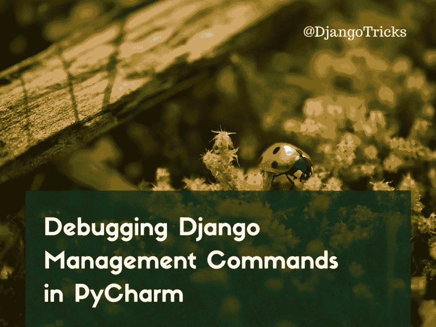
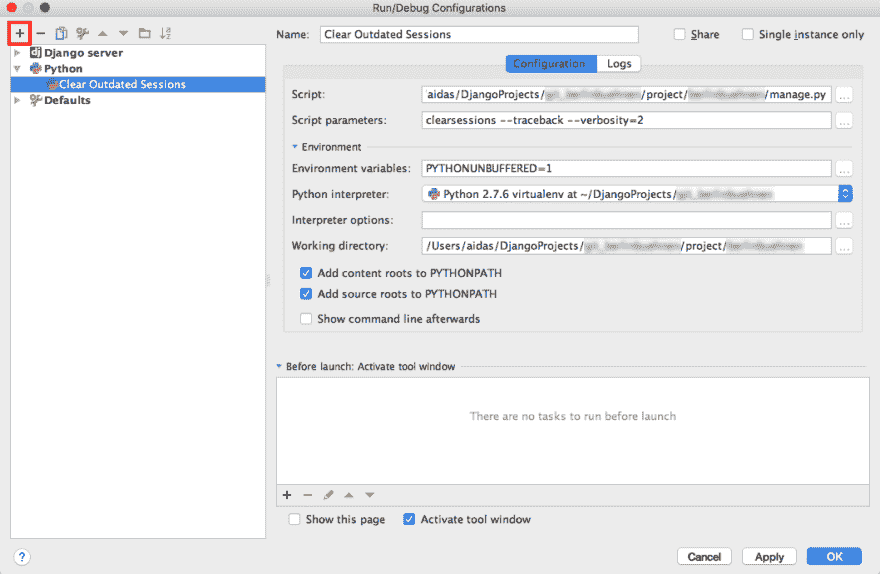
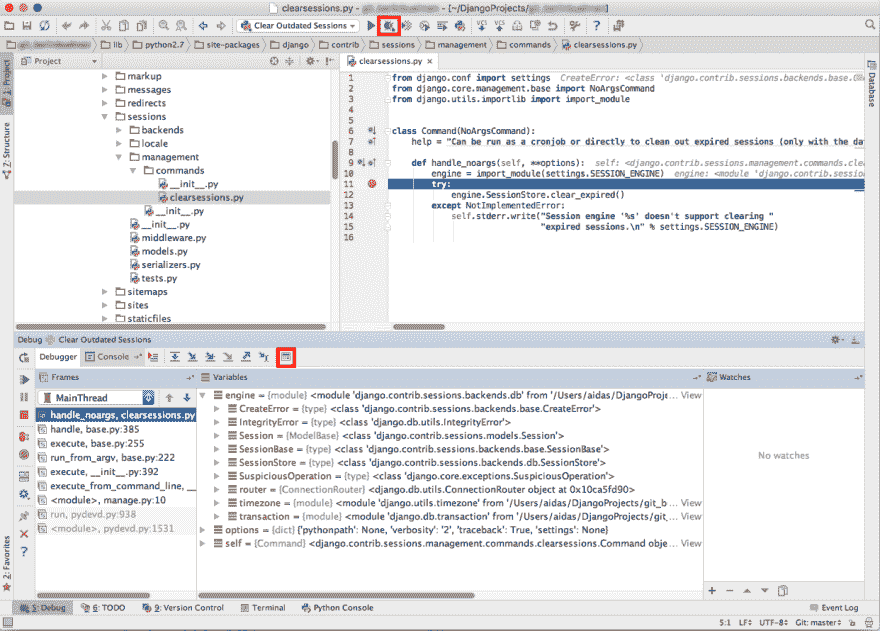
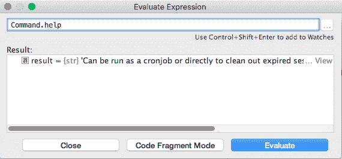

# 在 PyCharm 中调试 Django 管理命令

> 原文:[https://dev . to/django tricks/debugging-django-management-commands-in-py charm](https://dev.to/djangotricks/debugging-django-management-commands-in-pycharm)

[T2】](https://res.cloudinary.com/practicaldev/image/fetch/s--8dZAH2_R--/c_limit%2Cf_auto%2Cfl_progressive%2Cq_auto%2Cw_880/https://3.bp.blogspot.com/-k9c5SDqv8-k/WFCk9yVTdGI/AAAAAAAABwE/xo8B7TUEQI4OG48aU3-v7YAiNIVZBy62wCPcB/s1600/Debugging%252BDjango%252BManagement%252BCommands%252Bin%252BPyCharm.png)

我最喜欢的 Python 项目编辑器是 PyCharm。除了[编辑代码](http://djangotricks.blogspot.de/2013/09/7-powerful-features-of-pycharm-editor-i.html)之外，它还允许您在同一个窗口中检查数据库、使用 Git 存储库、运行管理命令、执行 bash 命令和 Python 脚本以及调试代码。在本文中，我将向您展示如何在 PyCharm 中可视化地设置断点和调试 Django 管理命令。

Django 管理命令是可以在 Django 项目上执行的脚本，用于处理项目数据库、媒体文件或代码。Django 本身有一堆命令，比如:`migrate`、`runserver`、`collectstatic`、`makemessages`和`clearsessions`。管理命令可以这样执行:

```
(myproject_env)$ python manage.py clearsessions 
```

<svg width="20px" height="20px" viewBox="0 0 24 24" class="highlight-action crayons-icon highlight-action--fullscreen-on"><title>Enter fullscreen mode</title></svg> <svg width="20px" height="20px" viewBox="0 0 24 24" class="highlight-action crayons-icon highlight-action--fullscreen-off"><title>Exit fullscreen mode</title></svg>

如果你想在你的项目中创建一个定制的管理命令，你可以在官方 Django 文档中找到如何做。你也可以在《Django Cookbook -第二版[Web 开发的*第九章*中找到一些实际的例子。](https://www.packtpub.com/web-development/web-development-django-cookbook-second-edition)

在这个例子中，我不会创建任何新的管理命令，但是会调试来自 Django 的位于`django/contrib/sessions/management/commands/clearsessions.py`的`clearsessions`命令。

首先，让我们单击“编辑配置...”在顶部工具栏中，运行按钮(带有播放图标)之前。在打开的对话框“运行/调试配置”中，点击“添加新配置”按钮(带有加号图标)并选择“Python”。

让我们用这些值填充配置:

```
Name: Clear Outdated Sessions
Script: /Users/me/DjangoProjects/myproject\_env/project/myproject/manage.py
Script paramethers: clearsessions --traceback --verbosity=2
Python interpreter: Python 2.7.6 virtualenv at ~/DjangoProjects/myproject\_env
Working directory: /Users/me/DjangoProjects/myproject\_env/project/myproject/ 
```

<svg width="20px" height="20px" viewBox="0 0 24 24" class="highlight-action crayons-icon highlight-action--fullscreen-on"><title>Enter fullscreen mode</title></svg> <svg width="20px" height="20px" viewBox="0 0 24 24" class="highlight-action crayons-icon highlight-action--fullscreen-off"><title>Exit fullscreen mode</title></svg>

[T2】](https://3.bp.blogspot.com/-u8baIcTnHwk/Vz4goxWjkNI/AAAAAAAABsk/MSuysY8Kg6AlOe3qcvsp47J2E6FV90dGQCLcB/s1600/1.setting_executable_python_script.png)

然后用管理命令`django/contrib/sessions/management/commands/clearsessions.py`的定义打开文件。单击编辑器的左侧空白添加一个断点(用红色圆圈标记),脚本应在该处停止执行以进行检查。

通常，要运行这个脚本，您可以单击运行按钮(带有播放图标)。但是当我们想要调试脚本时，我们将单击工具栏中的 debug 按钮(带有 bug 图标)。

[T2】](https://2.bp.blogspot.com/-RV3oaSW6ZyM/Vz4gowVfXaI/AAAAAAAABsg/MS8uCiywY-YfWGl83rbRtDJCulVs_7_qACLcB/s1600/2.debugging.png)

脚本将开始执行，并在您设置的断点处暂时停止。默认情况下，您可以在窗口底部打开的调试面板中检查所有局部变量。

您可以使用箭头按钮“单步执行”、“单步执行”等来浏览代码执行。要评估局部或全局变量或值，请单击“评估表达式”按钮(带有计算器图标)并输入一些 Python 代码。

[T2】](https://2.bp.blogspot.com/-L4101od4F-0/Vz4gokzOUPI/AAAAAAAABsc/HeM6VDgISg4uI30dilwxudWY6gDL5JgxwCLcB/s1600/3.inspecting_variables.png)

当你准备好时，点击“恢复程序”按钮(带有快速播放图标)继续执行脚本。

类似地，您可以通过在调试模式下运行开发服务器(“Django 服务器”)来调试您的模型、视图、表单或中间件。

*本帖最初发表于[djangotricks.blogspot.com](http://djangotricks.blogspot.com/2016/05/debugging-management-commands-in-pycharm.html)T3】*