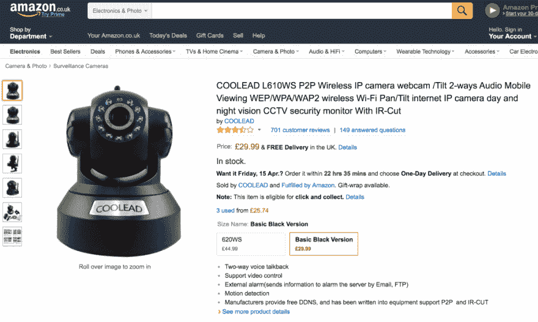
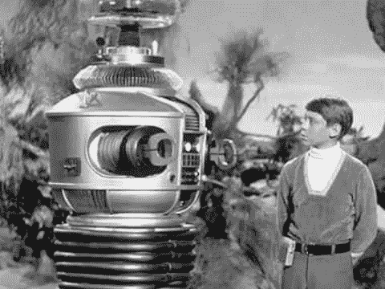
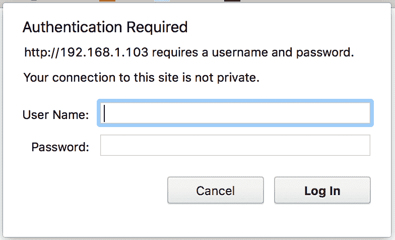
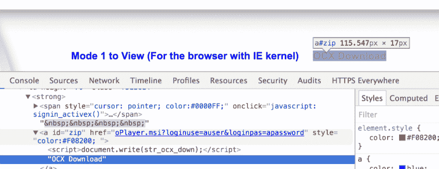
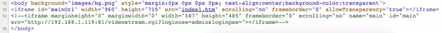
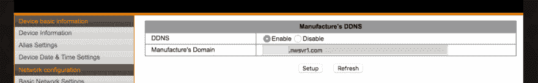
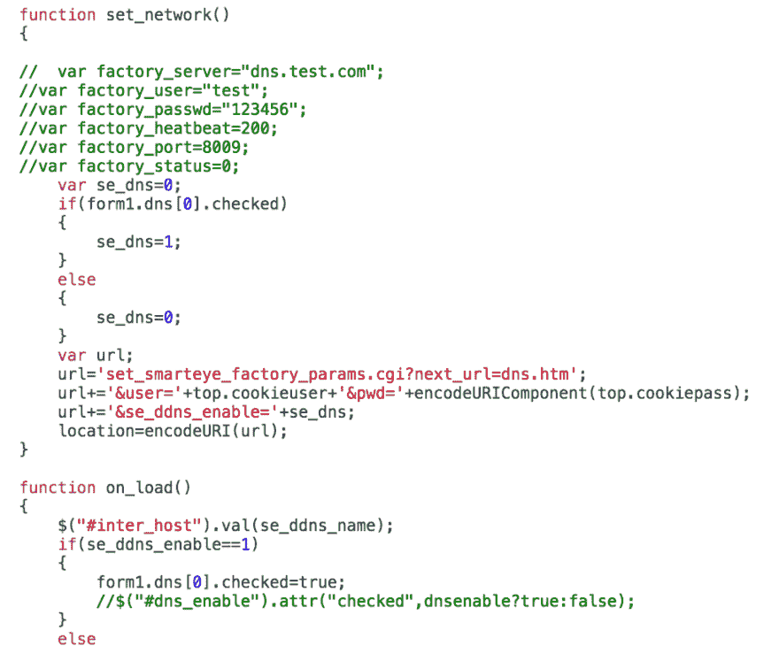

# 摔跤控制我的网络摄像头

> 原文:[https://dev . to/Neil Bartley/摔跤控制我的网络摄像头-3c6m](https://dev.to/neilbartley/wrestling-control-of-my-webcam-3c6m)

这篇文章最初出现在我的个人博客上。这些设备肯定还在使用，所以这些信息仍然是相关的。

几个月[现在是几年]前，我从亚马逊订购了一个普通的 IP 网络摄像头。第二天一辆酷派 L610WS 到了。购买的原因是作为我们新女儿的婴儿监视器。

[T2】](https://res.cloudinary.com/practicaldev/image/fetch/s--A0IifyJe--/c_limit%2Cf_auto%2Cfl_progressive%2Cq_auto%2Cw_880/https://cdn-images-1.medium.com/max/1024/1%2AkkWeGulyDlzNHJCbsQKQfQ.png)

### 多疑多了？

关于像这种网络摄像头这样的物联网设备的安全性，已经有了很多讨论。这甚至突破了极客网站的限制，进入了[主流媒体](https://www.theguardian.com/technology/2016/jan/25/search-engine-lets-users-find-live-video-of-sleeping-babies)。

当我购买这个设备时，我就知道它不安全。我的观点是，保护它只是更改默认密码和更新配置的问题——就像我在购买的任何设备上做的那样。

事实并非如此，我挖掘得越多，发现的失败就越多。

#### 危险！

<figure> 

<figcaption>【我也用 telnetd】</figcaption>

</figure>

*   如果你只是插上电源使用，这个网络摄像头是非常不安全的。
*   就算你花点时间更新密码和配置，也好不到哪里去。
*   固件和设置看起来没有任何形式的质量控制。
*   默认情况下，这个摄像头可以直接从互联网上访问，由于一些坏代码，不能被禁用。

#### 外部访问

为了使人们能够在家庭网络范围之外轻松查看网络摄像头，这些类型的设备通常提供了许多选项:

*   网络摄像头将使用 p2p 系统，并通过 [UPnP](https://en.wikipedia.org/wiki/Universal_Plug_and_Play) 打开路由器上的端口。
*   您可以将图像上传到 FTP 站点。
*   你可以通过电子邮件发送图像。
*   文档会建议打开路由器上的端口以允许访问。
*   动态域名服务(DDNS)将确保您始终可以连接，即使您的路由器改变 IP。
*   一个更可怕的选择是，网络摄像头会将图像/视频上传到制造商的服务器上，供你从他们的网站上观看。

我的网络摄像头提供 p2p 系统、动态名称服务、FTP 上传和电子邮件。

### 软件

#### 浏览器

插上网络摄像头，浏览 IP 地址，我看到了一个标准的 HTTP 认证屏幕。

[T2】](https://res.cloudinary.com/practicaldev/image/fetch/s--yNKMGI3Z--/c_limit%2Cf_auto%2Cfl_progressive%2Cq_auto%2Cw_880/https://cdn-images-1.medium.com/max/784/1%2Aicp_rxzEAYSzVJD58HzpOA.png)

注意“您与此站点的连接不是私人的”。这意味着您的用户名和密码以明文形式通过网络(或互联网)发送，很容易被拦截。

认证后，你会看到许多选项来查看你的相机基于你的操作系统/浏览器(即，而不是 IE，移动)。

[T2】](https://res.cloudinary.com/practicaldev/image/fetch/s--85rAbH0r--/c_limit%2Cf_auto%2Cfl_progressive%2Cq_auto%2Cw_880/https://cdn-images-1.medium.com/max/1024/1%2ARMR-TgQid090L7-rzwZ33A.png)

IE 选项通过一个链接提供一些软件的下载，这个链接包含了你的用户名和密码。我不会去任何与这个摄像头捆绑在一起的软件——我不需要它，也不会信任它。

到目前为止，我还没有看到对这个软件有任何信心。让我们来看看显示网络摄像头视频/图像的页面:

[T2】](https://res.cloudinary.com/practicaldev/image/fetch/s--ZBrw11zO--/c_limit%2Cf_auto%2Cfl_progressive%2Cq_auto%2Cw_880/https://cdn-images-1.medium.com/max/1024/1%2ANP6tY5PwGsaPUhEc23mS2A.png)

这看起来像注释掉的开发代码。它还泄露了默认的管理员用户和密码( *admin，*无密码)。

#### 配置

我尝试锁定此设备上的 DDNS 配置，但我不能。选项是有的，但是我的选择没有被执行，甚至在点击了两个标签错误的按钮后都没有被保存。

[T2】](https://res.cloudinary.com/practicaldev/image/fetch/s--7neLyzPy--/c_limit%2Cf_auto%2Cfl_progressive%2Cq_auto%2Cw_880/https://cdn-images-1.medium.com/max/1024/1%2A2GRnHZ4XY7SRehf5VcfhAg.png)

查看源代码可以看到更多注释掉的代码，这次是 JS。

[T2】](https://res.cloudinary.com/practicaldev/image/fetch/s--iBztmaVR--/c_limit%2Cf_auto%2Cfl_progressive%2Cq_auto%2Cw_880/https://cdn-images-1.medium.com/max/1024/1%2AB9hXqy19cf-kcPqRMlX8qw.png)

多亏了这个代码片段，下面的请求*将*禁用 DDNS。但是我不信任这个设备。