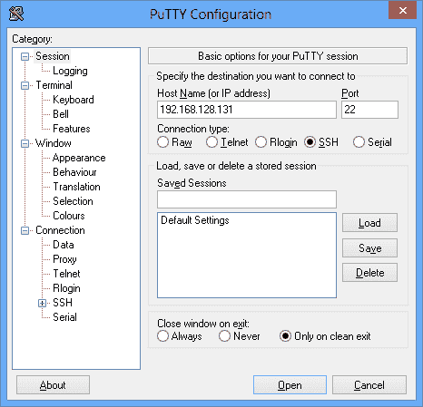
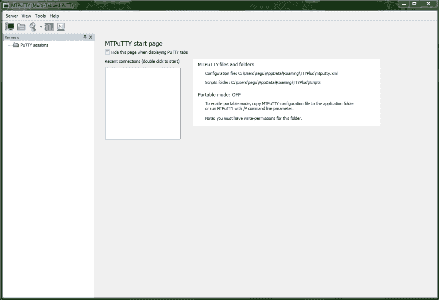
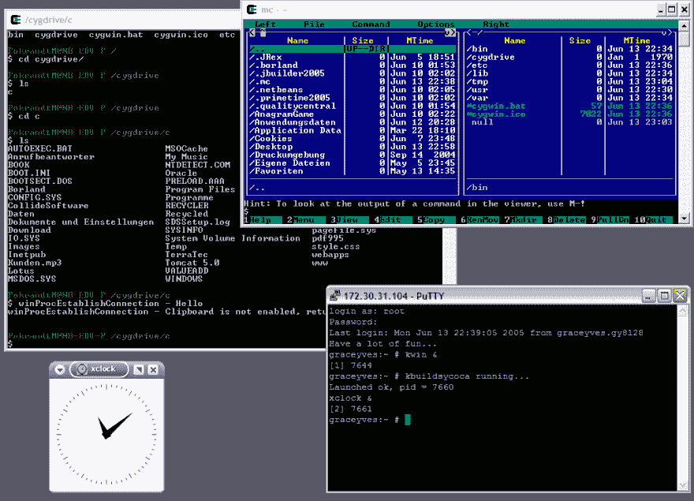
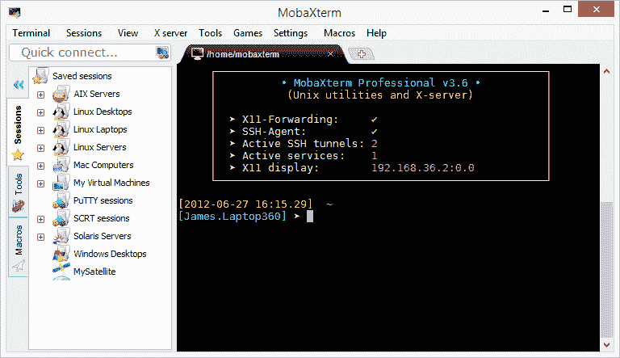
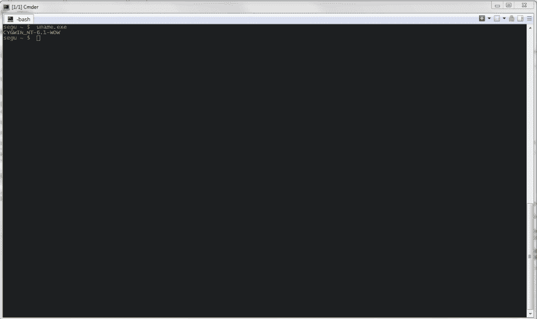

# 从 Windows 工作站管理 linux 服务器

> 原文:[https://dev . to/rnd MH 3 ro/manage-Linux-servers-from-a-windows-workstation-5hij](https://dev.to/rndmh3ro/manage-linux-servers-from-a-windows-workstation-5hij)

**编辑**:本文首发于 2016 年。截至 2019 年，我仍然必须在工作中使用 Windows，但现在我只是将 WSL 与 wsltty 一起使用。

在工作中，我不得不在我的工作站上使用 Windows 作为操作系统，尽管我几乎只管理 linux 服务器。从 Windows 通过 SSH 连接到 linux 服务器有很多方法，我会告诉你我的方法。

我(当然)从 [PuTTY](http://www.putty.org/) 开始，这无疑是最著名的 windows ssh 客户端。很快我就注意到了一些限制，比如缺少选项卡式界面(没有什么比任务栏中有 20 个 putty 窗口更糟糕的了)，没有(有用的)会话管理，通过 GUI 进行繁琐的配置，或者默认情况下没有可移植性(putty 将会话存储在注册表中)。所有这些问题以及更多的问题让我寻找替代方案。

[T2】](https://res.cloudinary.com/practicaldev/image/fetch/s--J54NT75m--/c_limit%2Cf_auto%2Cfl_progressive%2Cq_auto%2Cw_880/https://www.zufallsheld.img/cmder/putty.png)

对我来说，要解决的最重要的“问题”是我开始喜欢上火狐浏览器时丢失的标签。有几个程序为 Putty 提供了一个包装器，以便与选项卡一起使用:SuperPuTTY、PuTTY Manager 或 MTPuTTY。

[T2】](https://res.cloudinary.com/practicaldev/image/fetch/s--HjP6lcVo--/c_limit%2Cf_auto%2Cfl_progressive%2Cq_auto%2Cw_880/https://www.zufallsheld.img/cmder/mtputty.png)

当时我的第一选择是 [MTPuTTY](http://www.ttyplus.com/multi-tabbed-putty/) ，一个满足了我多年需求的工具。直到我有了一台笔记本电脑作为我的主要工作站。使用它，MTPuTTY 有一个(可重现的)错误，当你在 PuTTY 窗口上向下移动光标时，窗口会随着你的光标向下移动，即使它是全屏的。也因为不是开源的，软件的作者没有回复我的联系尝试，我不得不寻找一个替代方案。

在使用 PuTTY 之前，我已经在几年前使用了 cygwin。Cygwin 是“Windows 上 GNU 和开源工具[…]的集合”。cygwin 的安装和配置对用户来说不是很友好，需要做很多改动，所以我一直不习惯。即使是我在 MTPuTTY 之后最后一次有效使用 cygwin 的尝试也不令人满意。

[T2】](https://res.cloudinary.com/practicaldev/image/fetch/s--eE6Ojt8P--/c_limit%2Cf_auto%2Cfl_progressive%2Cq_auto%2Cw_880/https://www.zufallsheld.img/cmder/cygwin.png)

接下来，我尝试了 mobax term T1，这是一个宣传自己具有内置 Xserver、标签、SFTP 和便携性等功能的程序。一开始我真的很喜欢 MobaXterm。但功能范围占了上风，与 MTPuTTY 和其他软件相比，它显得迟缓和臃肿。事实上，它不是开源的，免费版本只能处理十个保存的会话，这让我的用例变得更糟。

[T2】](https://res.cloudinary.com/practicaldev/image/fetch/s--j-N22D9p--/c_limit%2Cf_auto%2Cfl_progressive%2Cq_auto%2Cw_880/https://www.zufallsheld.img/cmder/mobaxterm.png)

在我继续寻找合适的管理工具的过程中，我偶然发现了自称“你会喜欢的 windows shell”的 babun。Babun 是基于 cygwin 的，尽管它提供了比 cygwin 更方便的特性:非常容易安装(只需运行一个脚本！)，它自己的包管理器*契约*，自动更新以及开箱即用的代理和 git 支持！

[T2】](https://res.cloudinary.com/practicaldev/image/fetch/s--EcqbUREZ--/c_limit%2Cf_auto%2Cfl_progressive%2Cq_auto%2Cw_880/https://www.zufallsheld.img/cmder/babun.png)

因为您实际上是在 linux-shell 上工作，所以不需要通过 GUI 进行复杂而繁琐的会话处理。现在，我可以通过一个简单的文本文件使用内置的 ssh 及其配置。

缺少的当然是标签！幸运的是，有一些 Windows 程序可以在一个统一的界面上以标签的形式显示整个程序。 [Cmder](http://cmder.net/) 就属于这种应用。但是它能做的不仅仅是将程序显示为标签:它是一个完全成熟的 Windows 控制台模拟器(虽然我主要使用标签功能)。

最终，cmder 和 babun 之间的互动给了我以下优势，使我坚持这一组合:

*   原生 SSH
*   本地 Windows Bash-shell
*   标签！
*   自动更新
*   Git 集成
*   简单的会话处理

为了让您能从本文中学到一些东西，这里有一个关于如何设置和配置 cmder 和 babun 的简短教程:

*   取出[巴奔](https://babun.github.io/)并安装
*   提取[命令](http://cmder.net/)(使用完整版)并安装
*   使用 [Sourcecode Pro](https://github.com/adobe-fonts/source-code-pro/releases) 作为字体(可选)
*   修改配置文件
    *   。babunrc
    *   .bashrc
    *   。minttyrc
*   配置命令
    *   为 babun 创建新的启动任务
    *   任务参数:`/icon "%userprofile%\.babun\cygwin\bin\mintty.exe" /dir "%userprofile%"`
    *   命令:`%userprofile%\.babun\cygwin\bin\mintty.exe -`
    *   在“启动”>“将 babun-task 激活为自动启动任务”下的“指定的命名任务”下
*   选择配色方案(可选)
    *   从[这里](https://github.com/oumu/mintty-color-schemes)取一个并在中配置。minttyrc
*   修改 SSH-configuration(在~/中)。ssh/)
    *   生成 SSH-key 并放在这里
    *   创造。ssh/。配置并修改它

## 文章图片

*   [https://common . wiki media . org/wiki/file:putty \ _ 0.62 \ _ on \ _ windows \ _ 8 . png](https://commons.wikimedia.org/wiki/File:PuTTY%5C_0.62%5C_on%5C_Windows%5C_8.png)
*   [https://commons . wikimedia . org/wiki/File:Cygwin \ _ X11 \ _ rootless \ _ win XP . png](https://commons.wikimedia.org/wiki/File:Cygwin%5C_X11%5C_rootless%5C_WinXP.png)
*   [http://mobaxterm . mobatek . net/](http://mobaxterm.mobatek.net/)