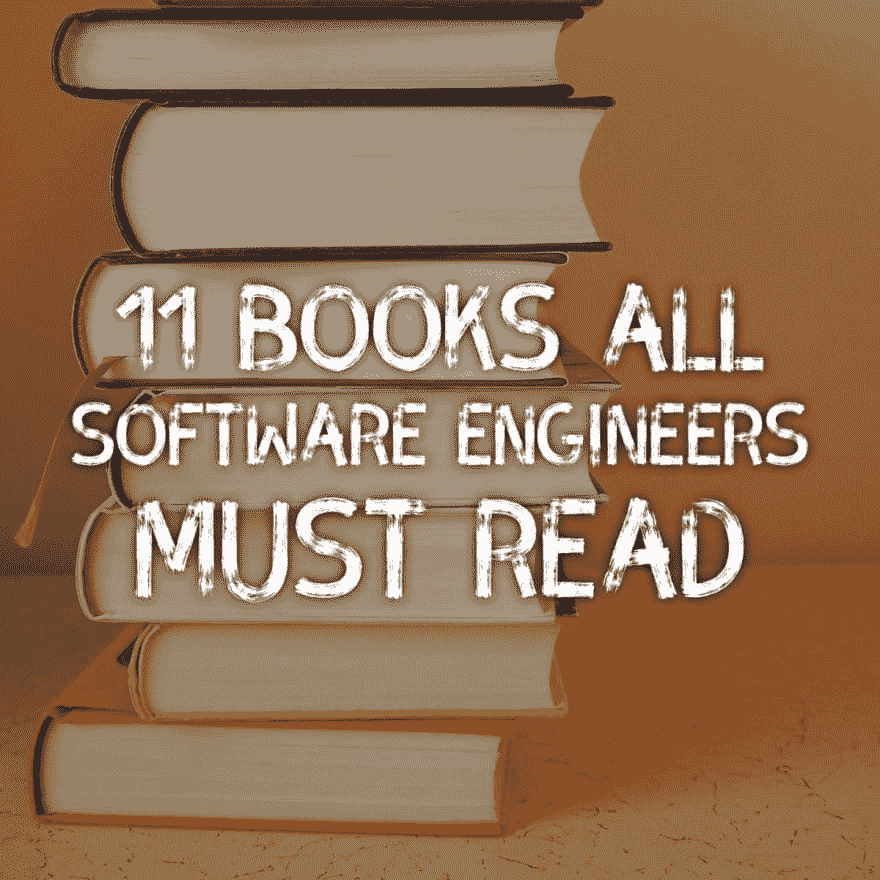

# 所有软件工程师必读的 11 本书

> 原文：<https://dev.to/lpasqualis/11-books-all-software-engineers-must-read>

这篇文章最初发表在 [CoderHood](https://coderhood.com) 上，作为所有软件工程师必读的 [11 本书](https://www.coderhood.com/11-books-all-software-engineers-should-read/)。CoderHood 是一个致力于软件工程人类层面的博客。

[T2】](https://res.cloudinary.com/practicaldev/image/fetch/s--GkiQGyod--/c_limit%2Cf_auto%2Cfl_progressive%2Cq_auto%2Cw_880/https://thepracticaldev.s3.amazonaws.com/i/flcyecnmn24pur7qj2rf.png)

当我在 1984 年开始编程时，没有多少文献可以指导我的学习道路。我的一个问题是我在意大利，我一句英语都不懂。有可能有英文书籍，但意大利语翻译的选择是不够的。我早期的大部分知识来自一些翻译的编程书籍和一些技术杂志。

在可用的意大利语译本中，我深情地记得彼得·诺顿的一些早期作品，可以从他双臂交叉的完整封面照片中辨认出来。

今天有成千上万的技术书籍，互联网是一个信息宝库。找到学习一门新语言或框架所需要的东西就像运行谷歌搜索一样简单。也有许多非技术书籍可以指导你如何作为一个开发人员在团队和软件组织的环境中很好地工作。领导原则、团队合作、开发流程、商业和一般软件行业知识对于成功的科技职业生涯非常重要，我想和你们分享一些我最喜欢的书籍，排名不分先后。

## 极端所有权:美国海军海豹突击队队员如何领先并获胜

***由[乔科·威林克](https://twitter.com/jockowillink)和[叶小开·巴宾](https://twitter.com/LeifBabin)主演。***

内心游戏对科技职业发展非常重要，这本书将帮助你实现你的目标。这本书与软件行业无关，而是与你在软件行业取得成功所需的内心对话有关。

作者之一，[乔科](https://twitter.com/jockowillink)，是地球上最恐怖的人；一名海军海豹突击队，被派往伊拉克最激烈的战场上领导布鲁瑟特遣部队。在那里，他形成了对自己所做的任何事情的结果拥有绝对所有权的心态。

这本书是把在战场上获得的智慧和原则翻译成一种可以应用于商业和生活的思维方式。对于任何想掌控自己职业道路、不再找借口的人来说，这是一本必读的书。它将改变你对待工作和生活的方式。

## Scrum:用一半的时间做两倍工作的艺术

***由[杰夫·萨瑟兰](https://twitter.com/jeffsutherland)，[JJ·萨瑟兰](https://twitter.com/jjsutherland)***

如果你的组织使用[敏捷](https://www.coderhood.com/tag/agile/)方法来开发软件，这本书适合你。如果你的组织没有遵循敏捷方法，你应该决定你是否需要改变它。这本书对这两种情况都有帮助。

它不仅是工程师和 Scrum 大师的必读之作，也是任何想了解软件是如何构建的人的绝佳书籍。它揭开了这个过程的神秘面纱，明确了一个组织能够并且应该从 Scrum 团队那里得到什么。这不是一本技术书。这不是一本只给工程师看的书。这本书是为任何想学习一种方法的人准备的，这种方法可以应用于提高任何领域和组织的团队的生产力。

这不是一个关于 Scrum 实践的详细指南，但是它将非常详细地解释为什么 Scrum 有效，为什么你应该考虑用它来指导构建软件的过程。它将帮助你形成理解 Scrum 所需的心态，并为你提供实现 Scrum 的基础。

我敏锐地意识到，并不是所有的开发人员都喜欢 Scrum 或敏捷方法，但是我发现大多数时候原因是以下一个或多个:

1.  他们不理解 Scrum，也从来没有花时间去研究它。
2.  他们以前尝试过，因为他们不得不这样做，但经过努力，他们认为这是行不通的。
3.  他们以前尝试过，尝试过，但没有给它足够的时间进入最佳状态。
4.  他们以前尝试过，尝试过，但只赞同少数原则，而忽略了其他原则。
5.  他们在团队中工作，团队中的一些人抓住每一个机会与流程抗争。
6.  他们从来没有很好地实施过。
7.  他们在团队中不能很好地发挥作用。
8.  他们觉得花在非编码活动上的时间都是浪费时间。
9.  他们不习惯计划他们的工作，任何这样做的尝试都违背了他们“边做边设计”的习惯。
10.  他们觉得自己拥有代码，不接受任何其他开发人员的帮助或合作。

我推荐你买这本书，抱着开放的心态去读，看看是否能帮你度过难关。

## 第 5 秒法则

***由[梅尔罗宾斯](https://twitter.com/melrobbins)*T5】**

这本书描述了一个非常简单的概念，但并不容易。

你知道那个决定性的时刻，当你在开会的时候，一个想法突然出现在脑海里，但是在你分享之前，你说服自己不要去想它？或者当你看到一个你认识(或想认识)的人，但劝自己不要说“嗨”的时候？或者早上闹钟响起的那一刻，你知道你需要起床，但你不想起床，按下了贪睡按钮？

这本书会告诉你关于那个时刻的一切。这本书实际上不是关于规则本身的。不要读它来学习规则！我会帮你省钱的；它是这样的:“当你有本能去实现一个目标时，你必须在 5 秒钟内行动起来，否则你的大脑会阻止你。54321 开始。好了，你拿到了。

这本书更多的是关于理解你的大脑告诉你不要为了达到目标而行动的那一刻。这是一个围绕主题的沉思，从许多不同的角度进行探讨。

通常，作者读的书的音频版本是偶然的。这部非常棒，我推荐音频版的《T1 》,因为作者是一位优秀的公共演说家，听起来她像是在和你说话，而不仅仅是在看书。

## 乔布斯

***乘***

我花了几个星期才读完它——它长达 656 页——我非常喜欢它，我相信我会再读一遍。

这本书是一个鼓舞人心的跳跃，让我了解了一个天才迷人的思想和生活，在某些方面，他让我想起了一个版本的达芬奇，他不仅在艺术、设计和工程方面有天赋，在商业方面也有天赋，并且对人们想要什么有着深刻的理解。他能够在人们知道之前看到他们需要什么，并在纯设计艺术作品中编纂他的愿景。

我向软件工程师推荐这本书，因为它展示了设计产品和理解客户的艺术。它展示了商业头脑和销售人员是如何成为产品成功的一部分的，以及像史蒂夫·乔布斯这样的人类天才有多深。

## 安静:在一个说个不停的世界里内向者的力量

***由[苏珊·凯恩](https://twitter.com/susancain)**T5】*

不是所有的开发者都是内向的人。事实上，有[调查](https://evansdata.com/reports/viewRelease.php?reportID=10)表明大多数开发人员认为自己是适度外向的。不管你认为自己是外向还是内向，这本书都会帮助你了解内向的人，以及他们是如何思考和运作的。

这本书让我对内向者和外向者之间深刻而迷人的差异，这两个极端之间的连续性以及其中的巨大差异有了新的理解。

它“与我交谈”,因为它解释了为什么在许多同样以客户为中心的工程组织中，不同的人组成的团队(尤其是“面向客户的团队”和“面向产品的团队”)经常在非常不同的页面上，并且以非常不同的方式工作。此外，它解释了为什么这种多样性是有益的，如果你理解更深层次的差异。

如果你是父母，这本书会帮助你更好地理解你的孩子；至少我知道它帮助了我，因为我是两个非常不同类型的内向者和一个外向者的父亲。这方面的研究很多，但我所知甚少。

## 练习头脑:在你的生活中培养专注和自律——通过学会热爱过程来掌握任何技能或挑战

***由[托马斯·m·斯特恩](https://twitter.com/practicingmind)**T5】*

软件开发需要不断学习新技术、语言、框架、思想流派、过程和技能。它永远不会结束，也永远不会结束。

你花了多少时间去学习如何学习？嗯，这本书描述了通过实践学习的过程。它显示了关注学习过程而不是目标如何改善学习体验，减轻学习者的压力，提高学习效果。

这本书是所有软件工程师的必读书。

## 算法赖以生存:人类决策的计算机科学

***由[布莱恩·克里斯蒂安](http://brianchristian.org/algorithms-to-live-by/)，[汤姆·格里菲斯](http://cocosci.berkeley.edu/tom/index.php)***

如果你从来没有学过计算机科学，你有没有想过计算机科学到底是怎么回事？工程师是如何思考的？为什么他们通常是优秀的问题解决者？为什么计算机科学慢慢成为基础教育的一部分？

如果你确实学习计算机科学，你可能会花很多时间思考如何将算法应用到日常生活中，而且你可能永远不会厌倦。它很有趣，也很有用。

不管怎样，这本书都是一次非技术性的旅程，探索计算机科学家对如何解决问题的研究给予我们的智慧。

## 简单规则:如何在复杂的世界里茁壮成长

***作者[唐纳德·苏尔](https://twitter.com/simple_rules)，[凯瑟琳·m·艾森哈特](https://profiles.stanford.edu/kathleen-eisenhardt)***

这本书改变了我的思维方式。读完之后，我发现自己在寻找将行为、过程和概念提炼成简单规则的方法。这是一个强大的概念，将与工程类型产生良好的共鸣。

这本书不是从头到尾超级精彩的读物，有一些不必要的部分。然而，我喜欢它的基本思想和背后的哲学，我相信它可以让所有处于职业生涯各个阶段的软件工程师受益。

## 零比一:创业笔记，或者说如何打造未来

***由[【布莱克·马斯特斯】](https://twitter.com/bgmasters)***

作者彼得·泰尔是贝宝的创始人之一，也是硅谷风险投资公司“基金”的创始人之一，该公司创办了 SpaceX 和 Airbnb 等公司。

如果用一句简短的话来表述而不添加上下文，他的观点可能相当激进:“你想尽可能地创造垄断，而竞争不利于商业。

他的观点背后的推理很有意思，这与超级成功的公司比竞争对手好得多的事实有关，因为他们并不过度担心竞争。他们花在竞争上的时间很少，大部分时间都在创新、营销和销售上。这本书详细介绍了这是如何实现的，互联网泡沫根源的一些信念的谬误，以及许多其他有趣的话题。

我发现特别有趣的一部分是销售在初创企业中的作用。泡沫时代的旧思维“如果你建造了它，他们就会来”并不太管用。这本书描述了分销的作用有多么重要，以及像史蒂夫·乔布斯这样的商业天才如何不仅掌握了预见比市场上任何其他产品都好 10 倍的产品的艺术，还掌握了创造伟大分销渠道的艺术。所有这些对你们中的许多人来说可能是“旧闻”，但它的表达方式和思想组织对我来说是非常有启发性的。

## 坚持:成功学习的科学

***由[彼得·c·布朗](http://www.petercbrown.com/)，[亨利·l·罗迪格三世](http://psych.wustl.edu/memory/roediger.html)，[马克·麦克丹尼尔](https://psychweb.wustl.edu/mcdaniel)***

这本书包含了关于我们如何学习和如何提高学习效率的有趣的研究结果。它详细介绍了交错学习、多样学习和间隔学习的优势。它对为什么“大量练习”对长期学习效果不好，为什么自我测试很重要，以及为什么学习时容易并不是更好的原因具有启发性。

它给了我一个很好的视角，为什么混合学习如此重要，为什么“平行学习”策略如此强大，为什么为标准化考试而学习不是一个好的学习方法，以及为什么操练和杀戮不是一个好的长期学习策略。

如果你认为自己是一个终身学生，如果你认为学习和保留新材料的过程是一个迷人的主题，这也是一本好书。

## 创新者:一群黑客、天才和极客如何创造了数字革命

***乘***

这本书从头到尾讲述了计算机和互联网发明背后的个人和团队的历史。它有时有点技术性，深入到它遇到的主题的一些非常有趣的细节，但绝不会太技术性，以至于非工程师无法阅读。

我最喜欢的是，它给读者带来了那些创造并最终体现了我们今天认为理所当然的技术现实的人们的斗争和个性。它展示了创新是直觉、个性、技能和个人动力综合作用的结果。它描述了实现这些直觉所需的人的因素和团队合作。它解释了为什么一个人经常推动创新，但总是需要不止一个人才能成为现实。它还显示了创新如何存在于由现有创新形成的线所创建的结构中，并且经常被多组人独立地同时发现。

个体创新者设想、计划和交付。独自一人，他们往往是有远见的天才；然而，它需要团队成员去设想、规划和向世界交付重大创新。当他们这样做时，其他人开始编织新的织物，这个过程重复进行。

## 引爆点:多么小的事情也能产生巨大的影响

***乘***

这本书是一个很好的读物，其中有一个有趣的部分是关于测试的类型，用来评估诸如“芝麻街”和“蓝色的线索与学龄前儿童”等节目的粘性。该研究的见解非常有趣，可以让软件开发人员了解创建产品路线图的过程。

* * *

### 如果你喜欢这篇文章，请保持联系！

*   在 CoderHood 上找到我所有的帖子。不要忘记订阅邮件来接收新帖子的通知。
*   在 LinkedIn 上加入我的职业网络。
*   在推特上关注我。
*   加入我的脸书主页。
*   最后，请在 dev.to 上关注我！