# 11 个反应实例

> 原文：<https://dev.to/drminnaar/11-react-examples-2e6d>

## 总结

在这篇文章中，我展示了我最近创建的 11 个 React 项目，目的是帮助那些 React 新手开始工作。这不是教程。相反，这是一个通过示例学习的项目参考。

这些项目如下所示:

1.  [启动器](https://github.com/drminnaar/react-starter)
2.  [点击器](https://github.com/drminnaar/react-clicker) - [现场演示这里](http://react-clicker.drminnaar.me)
3.  [基础时钟](https://github.com/drminnaar/react-clock-basic) - [现场演示这里](http://react-clock-basic.drminnaar.me)
4.  [基本计时器](https://github.com/drminnaar/react-timer-basic) - [现场演示在这里](http://react-timer-basic.drminnaar.me)
5.  [高级计时器](https://github.com/drminnaar/react-timer-advanced) - [现场演示在这里](http://react-timer-advanced.drminnaar.me)
6.  [电影卡](https://github.com/drminnaar/react-movie-cards) - [现场试玩这里](http://react-movie-cards.drminnaar.me)
7.  [摄魂师](https://github.com/drminnaar/react-masterminds) - [现场试玩在这里](http://react-masterminds.drminnaar.me)
8.  [标准计算器](https://github.com/drminnaar/react-calculator-standard) - [现场演示在这里](http://react-calculator-standard.drminnaar.me)
9.  [比特币监视器](https://github.com/drminnaar/react-bitcoin-monitor) - [现场演示这里](http://react-bitcoin-monitor.drminnaar.me)
10.  [标准天气监测](https://github.com/drminnaar/react-weather-standard) - [现场演示在这里](http://react-weather-standard.drminnaar.me)
11.  [NoteWorx React](https://github.com/drminnaar/noteworx-react-mongodb)

第 11 个项目代表了一个更高级的 React 项目，因此与本文中其他 10 个项目的简单性有些不同。这是我正在制作的另一个系列的一部分。

## 更新

*   [2018 年 1 月 3 日] -根据反馈，在项目现场演示中添加了链接。

## 项目

我已经创建了 11 个不同复杂程度的 React 项目。每个项目虽然不同，但总会表现出以下共同特征:

*   典型的反应式项目布局结构
*   巴别塔设置和配置
*   webpack 安装和配置
*   eslint 设置和配置
*   SCSS 设置和配置

每个项目都有一个详细的 README 文档，提供了关于项目以及如何启动和运行的更多信息。

项目一览表如下:

### 1。[启动器](https://github.com/drminnaar/react-starter)

一个基本模板，包含开始构建 React 应用程序所需的基本元素。这个项目可以作为构建新的 React 项目的基础。

点击 了解更多信息 **[。](https://github.com/drminnaar/react-starter)**

### 2。[遥控器](https://github.com/drminnaar/react-clicker)

一个基本的 React 应用程序，允许增加、减少或重置计数器。

点击 了解更多信息 **[。
在这里](https://github.com/drminnaar/react-clicker)** 找到现场试玩 **[。](http://react-clicker.drminnaar.me)**

[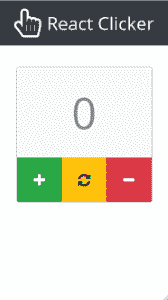T2】](https://res.cloudinary.com/practicaldev/image/fetch/s--wdANVhqN--/c_limit%2Cf_auto%2Cfl_progressive%2Cq_auto%2Cw_880/https://user-images.githubusercontent.com/33935506/34466923-203af658-eeec-11e7-8312-1e06a60bd727.png)

[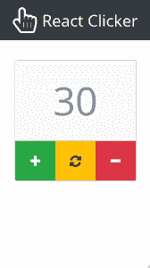T2】](https://res.cloudinary.com/practicaldev/image/fetch/s--CTI531fJ--/c_limit%2Cf_auto%2Cfl_progressive%2Cq_auto%2Cw_880/https://user-images.githubusercontent.com/33935506/34466924-206b53f2-eeec-11e7-8bd2-37d0a3635068.png)

### 3。[基本时钟](https://github.com/drminnaar/react-clock-basic)

一个显示当前日期和时间的基本数字钟，以及一个打开和关闭日期的拨动开关。

点击 了解更多信息 **[。](https://github.com/drminnaar/react-clock-basic)**

在这里找到现场试玩**T1**。

[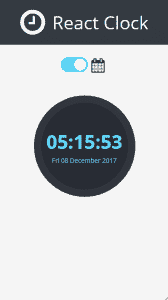T2】](https://res.cloudinary.com/practicaldev/image/fetch/s--kZJ5Rz9A--/c_limit%2Cf_auto%2Cfl_progressive%2Cq_auto%2Cw_880/https://user-images.githubusercontent.com/33935506/34466950-fb497e2c-eeec-11e7-8d68-c69ced852625.png)

[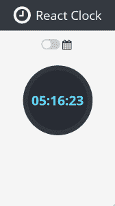T2】](https://res.cloudinary.com/practicaldev/image/fetch/s--bJCgGy4s--/c_limit%2Cf_auto%2Cfl_progressive%2Cq_auto%2Cw_880/https://user-images.githubusercontent.com/33935506/34466951-fb791826-eeec-11e7-8781-8e58394e34c7.png)

### 4。[基本定时器](https://github.com/drminnaar/react-timer-basic)

一个基本的计时器，将开始倒计时的基础上输入的时间秒。定时器提供启动、停止和复位功能。当计时器达到< = 10 的值时，计时器颜色变为红色。

点击 了解更多信息 **[。
在这里](https://github.com/drminnaar/react-timer-basic)** 找到现场试玩 **[。](http://react-timer-basic.drminnaar.me)**

[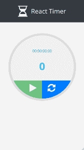T2】](https://res.cloudinary.com/practicaldev/image/fetch/s--oISy56mk--/c_limit%2Cf_auto%2Cfl_progressive%2Cq_auto%2Cw_880/https://user-images.githubusercontent.com/33935506/34467010-76c087ac-eeee-11e7-98d2-2d043b1c43f2.png)

[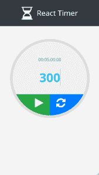T2】](https://res.cloudinary.com/practicaldev/image/fetch/s--n8WN5gK4--/c_limit%2Cf_auto%2Cfl_progressive%2Cq_auto%2Cw_880/https://user-images.githubusercontent.com/33935506/34467012-76facb92-eeee-11e7-9175-c34e518e3aef.png)

[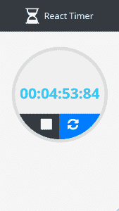T2】](https://res.cloudinary.com/practicaldev/image/fetch/s--7CX-8oSP--/c_limit%2Cf_auto%2Cfl_progressive%2Cq_auto%2Cw_880/https://user-images.githubusercontent.com/33935506/34467013-77297a6e-eeee-11e7-9135-d812c9b02abc.png)

[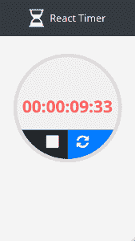T2】](https://res.cloudinary.com/practicaldev/image/fetch/s--WfFv4nIE--/c_limit%2Cf_auto%2Cfl_progressive%2Cq_auto%2Cw_880/https://user-images.githubusercontent.com/33935506/34467014-7758ad52-eeee-11e7-91b9-0d625be0a56d.png)

### 5。[高级定时器](https://github.com/drminnaar/react-timer-advanced)

提供高级用户界面体验的倒计时定时器。计时器使用键盘在显示屏上输入小时、分钟和秒。当计时器启动时，倒数计时器变为全屏。控制面板允许启动、停止、恢复和重置计时器。

点击 了解更多信息 **[。](https://github.com/drminnaar/react-timer-advanced)**

在这里找到现场试玩**T1**。

[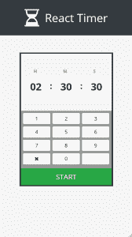T2】](https://res.cloudinary.com/practicaldev/image/fetch/s--exOGJEQX--/c_limit%2Cf_auto%2Cfl_progressive%2Cq_auto%2Cw_880/https://user-images.githubusercontent.com/33935506/34467052-744c3e0c-eeef-11e7-93ac-1b9e113a4b0b.png)

[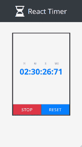T2】](https://res.cloudinary.com/practicaldev/image/fetch/s--rxGaePUO--/c_limit%2Cf_auto%2Cfl_progressive%2Cq_auto%2Cw_880/https://user-images.githubusercontent.com/33935506/34467053-747be440-eeef-11e7-8c44-a1cafb76ee32.png)

[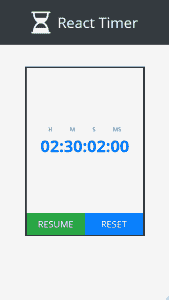T2】](https://res.cloudinary.com/practicaldev/image/fetch/s--VCbeMtTn--/c_limit%2Cf_auto%2Cfl_progressive%2Cq_auto%2Cw_880/https://user-images.githubusercontent.com/33935506/34467054-74aa7daa-eeef-11e7-90ac-8d24eea7f32c.png)

### 6。[电影卡](https://github.com/drminnaar/react-movie-cards)

一个基本的应用程序，以卡片列表的形式显示电影列表。每张卡片都提供了电影的详细信息，如标题、副标题、描述、图像和分级。

点击 了解更多信息 **[。](https://github.com/drminnaar/react-movie-cards)**

在这里找到现场试玩**T1**。

[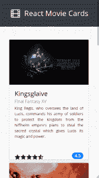T2】](https://res.cloudinary.com/practicaldev/image/fetch/s--MwmzqycZ--/c_limit%2Cf_auto%2Cfl_progressive%2Cq_auto%2Cw_880/https://user-images.githubusercontent.com/33935506/34467097-972a2712-eef0-11e7-95e5-49d131fd2d62.png)

[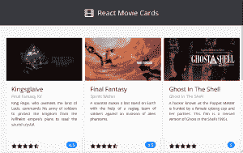T2】](https://res.cloudinary.com/practicaldev/image/fetch/s--i213kAfs--/c_limit%2Cf_auto%2Cfl_progressive%2Cq_auto%2Cw_880/https://user-images.githubusercontent.com/33935506/34467098-9759420e-eef0-11e7-8ec9-fb6d59ae5ae3.png)

[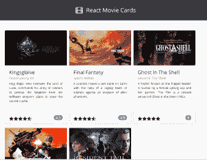T2】](https://res.cloudinary.com/practicaldev/image/fetch/s--Qr9ApeCP--/c_limit%2Cf_auto%2Cfl_progressive%2Cq_auto%2Cw_880/https://user-images.githubusercontent.com/33935506/34467099-9787a2f2-eef0-11e7-9f19-4adadcd603ec.png)

### 7。 **[摄魂](https://github.com/drminnaar/react-masterminds)**

一种基于不同难度的猜数字的基本游戏。游戏的目标是猜测一个由游戏引擎随机产生的数字。在每次猜测时，游戏会显示(使用信息和颜色)你的猜测与实际产生的数字有多接近(或多远)。猜中正确的数字后，玩家可以选择再次游戏。

该游戏提供 3 个难度等级设置，即简单、中等和困难。基于难度设置，游戏引擎将生成一个随机数，该随机数在一个数字范围内。例如:

*   简单- 0 -> 10
*   中等- 0 -> 100
*   难度- 0 -> 1000

点击 了解更多信息 **[。](https://github.com/drminnaar/react-masterminds)**

在这里找到现场试玩**T1**。

[T2】](https://res.cloudinary.com/practicaldev/image/fetch/s--HHsfVtDf--/c_limit%2Cf_auto%2Cfl_progressive%2Cq_auto%2Cw_880/https://user-images.githubusercontent.com/33935506/34467163-c26f88a8-eef1-11e7-8192-e6f7fabae32d.png)

[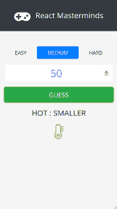T2】](https://res.cloudinary.com/practicaldev/image/fetch/s---kyfzkNh--/c_limit%2Cf_auto%2Cfl_progressive%2Cq_auto%2Cw_880/https://user-images.githubusercontent.com/33935506/34467164-c29ecdf2-eef1-11e7-911a-3ea22bd1f419.png)

[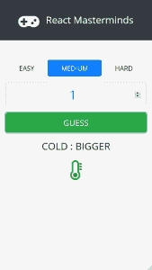T2】](https://res.cloudinary.com/practicaldev/image/fetch/s--yFMJF9i2--/c_limit%2Cf_auto%2Cfl_progressive%2Cq_auto%2Cw_880/https://user-images.githubusercontent.com/33935506/34467165-c2cc5d58-eef1-11e7-9909-7b432147886e.png)

[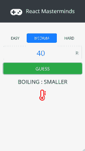T2】](https://res.cloudinary.com/practicaldev/image/fetch/s--0rBXO_-Z--/c_limit%2Cf_auto%2Cfl_progressive%2Cq_auto%2Cw_880/https://user-images.githubusercontent.com/33935506/34467166-c3001f9e-eef1-11e7-97e4-45dcf28f00c7.png)

[T2】](https://res.cloudinary.com/practicaldev/image/fetch/s--cdWrcFy0--/c_limit%2Cf_auto%2Cfl_progressive%2Cq_auto%2Cw_880/https://user-images.githubusercontent.com/33935506/34467167-c32dfc7a-eef1-11e7-8688-a5ba7ee28484.png)

### 8。[标准计算器](https://github.com/drminnaar/react-calculator-standard)

一个计算器，提供基本的算术运算，一个表达式生成器，以及所有表达式的完整历史。作为一种输入机制，它允许用户在键盘和历史记录之间切换。

点击 了解更多信息 **[。](https://github.com/drminnaar/react-calculator-standard)**

在这里找到现场试玩**T1**。

[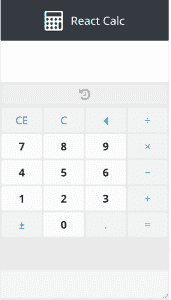T2】](https://res.cloudinary.com/practicaldev/image/fetch/s--bDIk1EII--/c_limit%2Cf_auto%2Cfl_progressive%2Cq_auto%2Cw_880/https://user-images.githubusercontent.com/33935506/34467193-df3ff1ce-eef2-11e7-9aab-4de0a3e5aea2.png)

[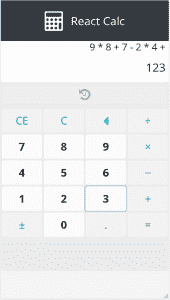T2】](https://res.cloudinary.com/practicaldev/image/fetch/s--ZGcihG2c--/c_limit%2Cf_auto%2Cfl_progressive%2Cq_auto%2Cw_880/https://user-images.githubusercontent.com/33935506/34467194-df6e4d9e-eef2-11e7-9ea5-c2f04b14f12f.png)

[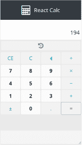T2】](https://res.cloudinary.com/practicaldev/image/fetch/s--yuJ3VSLL--/c_limit%2Cf_auto%2Cfl_progressive%2Cq_auto%2Cw_880/https://user-images.githubusercontent.com/33935506/34467195-df9cfa18-eef2-11e7-9969-10fd05fb7e9d.png)

[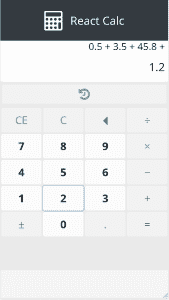T2】](https://res.cloudinary.com/practicaldev/image/fetch/s--_dOgAVWK--/c_limit%2Cf_auto%2Cfl_progressive%2Cq_auto%2Cw_880/https://user-images.githubusercontent.com/33935506/34467196-dfcc9872-eef2-11e7-928e-379ce6d1dc4e.png)

[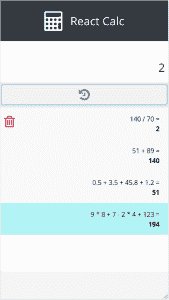T2】](https://res.cloudinary.com/practicaldev/image/fetch/s--olrolPhK--/c_limit%2Cf_auto%2Cfl_progressive%2Cq_auto%2Cw_880/https://user-images.githubusercontent.com/33935506/34467197-e03c7d0e-eef2-11e7-860f-c6145566453c.png)

[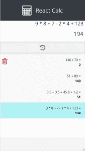T2】](https://res.cloudinary.com/practicaldev/image/fetch/s--88I4Otub--/c_limit%2Cf_auto%2Cfl_progressive%2Cq_auto%2Cw_880/https://user-images.githubusercontent.com/33935506/34467198-e079fa6c-eef2-11e7-8113-db6f236b6850.png)

### 9。[比特币监视器](https://github.com/drminnaar/react-bitcoin-monitor)

一款监控比特币价格指数(BPI)变化的应用。

默认情况下，将显示美元、英镑和欧元的 BPI。可选地，除了上述 3 种货币之外，用户还可以选择自己的货币进行显示。

比特币监视器利用了 **[CoinDesk 比特币价格指数 API](https://www.coindesk.com/api/)** 。

点击 了解更多信息 **[。](https://github.com/drminnaar/react-bitcoin-monitor)**

在这里找到现场试玩**T1**。

[T2】](https://res.cloudinary.com/practicaldev/image/fetch/s--vtzw-4ru--/c_limit%2Cf_auto%2Cfl_progressive%2Cq_auto%2Cw_880/https://user-images.githubusercontent.com/33935506/34467240-20fd8e04-eef4-11e7-9398-5bbbc8ba19c7.png)

[T2】](https://res.cloudinary.com/practicaldev/image/fetch/s---IvacHcH--/c_limit%2Cf_auto%2Cfl_progressive%2Cq_auto%2Cw_880/https://user-images.githubusercontent.com/33935506/34467241-212bd91c-eef4-11e7-8011-496d2ba0dd8c.png)

[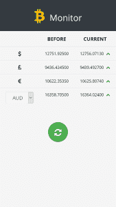T2】](https://res.cloudinary.com/practicaldev/image/fetch/s--tY93I2oa--/c_limit%2Cf_auto%2Cfl_progressive%2Cq_auto%2Cw_880/https://user-images.githubusercontent.com/33935506/34467242-2159958c-eef4-11e7-82dc-5d82d68b635a.png)

[T2】](https://res.cloudinary.com/practicaldev/image/fetch/s--nWs7pRcT--/c_limit%2Cf_auto%2Cfl_progressive%2Cq_auto%2Cw_880/https://user-images.githubusercontent.com/33935506/34467243-21881b96-eef4-11e7-9636-fe828f63b1e1.png)

### 10。[标准天气监视器](https://github.com/drminnaar/react-weather-standard)

一个天气应用程序，根据您当前的地理位置显示当前天气、每日天气预报和每小时天气预报。该应用集成了 **[OpenWeather API](http://openweathermap.org/)** 和 **[谷歌地理定位 API](https://developers.google.com/maps/documentation/geolocation/intro)** 。

点击 了解更多信息 **[。](https://github.com/drminnaar/react-weather-standard)**

在这里找到现场试玩**T1**。

[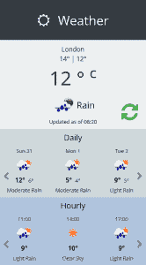T2】](https://res.cloudinary.com/practicaldev/image/fetch/s--n6DnibCZ--/c_limit%2Cf_auto%2Cfl_progressive%2Cq_auto%2Cw_880/https://user-images.githubusercontent.com/33935506/34467275-f63d48c0-eef4-11e7-9d43-45666432d54f.png)

### 11。[诺特沃克斯做出反应](https://github.com/drminnaar/noteworx-react-mongodb)

这个项目不像前面提到的项目那么基础。事实上，这个项目是我正在做的另一个系列的一部分，并将在未来发布。然而，我认为对于那些寻求更高级的东西的人来说，在这篇文章中提到它是有用的。如果你对这个项目感兴趣，那么你可以在我的 **[github 页面](https://drminnaar.github.io/#section-noteworx)** 找到到目前为止这个系列的项目列表。

NoteWorx React 是一个基本的笔记应用程序，它使用 React 前端来捕获和管理笔记，使用 ExpressJS 编写的 api 和 mongodb 来存储笔记。

点击 了解更多信息 **[。](https://github.com/drminnaar/noteworx-react-mongodb)**

[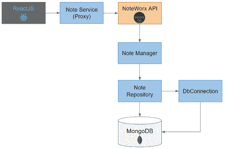T2】](https://res.cloudinary.com/practicaldev/image/fetch/s--SmBWNgy8--/c_limit%2Cf_auto%2Cfl_progressive%2Cq_auto%2Cw_880/https://user-images.githubusercontent.com/33935506/34467361-d5ad449a-eef7-11e7-8e09-4d4af017a453.png)

[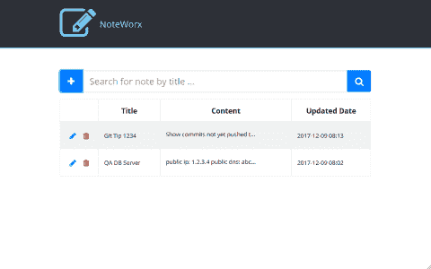T2】](https://res.cloudinary.com/practicaldev/image/fetch/s--e5uVfDaC--/c_limit%2Cf_auto%2Cfl_progressive%2Cq_auto%2Cw_880/https://user-images.githubusercontent.com/33935506/34467362-d5dc0302-eef7-11e7-835a-47ea6a9f3bd1.png)

[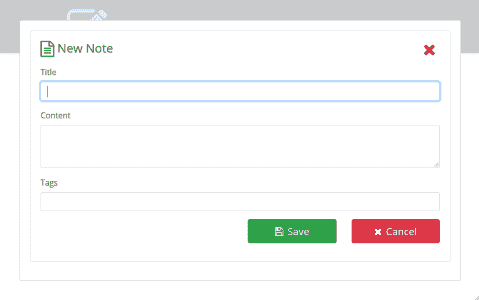T2】](https://res.cloudinary.com/practicaldev/image/fetch/s---YYTxjA1--/c_limit%2Cf_auto%2Cfl_progressive%2Cq_auto%2Cw_880/https://user-images.githubusercontent.com/33935506/34467363-d60fa91e-eef7-11e7-8dc0-7123785cd43f.png)

[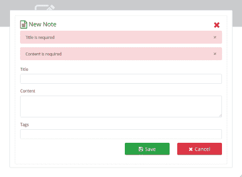T2】](https://res.cloudinary.com/practicaldev/image/fetch/s--rae6zzkW--/c_limit%2Cf_auto%2Cfl_progressive%2Cq_auto%2Cw_880/https://user-images.githubusercontent.com/33935506/34467364-d63d9c02-eef7-11e7-9889-2dba335abaad.png)

[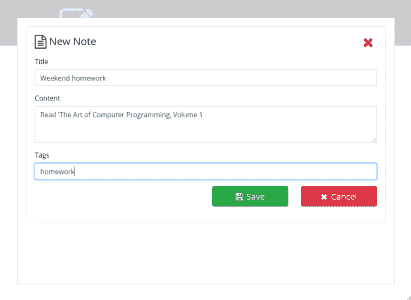T2】](https://res.cloudinary.com/practicaldev/image/fetch/s--Qf0q6NmV--/c_limit%2Cf_auto%2Cfl_progressive%2Cq_auto%2Cw_880/https://user-images.githubusercontent.com/33935506/34467365-d66c6c4e-eef7-11e7-81f9-1c5b75a2c128.png)

[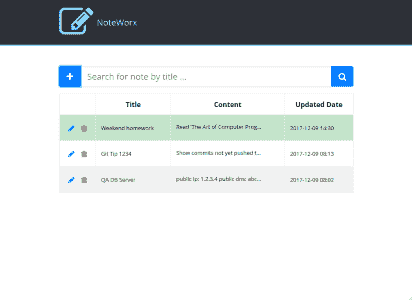T2】](https://res.cloudinary.com/practicaldev/image/fetch/s--ccOleXMc--/c_limit%2Cf_auto%2Cfl_progressive%2Cq_auto%2Cw_880/https://user-images.githubusercontent.com/33935506/34467366-d6a45f96-eef7-11e7-89c7-d44a98c4bea4.png)

## 结论

这不是结局。我将不断增加新的项目。我将添加更多简单的 React 项目，但我也将添加更先进的 React 项目。最后，我的目标是提供尽可能多的项目来帮助你爬行、行走和奔跑。我会把飞步留给比我聪明的人；).到目前为止，我创建的 10 个项目是为了帮助你爬行，甚至行走。