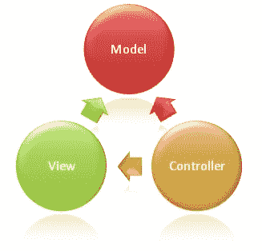

# 模型视图控制器(MVC)

> 原文:[https://dev.to/funkysi1701/model-view-controller-mvc-236p](https://dev.to/funkysi1701/model-view-controller-mvc-236p)

[T2】](https://res.cloudinary.com/practicaldev/image/fetch/s--1EMmvNab--/c_limit%2Cf_auto%2Cfl_progressive%2Cq_auto%2Cw_880/https://storageaccountblog9f5d.blob.core.windows.net/blazor/wp-content/uploads/2016/03/27.jpg%3Fw%3D327%26ssl%3D1)

模型视图控制器或 MVC 是一种在计算机上实现用户界面的软件架构模式。它将给定的软件应用程序分成三个相互连接的部分，以便将信息的内部表示与信息呈现给用户或用户接受信息的方式分开。

一段时间以来，我一直试图理解 MVC 的概念，希望写这篇文章能有助于巩固我对它的理解。

MVC 的核心概念之一是分离关注点的能力，这样你就可以把精力集中在应用程序的一个方面。

**型号**这是数据。如果您的应用程序使用数据库，模型通常会反映数据库中的内容，并关注从数据库中检索信息。

视图与向用户显示数据有关。通常这是应用程序的 html 页面。

控制器它关心的是实际做的事情和处理用户交互。通常，它会从视图中获取数据，并将数据发送给模型。

这三个关注点可以独立开发，因为它们彼此不依赖，对于更大的开发团队，你甚至可以比传统的应用程序更容易地划分开发。

我理解 MVC 的基本概念，但是我发现自己陷入了细节中。

数据库不重要。我需要记住这一点，不要在编写连接到数据库的自定义方法时偏离主题，否则最终将无法管理。我知道 SQL，所以可以轻松地编写 SQL 命令，将数据复制到我的应用程序所需的格式。我目前在做的 app，涉及到大量的现有数据，需要集中精力做 MVC 部分，后期再担心数据库。

在以前的尝试中，我试图针对许多表构建我的模型，但相反，我可以针对许多表编写一个查询，并将其插入到模型可以使用的一个表中。

更改模型通常会导致一个错误，通知您自数据库创建以来上下文已经更改。在我的例子中，解决这个问题的简单方法是删除数据库，并允许实体框架每次都重新创建数据库。只要我的数据库不包含新数据，我就不会丢失任何东西。

MVC 的核心优势之一是能够测试它，甚至使用测试驱动开发(TDD)。我还没有真正涉足测试，因为我仍在试图了解基本原理，但一旦我在我的应用程序上取得了一些进展，我就想测试，所以下次我被要求添加新功能时，我不会担心破坏东西。

我第一次拥有了一个从一开始就具有有效认证系统的应用程序。并且用一个关键字就可以非常容易地实现。将**【授权】**添加到您的控制器顶部即可。从 Visual Studio 构建实际的身份验证系统相对容易，因为它有 Azure AD 模板、基于表单的开放身份验证，如 google/twitter 等。

对于我的 MVC 应用程序和我对它的理解来说，它仍然是非常早期的，但我觉得我已经度过了难关，现在可以实际上用它来构建一些东西，而不是陷入混乱的螺旋下降中。

你对 MVC 怎么看为什么不在下面留下评论呢？为了获得更多关于 MVC 的信息，我一直在看有更多信息和教程的 http://www.asp.net/mvc。