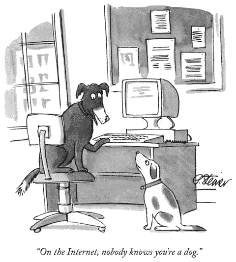

# 别担心，他们也没想通

> 原文:[https://dev . to/Ben/dont-worry-they-not-got-it-out-of-that-](https://dev.to/ben/dont-worry-they-havent-figured-it-out-either)

这是一个关于冒名顶替综合症、13 岁的我和编程的故事。

我已经很多年没有想过这个问题了，但是最近我想起了我建立的第一个网站。像我的大多数编码项目一样，它既是一个网站，也是一个商业项目。我不记得为什么我最终停止了这项工作。那是 2001 年，我 13 岁。

这次冒险是 http://fantasyemporium.tk 。这是一个幻想体育的新闻和分析网站。也许，我有十几个朋友向网站提交内容，他们这样做没有得到报酬(抱歉伙计们)。我有一个很棒的 SEO 策略，主要包括与其他幻想体育网站交换链接(2001 amirite？)和写人们想链接的好内容，大部分来自幻想体育论坛。尽管事后看来这个网站丑得可怕，但它设计得很好，符合当时的标准。我有一个很棒的内容自卷管理系统，这样必要的 HTML 就可以跨页面重用，我的朋友也可以提交纯文本内容，并让它自动格式化到页面上。我有很多展示广告账户，赚了一些钱。到目前为止，我最好的收入来源是在线赌博网站。回顾过去，我为这一切感到骄傲。但在那个时候，我无法摆脱这样的想法，最终有人会发现我和我所有的作家都只有 13 岁，整个事情是一个巨大的骗局。

我的一些担忧是有道理的，比如增加网上赌场的流量和在邮件中收到支票，但这从未真正困扰过我。真正让我退缩的是，我觉得其他人一定能看穿我的外表，认识到我的业务有多薄弱。他们必须认识到这一点。tk 是一个免费的域名服务，我的网站托管在 [Geocities](https://en.wikipedia.org/wiki/Yahoo!_GeoCities) 上，我没有权利告诉成年人去了解我的朋友们对阿伦·艾弗森在 12 队对抗的梦幻篮球选秀中应该参加哪一轮的看法。直到现在回想起来，听到关于当时互联网企业有多疯狂，以及至今有多少初创公司依靠拼凑的软件运营的故事，我才意识到，我的运营并不比这个领域的任何竞争对手、任何成人运营的企业更“不合法”。尽管我仍然认为“梦幻商场”这个名字很糟糕，但我不记得遇到过任何一个人关心. tk 域名的合法性，或者对我如何托管网站有任何想法或关心，或者对我和我的团队在初中有任何线索。他们看到了一个相当专业的网站，是当时大多数独立运营的内容网站的典范。

[T2】](https://res.cloudinary.com/practicaldev/image/fetch/s--MBNl4qcE--/c_limit%2Cf_auto%2Cfl_progressive%2Cq_auto%2Cw_880/http://res.cloudinary.com/practicaldev/image/fetch/c_scale%2Cfl_progressive%2Cq_90%2Cw_480/f_jpg/http://i.imgur.com/uJ5NFQe.jpg)

直到今天，我发现自己也在经历一些同样的担忧，担心我肯定做错了什么，担心其他程序员或企业家知道他们在做什么，他们可以看穿我的外表，担心我过于依赖框架，这些框架抽象出了我应该更了解的问题，担心如果我是一个“真正的”职业程序员，我会以不同的方式做事。当我冷静下来审视这种情况时，似乎人们还没有发现我的欺诈行为，我也还没有发现他们的欺诈行为。我似乎在和其他人玩同样的游戏。成长确实意味着发现每个人都只是在以某种方式即兴发挥，并且在你前进的过程中发现事情并不可耻。

他们称这种感觉为我描述的[冒名顶替综合症](https://en.wikipedia.org/wiki/Impostor_syndrome)。它很好地描述了我 13 岁时的恐惧，也很好地描述了我这些天的感受。但是，考虑到当时的背景，事后回想起来，我过去的承诺出人意料地合理，这是一种宣泄。如果你在这个数字技术领域，你真的是站在非常不稳定的地面上，在那里，已建立的最佳实践只是未来的创可贴，即使是该领域的最佳实践也只是站在前人的肩膀上。永远没有正确的道路。没有哪种最佳实践不会被更好的实践所取代。有一些非常聪明和有经验的人对这门手艺有着深刻的理解，还有更多人能够拿出足够的专业知识来做一些非常酷的东西。不断学习，不断用你新发现的能力去做几个月或几年前你认为是“别人”的事情，这是令人难以置信的兴奋。

没人弄明白。没有人知道技术的未来会怎样，除了他们狭隘的经验之外，很少有人对当前的形势有很好的理解。没有人知道或关心你是一个 13 岁的加拿大孩子，免费托管你的网站。没人在乎你是否已经完全理解了 websockets、NoSQL 数据库、元编程或任何你正在努力学习的东西，因为如果你绝对需要的话，你最终会明白的，就像你已经明白了这么多才明白这一点一样。没人在乎你觉得自己不知道自己在做什么，因为他们很多时候都有同样的感觉。

十年后，你回过头来看，会发现 99%的其他程序员和你一样无知，即使你现在并不觉得自己无知。享受相对不成熟的互联网，建立一些时髦的应用程序和网站，并花时间让它们变得伟大。