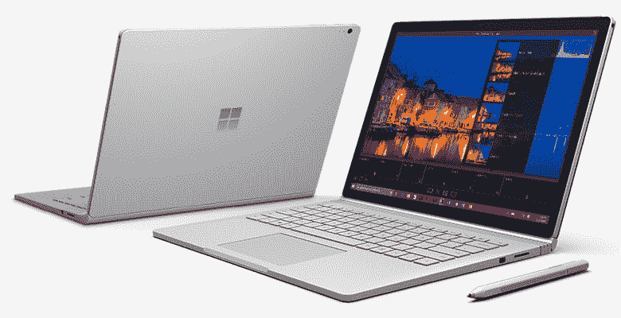

# 表面书评

> 原文：<https://dev.to/funkysi1701/surface-book-review-33lh>

 我刚刚给自己买了一台新的笔记本电脑，但它不是普通的笔记本电脑，而是一台[微软 Surface Book](https://www.microsoftstore.com/store/msuk/en_GB/pdp/productID.332604800) 。

我想这可能是我第一次给自己买一台顶级笔记本电脑，用了几天后，我喜欢上了它。

Surface Book 是微软 Surface 系列平板电脑中的最新产品，也是第一款配备键盘且更像传统笔记本电脑的平板电脑。键盘可从键盘上拆下，因此您可以像使用平板电脑一样使用 Surface Book。

因为它是一款顶级笔记本电脑，所以它并不便宜，所以如果价格是你选择笔记本电脑的一个重要因素，那么它就不适合你。微软正试图与苹果的 Macbook 系列竞争。

那么我的钱得到了什么？

*   Windows 10 专业版
*   16Gb 内存
*   512Gb 固态硬盘(格式化后的大小接近 474Gb)
*   第六代英特尔酷睿 i7 处理器
*   表面笔
*   13.5 英寸触摸屏

我只有几天的设备，但这些是我迄今为止的想法。我购买它的主要原因是为了用 Visual Studio 和 SQL Server 进行开发工作。

我真的很喜欢 Surface Pen。这是一个我本以为不会用很多的功能。该笔通过蓝牙连接，并允许与触摸屏进行交互。压敏屏幕允许执行各种触摸动作。

我特别喜欢物理键盘拆卸时提供的键盘选择。你可以有一个可以用笔或手指打字的屏幕键盘，一个可以分成两半的屏幕键盘，或者你可以用笔写字。这是一个惊人的特性。我的书法不好，但大多数时候它能理解我潦草的字迹。有了这个选项，你可以在网页上手写推文或填写表格。就速度而言，我不建议对大量文本使用这种输入方式，但对于浏览网页，当你只是点击链接时，这种方式很好。

Windows Hello–我可以通过查看屏幕解锁 windows。多酷啊！这真的很容易设置，它只是拍一张你的脸的照片，下次你登录时，你只需要看着屏幕就可以了。注意:如果您在平板电脑模式下工作，请确保平板电脑朝上。

不过，这并不都是明智之举。分离屏幕是复杂的，有时需要一些时间。有几次我觉得我需要另一只手，但我确信我做得越多，我就会发现做起来越容易。

电池续航时间不是很长，尤其是在只使用平板电脑的情况下。这是因为这台机器有两个电池，一个在底座上，一个在屏幕上，所以有了键盘，你就有更长的使用时间。事实上，我发现我用了几天后，电池的续航时间更长了。

屏幕分辨率非常高，为 3000 x 2000，但使用了巧妙的变焦技术，一切仍然可读，而且不小。然而，我经常使用远程桌面，这给我带来了一个问题。当 RDPing 远程会话使用主机屏幕分辨率，这使得我的服务器上的一切都很小。这个问题的解决方案可以在[超级用户](https://superuser.com/questions/891413/remote-connection-desktop-manager-2-7-does-not-support-dpi-scaling-anymore)上找到，并涉及到使用微软的远程桌面连接管理器，这是一个很酷的管理多个 RDP 会话的软件。这实际上是对我通常工作方式的一种改进，但在我找到答案之前，这很烦人。

键盘的另一个小烦恼是你不能用一只手按 Ctrl-Alt-Del。通常这不是一个要求，但如果当我把儿子放在腿上时屏幕锁定，我就会卡住，但我不会因此责怪 surface book。

当我拿到我的 Surface Book 时，我还得到了一个微软无线显示适配器。我不喜欢这种技术，因为我无法让它工作。我暂时让我的旧笔记本电脑连接，但我的 Surface Book 一直告诉我不！

总体来说我喜欢 Surface Book。这无疑是我用过的最好的笔记本电脑。现在我有了扩展坞，我可以连接两个显示器，有了有线互联网连接，它就成了一个合适的工作台。其他人是怎么想的？比苹果的一系列笔记本电脑好？