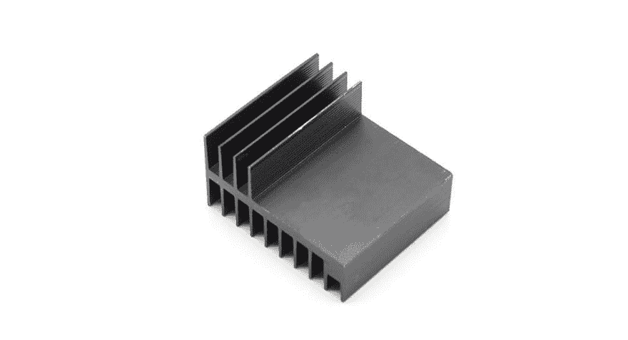
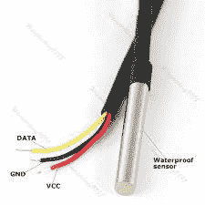
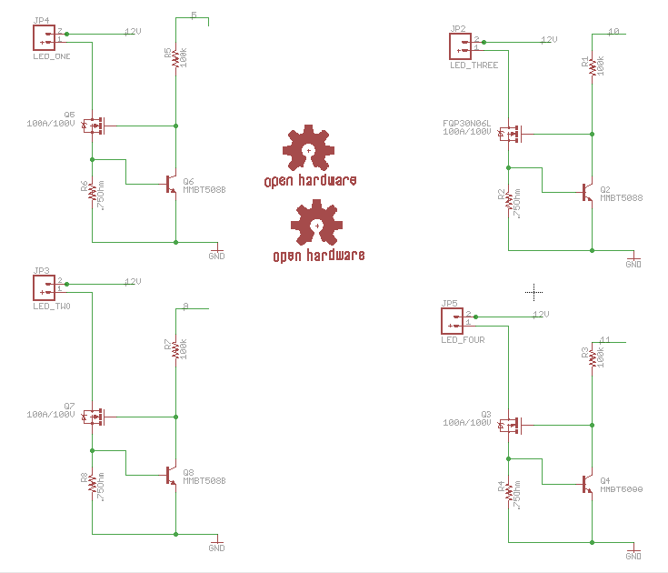

# 实验室控制器 v05-09

> 原文：<https://dev.to/ladvien/lab-controller-v05-09-3hf4>

### 修订版

这是以前工作的延伸。我已经为实验室完成了一个 LED 驱动器，连接上它，发现它是一个火灾隐患。为了得到我想要的流明量，我不得不将电流电阻设置为 0.47 欧姆。这将推动近 2 安培的电流通过小的 [FQP40N06L](http://https//www.fairchildsemi.com/datasheets/FQ/FQP30N06L.pdf) 。指示灯很亮，但 TO-220 很快变得太热，无法触摸。两种选择，要么重新设计或使用更少的电流，导致更暗的 led。容易选择，重新设计。

我意识到的第一件事是我需要一个散热器。具有讽刺意味的是，我选择了 TO-220s，一种通孔封装，因为我觉得它们能更好地应对高温。最后用的是 TO-263 封装的 [BS103AL](http://pccomponents.com/datasheets/INF-BUZ103AL.PDF) 。这是一个贴片封装，其腹部露出背面，便于放置散热器。

这个散热器看起来足够结实，尺寸也合适(5 厘米)。

[T2】](https://res.cloudinary.com/practicaldev/image/fetch/s--ozq-XIjX--/c_limit%2Cf_auto%2Cfl_progressive%2Cq_auto%2Cw_880/https://ladvien.cimg/1351906-3.jpg)

散热器上的凹槽将靠着 TO-263 阵列，希望能吸收所有多余的热量。然而，应急措施是在散热器背面放置一个风扇。

板上还有一个 ESP8266。我认为这是一个更好的控制 led 的选择，因为它们不会在屋外使用，并且总是连接到电源上。当然，我从来没有打开过 ESP8266，所以我希望我串对了。它具有 TX、RX 和 RESET 线路的电平转换功能。

我还添加了一个用于 USB 转 UART 的 CH340G。CH340G SOIC 芯片被订购了一段时间，但在我把它们放入这个板之前，我把它扔在一个 84 分线点上，并进行了测试。我对它不抱太大希望，但它非常有效。哼。

[T2】](https://res.cloudinary.com/practicaldev/image/fetch/s--MToSqHsp--/c_limit%2Cf_auto%2Cfl_progressive%2Cq_auto%2Cw_880/https://ladvien.cimg/CH340G_test.jpg)

这些小芯片只花了我 0.65 美元

[CH340G](http://www.ebay.com/itm/381476894812?_trksid=p2057872.m2749.l2649&ssPageName=STRK%3AMEBIDX%3AIT) $5 / 10 = .50

[12mhz 晶体](http://www.ebay.com/itm/251550015572?_trksid=p2057872.m2749.l2649&ssPageName=STRK%3AMEBIDX%3AIT) 1.42 / 01 = .14

最后一款有趣的器件是 DS18B20。这是一个单线温度探头，我计划将它热粘贴在散热片上，作为一种自动关机措施。或者，通过开关来减少风扇发出噪音的时间。

[T2】](https://res.cloudinary.com/practicaldev/image/fetch/s--QpgRQYfc--/c_limit%2Cf_auto%2Cfl_progressive%2Cq_auto%2Cw_880/https://ladvien.cimg/ds18b20.jpg)

[T2】](https://ladvien.cimg/LED_lab_Controller_2.pdf)

[T2】](https://ladvien.cimg/LED_lab_Controller_2.pdf)

[https://www.youtube.com/embed/KYiagQ0kjwc](https://www.youtube.com/embed/KYiagQ0kjwc)

可以找到设计文件，

[实验室 LED 控制器 v09](https://github.com/Ladvien/Ladviens-Eagle-Files/tree/master/Lab%20Controller%20Board)