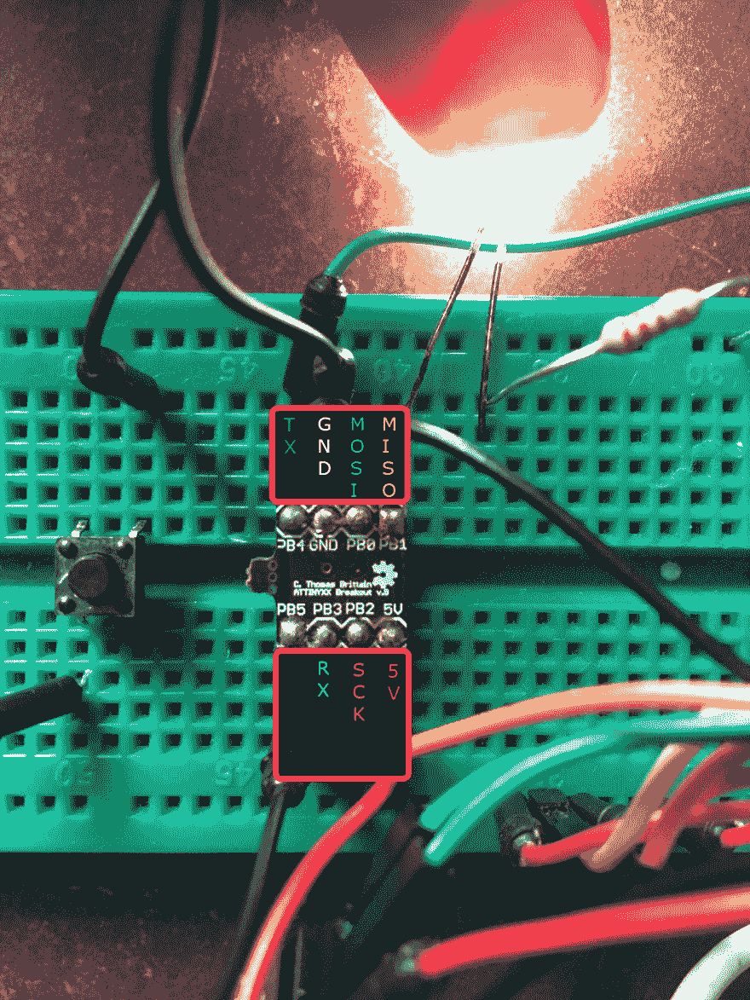
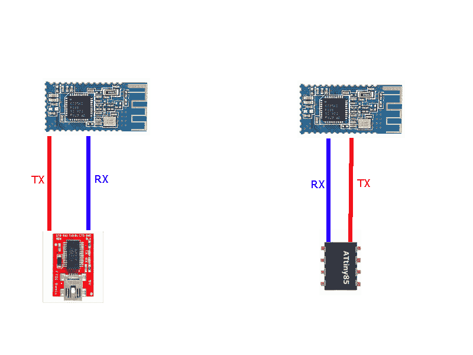

# TinySafeBoot、Arduino 和无线上传到 ATtiny85

> 原文:[https://dev . to/lad vien/tinysafeboot-arduino-and-wireless-upload-to-attiny 85-d4d](https://dev.to/ladvien/tinysafeboot-arduino-and-wireless-upload-to-attiny85-d4d)

### 梦

我曾梦想过一个拥有一切的 PCB:uC、H 桥、PSU、Lipo 充电器、感应功率收集器、*和*一个允许无线上传到 uC 的无线设备。一个我可以用于机器人和可穿戴项目的平台。这些功能中的大部分我已经解决了，但我认为对黑客来说难以捉摸的一个是无线上传。我有过很多失败的尝试，有些像为 LPC1114 编写自己的上传程序一样痛苦，有些像破解 Arduino IDE 源代码一样“简单”。然而，我发现了一个给我带来一点希望的组合:TinySafeBoot，Arduino IDE，以及大多数 Atmega 和 ATtiny Atmel 芯片。

### TinySafeBoot

TinySafeBoot 是一个非常简洁的 GPL 项目，大约 500 字节。它是一个引导加载程序，允许选择任意两个引脚作为双线通信的 RX / TX(它也有一个单线协议)。它有一个串行通信协议。

tinysafeboot

使 TSB 成为无线引导的最佳选择的特性是它的串行协议。与 Arduino 使用的硬件协议不同，串行通信允许远程设备控制引导加载程序的工作流程，而无需翻转任何硬件引脚。对比 Arduino 的 bootloader(我觉得现在是 optiboot？)集中于反复重置设备以激活引导加载程序。

硬件方法不适用于快速、远程的硬件重置。由于串行延迟，当新程序的第一个字节到达 RX 引脚时，Arduino 引导加载程序通常可以轻松地引导现有程序。此外，在我专注的无线设备 HM-1X 和 ESP8266 上，没有快速(低于 400 毫秒)翻转引脚的方法。简而言之，Arduino 引导程序或软件需要被黑客攻击；都不是，我有时间去做。

还有其他芯片的可能性。我花了很多时间试图为 LPC1114 编写一个无线上传程序。然而，我还不具备完成它的技能水平(我还没有放弃)。使用 LPC1114 还有一个心理障碍。它的文档。并不是 1114 的文档太差，而是 Atmel(Arduino 心脏的制造商)的文档好得多。如果为 Atmel 芯片解决了这一难题，那么解决无线上传难题将更加有益。嗯，至少对于像我这样还不具备快速浏览粗糙文档芯片技能的黑客来说是这样。老实说，这是关于时间的——我只有这么多，有时它是关于完成一个项目，而不是我可能会学到什么(亵渎，对不对？).

当然，TSB 还有其他功能，如自动防护和密码保护等。它并不完美，但我喜欢它的简单。

### 获取 TSB 设置

我在三个设备上测试了 TSB，分别是 ATtiny85、ATmega328P 和 ATtiny1634。然而，ATtiny1634 并没有成功。

TSB 有两个部分，

1.  固件
2.  [软件](http://jtxp.org/tech/tinysafeboot_en.htm)

我们将只下载允许你为你的目标芯片生成“定制”固件的软件。

[T2】](http://jtxp.org/tech/tinysafeboot_en.htm)

从现在开始，我将示范如何让 TSB 坐上 85 号巴士。

#### [ISP](#isp)

首先，我们需要一个 AVR ISP。很久以前，我买了一个 AVR-ISP MKII，我结合 Atmel Studio 7 使用。这将允许我们烧引导加载程序和设置保险丝。如果你没有官方的 AVR-ISP，理论上你可以通过 Arduino IDE 结合 Arduino 作为 ISP 程序员使用 AVRdude。

所以，要么，

1.  [AVR ISP MKII](http://www.atmel.com/tools/AVRISPMKII.aspx)
2.  [Atmel Studio 7](http://www.atmel.com/Microsite/atmel-studio/)

或者

1.  [Arduino IDE](https://www.arduino.cc/en/Main/Software)
2.  [Arduino Uno ISP](https://www.arduino.cc/en/Tutorial/ArduinoISP)

无论哪种方式，一旦我们有了我们的 ISP 设置，我们将把它连接到 ATtiny85，

[T2】](https://res.cloudinary.com/practicaldev/image/fetch/s--A3NWDx8w--/c_limit%2Cf_auto%2Cfl_progressive%2Cq_auto%2Cw_880/https://ladvien.cimg/attiny85_soic.png)

关于上述试验板的一个注意事项。有一个瞬时开关与复位引脚串联连接，

`PB5<--->Switch<--->GND`

这将允许我们轻松地重置 ATtiny85，这是将 TSB 置于引导模式所必需的。

请注意，RX / TX 将。他们不是 ISP 的一部分。当引导加载程序被烧录后，它们将成为我们的引导加载程序的 TX / RX 引脚。

#### 创建引导程序

现在，生成引导装载程序。

如果还没有，请下载该软件，将其解压缩到一个工作区，并在命令行中打开该工作区。TSB 软件仅支持命令行界面。

现在输入以下内容，

`C:\TSB_workspace>tsb tn85 b3b4`

然后，TSB 应该生成一个十六进制文件，标题如下:

`tsb_tn85_b3b4_20150826.hex`

这个十六进制文件将是我们为特定 AVR，ATtiny85 定制的引导装载程序。

为了瓦解 TSB 指挥部，

*   `tn85`告诉 TSB 软件，我们希望在 ATtiny85 上安装该固件。如果你需要查找芯片代码，你可以在 TSB 工作区名为“devices.txt”的文件中找到
*   `b3b4`告诉 TSB 软件您想使用 PB3 作为 RX，PB4 作为 TX。我选择这些作为 pin，因为它们没有被 ISP 使用。*注意*，将 ISP 和 UART 连接到同一个管脚*会导致*出现问题。

#### Bootloader 烧录

要刻录新生成的引导程序，您需要将 ISP 连接到 ATtiny85。首先，检查你芯片的保险丝。根据 TSB 网站，我们需要设置以下保险丝，

*ATtinys:*

*   必须设置 SELFPRGEN 以从固件(如 TSB)启用闪存写入
*   应设置 BODLEVEL，以避免在不安全的设备上电期间闪存损坏。
*   LOCKBITS 可设置为模式 3 以增强安全性(即，旨在提供严格的密码保护)。

*自动柜员机:*

*   BOOTRST activated 允许 MCU 在每次硬件复位时跳转到 Bootloader 部分(而不是$0000)。
*   应设置 BODLEVEL，以避免在不安全的设备上电期间闪存损坏。
*   BOOTSZ=10 或 BOOTSZ=11，为 Bootloader 部分保留 512 个字节。
*   模式 2 或 3 的 BLB 保护引导加载器部分免受固件的不期望的写访问。
*   在安全环境中，锁定位可以设置为模式 3(l b-模式 3)。

使用 Atmel studio，进入`Tools-->Device Programming`选择您的程序员(AVR ISP MKII for me)，选择 ATtiny85，点击应用。现在，转到`Fuses`并确保它们被设置为 ATtiny85 的以下值。

[T2】](https://res.cloudinary.com/practicaldev/image/fetch/s--cTZ3jjZ7--/c_limit%2Cf_auto%2Cfl_progressive%2Cq_auto%2Cw_880/https://ladvien.cimg/ATtiny85_settings.png)

如果你需要使用 Arduino-as-ISP 来设置保险丝，我不确定我有没有这样做过，但这里有一篇文章似乎是合法的，

*   [用 Arduino-as-ISP 和 AVRdude 设置保险丝](https://dntruong.wordpress.com/2015/07/08/setting-and-reading-attiny85-fuses/)

一旦保险丝已经设置好，是时候烧引导加载程序了。使用 Atmel 方法，转到`Tools--Device Programming`并点击`Device Signature`，这将允许 ISP 查看芯片是否准备好上传。一旦芯片通过验证，进入`Memories`点击省略号并选择你的十六进制文件，

[T2】](https://res.cloudinary.com/practicaldev/image/fetch/s--xWzK1N5N--/c_limit%2Cf_auto%2Cfl_progressive%2Cq_auto%2Cw_880/https://ladvien.cimg/burn_tsb.png)

然后点击`Program`。运气好的话，你的引导程序会被烧掉，然后会有很多欢乐。

要确保正确刻录引导程序，请将您的 ATtiny85 直接连接到 USB 转 UART。打开一个串行终端，以任意波特率 9600 连接。点击 ATtiny85 上的 reset，然后快速(2 秒内)发送串行终端中的`@`。如果 bootloader 已经被烧录，ATtiny85 应该回复`TSB`，后跟设备数据。

#### 无线上传

有趣的部分来了。我把我的 ATtiny85，2 个 HM-10 模块和一个 FTDI 芯片连接到一个类似 PC 的下面，

[T2】](https://res.cloudinary.com/practicaldev/image/fetch/s--n8WnKy0t--/c_limit%2Cf_auto%2Cfl_progressive%2Cq_auto%2Cw_880/https://ladvien.cimg/TSB_wireless.png)

要查看你的一切是否正常，打开一个串行终端程序。我有点偏爱这个: [HM-1X Aid](https://github.com/Ladvien/HM-1X-Build/raw/master/setup.exe) 。使用串行终端以 9600bps 的速度连接 USB 至 UART。连接后，按下 ATtiny85 上的 reset 按钮，从终端发送字符`@`几次。如果一切都设置正确，芯片应该回复，`TSB`然后是设备信息。如果它没有回复，有几件事要检查。

1.  测试您的无线连接。我必须确保蓝牙设备已经配对，并且连接到 ATtiny 的蓝牙设备的波特率设置小于 115200。
2.  确保你的保险丝设置正确。尤其是在 ATtiny 上，因为它不是出厂设置。

#### 无线上传 Arduino 草图

好了，如果你能让引导程序无线回复，那就该测试整个设置了。打开你的 Arduino 并确保你安装了 ATtiny85 的支持，

*   [Arduino IDE 和 ATtiny 指南](http://highlowtech.org/?p=1695)

然后，在 Arduino IDE 选择中，

*   董事会:ATtiny
*   处理器:ATtiny85
*   时钟:8mhz(内部)

添加这个测试草图，

```
void setup() {
  // put your setup code here, to run once:
  for(int i = 0; i < 9; i++){
    pinMode(i, OUTPUT);
  }
}

void loop() {
  // put your main code here, to run repeatedly:
  int pin = 0;
  for(int i = 0; i < 9; i++){
    digitalWrite(i, HIGH);
  }
  delay(500);
  for(int i = 0; i < 9; i++){
    digitalWrite(i, LOW);
  }
  delay(500);
} 
```

<svg width="20px" height="20px" viewBox="0 0 24 24" class="highlight-action crayons-icon highlight-action--fullscreen-on"><title>Enter fullscreen mode</title></svg> <svg width="20px" height="20px" viewBox="0 0 24 24" class="highlight-action crayons-icon highlight-action--fullscreen-off"><title>Exit fullscreen mode</title></svg>

仍然在 Arduino IDE 中，转到`Sketch--->Export compiled Binary`。将十六进制文件保存到您的 TSB 工作空间。在命令提示符下打开您的 TSB 工作区，键入以下命令，将 COM port #替换为您拥有 USB-to-UART 的 COM port，并将文件名替换为您新编译的十六进制文件的名称。

`C:\TSB_Workspace\tsb com4:9600 fw name_of_sketch.hex`

按下 ATtiny85 上的重置按钮，然后按下 PC 上的 enter 键。如果一切按计划进行，命令行将相应地变为“读取”和“写入”。文件上传后，重置您的 ATtiny85。几秒钟后，ATtiny85 上的每个引脚应该在半秒钟内变为高电平，然后在半秒钟内变为低电平。如果您没有 LED 或 MM，请再次打开您的串行终端，使用您的无线设置连接到 COM 端口，您的串行终端应该每半秒钟接收一次字符“0x00”。

其他波特率也可以。但我发现任何超过 38400 的都不稳定。

就是这样。让我知道你有什么问题。

### 未来

现在有一种方法可以将十六进制文件无线上传到一个大的芯片阵列，我计划尝试一些事情，

1.  用 C#编写一个上传程序，它可以远程控制 HM-1X 上的一个引脚，从而将 ATtiny85(或其他芯片)的复位线拉低。这将允许我无线设置芯片进入引导模式。