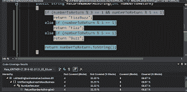

# 单元测试的商业价值是什么？第二部分

> 原文：<https://dev.to/kritner/what-is-the-business-value-of-unit-testing-part-2-4gk9>

[第二部](http://kritner.blogspot.com/2016/02/what-is-business-value-of-unit-testing_22.html)你在这里

[第一部](http://kritner.blogspot.com/2016/02/what-is-business-value-of-unit-testing.html)

在前一篇文章中，我们从一个业务应用程序开始，要求:

> 作为用户，我需要一种输入数字的方法。一旦输入了号码，我需要把它打印出来给我。

客户喜欢这个应用程序！但是对我们有一些新的要求:

> 作为用户，我需要一种输入数字的方法。一旦输入了号码，我需要把它打印出来给我。
> 
> 如果输入一个能被 3 整除的数字，用户应该收到“嘶嘶”声而不是数字
> 
> 如果输入一个能被 5 整除的数字，用户应该收到“嗡嗡”声而不是数字

现在的要求相当于儿童问题和/或代码形 [FizzBuzz](http://codingdojo.org/cgi-bin/index.pl?KataFizzBuzz)

我们的代码以前只有一个逻辑分支。获取号码，返回号码。根据新的要求，我们可以看到将会有更多的分支:

1.  数字不能被 3 或 5 整除
2.  数字能被 3 整除
3.  数字能被 5 整除
4.  (没有明确说明，但是)数能被 3 和 5 整除。

第四个分支没有在需求中陈述，但是看起来像是应该向业务所有者询问的事情，因为它可能没有被考虑，或者甚至可能被假设。

我们最初的方法是这样的:

```
public string ReturnNumberAsString(int numberToReturn)
{
    return numberToReturn.ToString();
} 
```

将更新为现在的样子:

```
 public string ReturnNumberAsString(int numberToReturn)
        {
            if (numberToReturn % 3 == 1 && numberToReturn % 5 == 1)
                return "FizzBuzz";
            else if (numberToReturn % 3 == 1)
                return "Fizz";
            else if (numberToReturn % 5 == 1)
                return "Buzz";

            return numberToReturn.ToString();
        } 
```

现在请注意，我们上一轮的所有单元测试继续通过，因为用于测试方法的数据继续通过我们的新实现。这通常是作为单元测试和需求变更的潜在陷阱提出来的——这似乎是一个合理的关注点！当需求比以前复杂得多的时候，我们的单元测试继续通过。

这就是为什么考虑单元测试(和它们的断言)以及代码覆盖率是如此重要。单元测试总有可能不会因为代码中的新分支而中断。但是，如果你查看代码覆盖率，特别是应用于我们方法的代码覆盖率，你会发现单元测试并没有覆盖所有的代码分支。

[T2】](https://3.bp.blogspot.com/-zl1yKID4FJg/VspsrVTdaiI/AAAAAAAAC2c/MkfCZb124h0/s1600/newRequirementsNoCodeCoverage.PNG)

从上面的截图中可以看到，我们的代码覆盖率用百分比表示，紫色和黄色的文本已经下降。我们代码中的 3 个新分支目前还没有被单元测试覆盖。下面是更新方法时的报告，但是没有覆盖需求的单元测试:[https://github . com/krit ner/UnitTestingBusinessValue/tree/bb 1 F9 BDA 9250 fbdb 85 a 8737 c 0 c 006 f 06 e 6 da 788](https://github.com/Kritner/UnitTestingBusinessValue/tree/bb1f9bda9250fbdb85a8737c0c006f06e6daa788)

现在编写几个单元测试:

```
/// <summary>
        /// number mod 3 and 5 returns FizzBuzz
        /// number mod 3 returns Fizz
        /// number mod 5 returns Buzz
        /// </summary>
        [TestMethod]
        public void NumberReturner\_ReturnNumberAsString\_SpecialCasesReturnValid()
        {
            // Arrange
            NumberReturner rt = new NumberReturner();
            int modThree = 9;
            int modFive = 10;
            int modThreeAndFive = 15;

            // Act
            var resultsModThree = rt.ReturnNumberAsString(modThree);
            var resultsModFive = rt.ReturnNumberAsString(modFive);
            var resultsModThreeAndFIve = rt.ReturnNumberAsString(modThreeAndFive);

            // Assert
            Assert.AreEqual("Fizz", resultsModThree, nameof(resultsModThree));
            Assert.AreEqual("Buzz", resultsModFive, nameof(resultsModFive));
            Assert.AreEqual("FizzBuzz", resultsModThreeAndFIve, nameof(resultsModThreeAndFIve));
        } 
```

嗯。我们目前有一个失败的测试。Fizz 不是从 resultsModThree 返回，而是从 9 返回。让我们看看这是怎么回事。

哦。看起来我无意中在需求 [#2](https://github.com/Kritner/UnitTestingBusinessValue/issues/2) 的实现中创造了一个 bug。

```
if (numberToReturn % 3 == 1 && numberToReturn % 5 == 1)  
    return "FizzBuzz";  
else if (numberToReturn % 3 == 1)  
    return "Fizz";  
else if (numberToReturn % 5 == 1)  
    return "Buzz"; 
```

应该是:

```
if (numberToReturn % 3 == 0 && numberToReturn % 5 == 0)
    return "FizzBuzz";
else if (numberToReturn % 3 == 0)
    return "Fizz";
else if (numberToReturn % 5 == 0)
    return "Buzz"; 
```

现在我们已经更正了代码，我们的新单元测试通过了。但是我们最初的单元测试:

```
// Arrange 
int expected = 42;  
NumberReturner biz = new NumberReturner();  

// Act 
var results = biz.ReturnNumberAsString(expected);  

// Assert 
Assert.AreEqual(expected.ToString(), results); 
```

现在失败了。当然是- 42 % 3 是 0，所以我们实际上收到了 42 的嘶嘶声。将该测试更新为期望值 7。

所有这些意味着什么？在这种情况下，我们的单元测试既帮助了我们，也伤害了我们。他们帮助我们，因为他们帮助我们确定我在需求实现中有一个逻辑错误。他们伤害了我们，因为我们有一个“假阳性”通行证。这就是为什么单元测试断言是重要的，并且代码覆盖率保持很高。没有这两者的结合，测试的商业价值就不那么重要。更新后的实现和逻辑:[https://github . com/krit ner/UnitTestingBusinessValue/tree/78f 03 b 8550593 b 9576 f 28 e 8608561 F4 add 989879](https://github.com/Kritner/UnitTestingBusinessValue/tree/78f03b8550593b9576f28e8608561f4add989879)

在非单元测试场景中，很可能我们的业务逻辑只能通过 UI 进行测试。UI 测试更加沉闷，速度更慢，并且更难一致地重现。想象一下，在我们的逻辑每次改变之后，我们必须通过 UI 一遍又一遍地测试所有的分支。这可能意味着编译、启动、应用程序登录、导航到要测试的逻辑等。哦，然后再做三遍(由于这个**简单* *应用的逻辑)。这是单元测试如此强大的另一个原因。随着我们不断对代码进行更改，我们可以帮助确保我们所做的更改不会以我们意想不到的方式影响系统。我们所用的时间只是手工 UI 测试所用时间的一小部分。

希望这篇文章和前面的帮助能够展示一个好的单元测试套件是如何真正帮助你不仅减少代码中的错误，而且更快地测试你的代码。