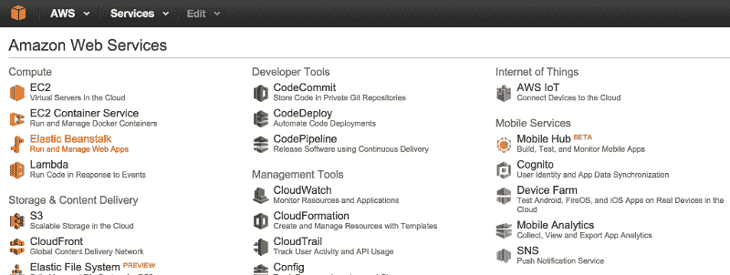
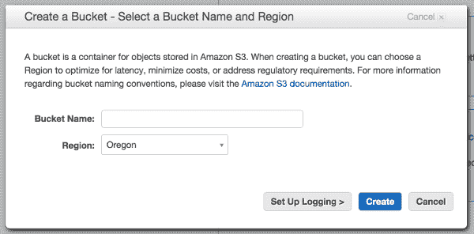
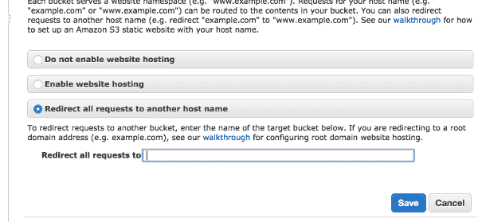
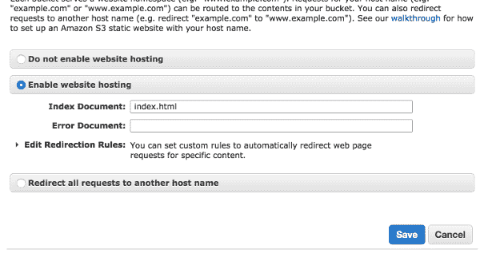
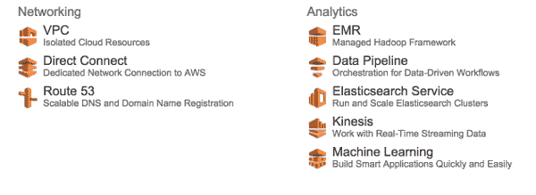

# 在 AWS S3 上托管一个静态站点

> 原文:[https://dev.to/mariordev/host-a-static-site-on-aws-s3-5ai9](https://dev.to/mariordev/host-a-static-site-on-aws-s3-5ai9)

如果你的网站是静态的，比如一个页面或者一个只需要 HTML、CSS 和 JavaScript 的简单网站，你可以用很低的成本在亚马逊网络服务 S3 上托管它。S3 通常用于存储目的，但是您也可以轻松运行一个完整的静态站点。这个博客在 S3 上运行。让我一步一步地告诉你如何做到这一点。

## AWS 账户

你首先需要的是一个 AWS 账户。如果你没有账户，去 AWS[创建一个账户](https://aws.amazon.com/)。

登录您的 AWS 帐户，在 AWS 仪表板的*存储&内容交付*下选择 S3 服务:

[T2】](https://res.cloudinary.com/practicaldev/image/fetch/s--8M4Yhke---/c_limit%2Cf_auto%2Cfl_progressive%2Cq_auto%2Cw_880/http://www.mariorodriguez.co/assets/img/posts/aws-dashboard.png)

## 创建桶

存储桶是存储对象(文件和文件夹)的容器。你需要创建两个桶:一个用于你站点的根域，另一个用于 T2 的子域名。给桶起一个和你的域一样的名字，像这样:

*   *根*域的桶:`yourdomain.com`
*   *www* 域:`www.yourdomain.com`

[T2】](https://res.cloudinary.com/practicaldev/image/fetch/s--hZr1wOFC--/c_limit%2Cf_auto%2Cfl_progressive%2Cq_auto%2Cw_880/http://www.mariorodriguez.co/assets/img/posts/aws-bucket-create.png)

新存储桶的默认权限是，只有所有者可以访问，其他人不能。

## 重定向

你需要将流量从*yourdomain.com*重定向到*[www.domain.com](http://www.domain.com)*。如果你愿意，也可以反过来做，但是在这个例子中，我们将坚持从*根*域重定向到 *www* 。请遵循以下步骤:

*   选择铲斗`yourdomain.com`
*   选择**属性**按钮
*   展开**静态网站托管**部分
*   选择标题为**的选项，将所有请求重定向到另一个主机名**
*   **将所有请求重定向至:** `www.yourdomain.com`
*   选择**保存**按钮

[T2】](https://res.cloudinary.com/practicaldev/image/fetch/s--62qH7a2c--/c_limit%2Cf_auto%2Cfl_progressive%2Cq_auto%2Cw_880/http://www.mariorodriguez.co/assets/img/posts/aws-bucket-redirect.png)

## 启用网站托管

现在您需要为`www.yourdomain.com`桶启用网站托管。步骤与前面的相似:

*   选择铲斗`www.yourdomain.com`
*   选择**属性**按钮
*   展开**静态网站托管**部分
*   选择标题为**启用网站托管**的选项
*   在标题为**索引文件**的框中输入`index.html`
*   选择**保存**按钮

[T2】](https://res.cloudinary.com/practicaldev/image/fetch/s--sNJd5aRm--/c_limit%2Cf_auto%2Cfl_progressive%2Cq_auto%2Cw_880/http://www.mariorodriguez.co/assets/img/posts/aws-s3-enable-hosting.png)

## 权限

让我们允许对`www.yourdomain.com`桶的只读访问:

*   选择铲斗`www.yourdomain.com`
*   选择**属性**按钮
*   展开**权限**部分
*   选择**添加存储桶策略**按钮
*   输入以下策略(确保用您的实际域替换*yourdomain.com*):

```
{
    "Version": "2012-10-17",
    "Statement": [
        {
            "Sid": "AddPerm",
            "Effect": "Allow",
            "Principal": "*",
            "Action": "s3:GetObject",
            "Resource": "arn:aws:s3:::www.yourdomain.com/*"
        }
    ]
} 
```

<svg width="20px" height="20px" viewBox="0 0 24 24" class="highlight-action crayons-icon highlight-action--fullscreen-on"><title>Enter fullscreen mode</title></svg> <svg width="20px" height="20px" viewBox="0 0 24 24" class="highlight-action crayons-icon highlight-action--fullscreen-off"><title>Exit fullscreen mode</title></svg>

这给了任何人从`www.yourdomain.com`桶“获取对象”的权限，包括它的任何文件夹。

## 上传

当你还在`www.yourdomain.com`桶里的时候，你可以上传你的*index.html*文件(以及你所有的站点文件):

*   选择**上传**按钮
*   按照上传屏幕上的说明操作

此时，您的站点应该可以通过默认的端点 URL 进行访问:http://`bucket-name`. S3-website-`AWS-region`. Amazon AWS . com

例如:

http://`yourdomain.com`. S3-website-us-west-2 . Amazon AWS . com

或

http://`www.yourdomain.com`. S3-website-us-west-2 . Amazon AWS . com

## 使用自己的域名

要使用您自己的域，您需要设置您的 DNS 记录。为此，我们将使用 Route 53 服务，因此返回到仪表板并选择 *Networking* 下的 Route 53 图标。

[T2】](https://res.cloudinary.com/practicaldev/image/fetch/s--xFoQfHU4--/c_limit%2Cf_auto%2Cfl_progressive%2Cq_auto%2Cw_880/http://www.mariorodriguez.co/assets/img/posts/aws-dashboard2.png)

请遵循以下步骤:

*   选择**托管区域**
*   选择**创建托管区域**按钮
*   **域名:**【yourdomain.com T2】
*   **类型:**公共托管区域
*   选择**创建**按钮

为*yourdomain.com*创建一个**一个**记录:

*   选择**创建记录集**按钮
*   **名称:**无(留空)
*   **类型:** *A-IPv4 地址*
*   **别名:**是
*   **别名目标:**【yourdomain.com T2】(下-S3 网站端点-)
*   **路由策略:**简单
*   **评估目标健康:**否
*   选择**保存记录集**按钮

现在为【www.domain.com】[创建一个**一个**记录:](http://www.domain.com)

*   选择**创建记录集**按钮
*   **名称:** www
*   **类型:** *A-IPv4 地址*
*   **别名:**是
*   **别名目标:***[【www.yourdomain.com】](http://www.yourdomain.com)*(下-S3 网站端点-)
*   **路由策略:**简单
*   **评估目标健康:**否
*   选择**保存记录集**按钮

### 更新域名提供商的 DNS 服务器

您会注意到，在创建托管区域时，默认情况下会创建一个 **NS** 记录。这个 NS 记录有四台 DNS 服务器。这些是您需要在您的域提供商记录中输入的 DNS 服务器，以将您的域流量定向到 AWS。所以，去你的域名提供商那里，登录你的账户，更新你的 DNS 服务器。

你完了。现在只是一个等待的游戏。一旦在全世界的 DNS 服务器上完成传播，流量将被正确地定向到 S3，您的站点将可以通过您自己的域访问。

关于在 S3 托管静态网站的更多信息，请查看 AWS 文档。

干杯！