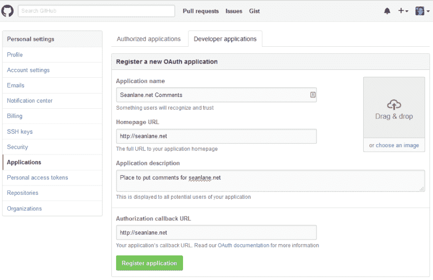
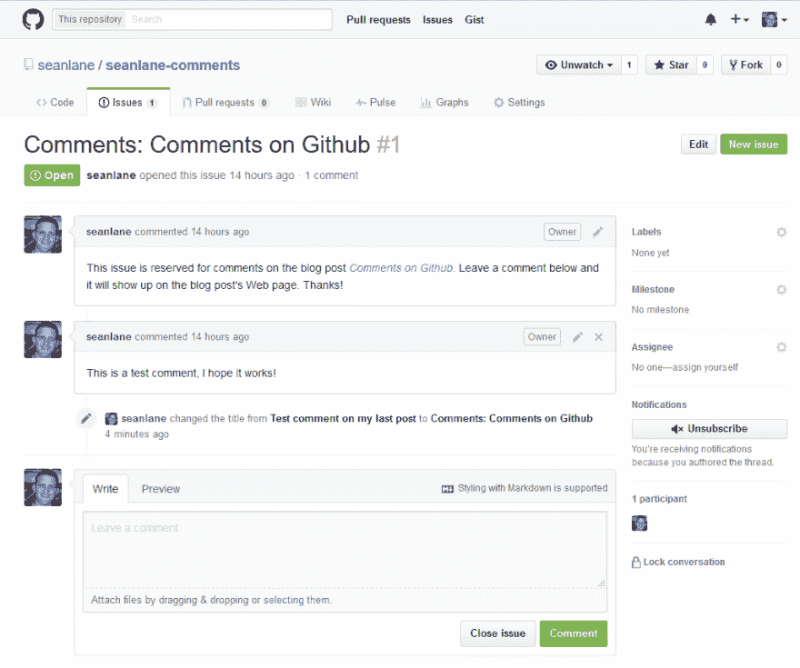
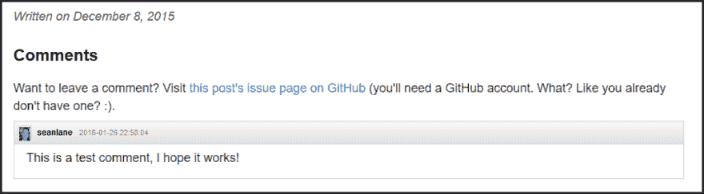

# 在 Github 页面上的问题中托管评论

> 原文:[https://dev . to/Sean lane/hosting-comments-within-issues-on-github-pages-3k0f](https://dev.to/seanlane/hosting-comments-within-issues-on-github-pages-3k0f)

*注意:*截至 2018 年 2 月，该网站的回购是公开的，因此我将评论移动到同一个回购，而不是为它们使用单独的项目。

当我创建一个博客来有一个地方来写和记录事情，以及完成 [CS 404](https://cs.byu.edu/course/cs-404) 的一个类要求时，有一些我希望它拥有的属性。我希望它简单，在一个有信誉的平台上托管，在我的控制之下，并且表现良好。通过使用 Github 页面托管一个 run a Jekyll 静态站点，我几乎可以一下子得到所有东西。

然而，我发现缺少的一件事是评论，或者给任何人一种方法来回应或评论给定的博客帖子。我四处寻找几种不同的解决方案。许多人求助的一个选择是使用 [Disqus](https://disqus.com/) 评论。这很容易实现，只需要在任何你想添加评论的帖子上添加一段简单的 Javascript 代码，但是使用 Disqus 的几个缺点很快就显现出来了。作为一个额外的 Javascript 组件，它需要额外的请求，这可能会使曾经快速、简单的网站陷入困境。 <sup id="fnref:1">[1](#fn:1)</sup> 其他隐私和安全问题也随之而来，你信任的任何第三方服务只是你网站的另一个负债。我看的其他产品有 [Discourse](https://www.discourse.org/) 和 [Poole](http://pooleapp.com/) ，但我真的想避免让网站变得更加复杂，不得不依赖第三方。

我发现了 Ivan Zuzak 的一篇博文，详细描述了如何利用 Github 的问题跟踪系统来管理 Github 页面站点的评论。 <sup id="fnref:3">[3](#fn:3)</sup> 这是一个非常漂亮的黑客技术，它通过网站托管的同一个平台添加评论，只需要在我的工作流程中添加几个步骤。

我按照伊万的步骤，根据我自己的情况对他的指示做了一点小小的改动。改变的原因是我把我的站点放在一个私有的 Github 库中，我不想把它公开。解决的办法是简单地使用第二个公共回购来进行评论，而我继续将网站保留在私人回购中。除此之外，一切都很完美。以下步骤(在 Ivan 的博客文章中有进一步的解释)将系统设置到位:

## 将基础添加到您的站点

1.  (可选)创建一个公共存储库，您可以在其中创建问题来存放评论。如果你的网站托管的回购是私人的，那么问题也将是私人的。即使该网站有权将评论提交给公众查看，如果没有被明确授权至少查看回购协议，任何人都无法通过 Github 提交新的评论。我的工作是创建第二个公共回购来存储我的评论。如果你的 Github Pages 站点已经在公开回购中，那么你可以简单地使用回购的问题进行评论。

2.  [向 GitHub 注册一个新的 OAuth 应用程序。](https://github.com/settings/applications/new)给它起一个你能记住的名字(这对我们的目的并不重要)。主页和授权回拨 URL 应该都是你的博客的 URL。例如，我的设置为`http://seanlane.net`，如下图所示:

<figure>[](https://res.cloudinary.com/practicaldev/image/fetch/s--S5-t8CLt--/c_limit%2Cf_auto%2Cfl_progressive%2Cq_auto%2Cw_880/https://sean.lane.img/2016/01/comments_on_github/oauth_app.png) 

<figcaption>

#### 在 Github

</figcaption>

</figure>

中添加新的 OAUTH 应用

这授权站点绕过[同源策略](https://en.wikipedia.org/wiki/Same-origin_policy)，这在伊万的作品 <sup id="fnref:4">[4](#fn:4)</sup> 中有进一步解释。

1.  我在每个帖子的 Jekyll 模板中添加了以下代码:

```

  <div id="comments">
    <h2>Comments</h2>
    <div id="header">
        Want to leave a comment? Visit <a href="https://github.com/seanlane/seanlane-comments/issues/{{page.commentIssueId}}"> 
        this post's issue page on GitHub</a> (you'll need a GitHub account. What? Like you already don't have one? :).
    <div>
  </div>
  <script type="text/javascript" src="http://ajax.googleapis.com/ajax/libs/jquery/1/jquery.min.js"></script>
  <script type="text/javascript" src="http://datejs.googlecode.com/svn/trunk/build/date-en-US.js"></script>
  <script type="text/javascript">

      function loadComments(data) {
          for (var i=0; i < data.length; i++) {
              var cuser = data[i].user.login;
              var cuserlink = "https://www.github.com/" + data[i].user.login;
              var clink = "https://github.com/seanlane/seanlane-comments/issues/{{page.commentIssueId}}#issuecomment-" + 
                  data[i].url.substring(data[i].url.lastIndexOf("/") + 1);
              var cbody = data[i].body_html;
              var cavatarlink = data[i].user.avatar_url;
              var cdate = Date.parse(data[i].created_at).toString("yyyy-MM-dd HH:mm:ss");

              $("#comments").append("<div class='comment'><div class='commentheader'><div class='commentgravatar'>" 
                  + '' 
                  + "</div><a class='commentuser' href=\"" + cuserlink + "\">" 
                  + cuser + "</a><a class='commentdate' href=\"" + clink 
                  + "\">" + cdate + "</a></div><div class='commentbody'>" + cbody + "</div></div>");
          }
      }

      $.ajax("https://api.github.com/repos/seanlane/seanlane-comments/issues/{{page.commentIssueId}}/comments", {
          headers: {Accept: "application/vnd.github.full+json"},
          success: function(msg){
              loadComments(msg);
          }
      });
  </script>
 
```

这将检查文章是否有问题 ID(将在接下来的步骤中设置),从中收集评论，然后在页面底部填充评论。

1.  为了让注释看起来更容易，我还在我的模板主 CSS 文件中添加了一些 CSS:

```
/ ********************************
*
* COMMENTS
*
******************************** /

.comment {
    background-color: transparent;
    border-color: #CACACA;
    border-style: solid;
    border-width: 1px;
    color: black;
    display: block;
    margin-bottom: 10px;
    margin-top: 10px;
    padding: 0px;
    width: 100%;
  }

.comment .commentheader {
  border-bottom-color: #CACACA;
  border-bottom-style: solid;
  border-bottom-width: 1px;
  color: black;
  background-image: -webkit-linear-gradient(#F8F8F8,#E1E1E1);
  background-image: -moz-linear-gradient(#F8F8F8,#E1E1E1);
  color: black;
  display: block;
  float: left;
  font-family: helvetica, arial, freesans, clean, sans-serif;
  font-size: 12px;
  font-style: normal;
  font-variant: normal;
  font-weight: normal;
  height: 33px;
  line-height: 33px;
  margin: 0px;
  overflow-x: hidden;
  overflow-y: hidden;
  padding: 0px;
  text-overflow: ellipsis;
  text-shadow: rgba(255, 255, 255, 0.699219) 1px 1px 0px;
  white-space: nowrap;
  width: 100%;
}

.comment .commentheader .commentgravatar {
  background-attachment: scroll;
  background-clip: border-box;
  background-color: white;
  background-image: none;
  background-origin: padding-box;
  border-color: #C8C8C8;
  border-style: solid;
  border-width: 1px;
  color: black;
  display: inline-block;
  float: none;
  font-family: helvetica, arial, freesans, clean, sans-serif;
  font-size: 1px;
  font-style: normal;
  font-variant: normal;
  font-weight: normal;
  height: 20px;
  line-height: 1px;
  margin-left: 5px;
  margin-right: 3px;
  margin-top: -2px;
  overflow-x: visible;
  overflow-y: visible;
  padding: 1px;
  text-overflow: clip;
  text-shadow: rgba(255, 255, 255, 0.699219) 1px 1px 0px;
  vertical-align: middle;
  white-space: nowrap;
  width: 20px;
}

.comment .commentheader a:link {
  text-decoration: none;
}

.comment .commentheader a:hover {
  border-bottom:1px solid;
}

.comment .commentheader .commentuser {
  background-color: transparent;
  color: black;
  display: inline;
  float: none;
  font-family: helvetica, arial, freesans, clean, sans-serif;
  font-size: 12px;
  font-style: normal;
  font-variant: normal;
  font-weight: bold;
  height: 0px;
  line-height: 16px;
  margin-left: 5px;
  margin-right: 10px;
  overflow-x: visible;
  overflow-y: visible;
  padding: 0px;
  text-overflow: clip;
  text-shadow: rgba(255, 255, 255, 0.699219) 1px 1px 0px;
  white-space: nowrap;
  width: 0px;
}

.comment .commentheader .commentdate {
  background-color: transparent;
  color: #777;
  display: inline;
  float: none;
  font-family: helvetica, arial, freesans, clean, sans-serif;
  font-size: 11px;
  font-style: normal;
  font-variant: normal;
  font-weight: normal;
  height: 0px;
  line-height: 33px;
  margin: 0px;
  overflow-x: visible;
  overflow-y: visible;
  padding: 0px;
  text-overflow: clip;
  text-shadow: rgba(255, 255, 255, 0.699219) 1px 1px 0px;
  white-space: nowrap;
  width: 20em;
}

.comment .commentbody {
  background-attachment: scroll;
  background-clip: border-box;
  background-color: transparent;
  background-image: none;
  background-origin: padding-box;
  color: #333;
  display: block;
  margin-bottom: 1em;
  margin-left: 1em;
  margin-right: 1em;
  margin-top: 40px;
  overflow-x: visible;
  overflow-y: visible;
  padding: 0em;
  position: static;
  width: 96%;
  word-wrap: break-word;
}

.comment .commentbody p {
  margin-bottom: 0.5em;
  margin-top: 0.5em;
  margin-left: 0em;
  margin-right: 0em;
}

.comment .commentbody pre {
  border: 0px solid #ddd;
  background-color: #eef;
  padding: 0 .4em;
}

.comment .commentbody pre code {
  border: 0px solid #ddd;
}

.comment .commentbody code {
  border: 1px solid #ddd;
  background-color: #eef;
  font-size: 85%;
  padding: 0 .2em;
} 
```

有了这四个步骤，我就可以在任何给定的博客文章(或任何有支持代码的页面)上引入评论。再次注意，大部分代码来自 Ivan Zuzak 的帖子，我做了一些小的修改。

## 给帖子添加评论

现在剩下要做的就是对任何你想要评论的文章执行以下步骤。对于每个帖子，请执行以下操作:

1.  在您指定的回购中创建一个新问题，作为您对该特定帖子的评论的宿主。每期都遵循一个基础 URL: `https://github.com/{GITHUB USERNAME}/{REPO NAME}/issues/{ISSUE ID #}`。每个问题都有一个唯一的 ID，在问题创建后，可以在问题的 URL 中看到该 ID。比如，[https://github.com/seanlane/seanlane-comments/issues/1:](https://github.com/seanlane/seanlane-comments/issues/1:)

<figure>[](https://res.cloudinary.com/practicaldev/image/fetch/s--F5MDQ7b3--/c_limit%2Cf_auto%2Cfl_progressive%2Cq_auto%2Cw_880/https://sean.lane.img/2016/01/comments_on_github/issue.png)

<figcaption>

#### Github 问题页面截图为本帖评论

</figcaption>

</figure>

1.  获取将作为特定帖子的评论页面的该问题的 ID，并将该 ID 作为属性添加到页面 YAML 头版:

```
--- 
layout: post 
title: Comments on Github 
commentIssueId: 1 
--- 
```

正确设置后，我们将在博客文章后看到相应的评论部分:

<figure>[](https://res.cloudinary.com/practicaldev/image/fetch/s--KQXk9zaY--/c_limit%2Cf_auto%2Cfl_progressive%2Cq_auto%2Cw_880/https://sean.lane.img/2016/01/comments_on_github/comments_example.png) 

<figcaption>

#### 行动中的评论截图

</figcaption>

</figure>

这可能是一个小小的改动，但现在我有了一个简单的方法将评论放入我的静态网站，而不需要涉及第三方平台或强迫用户下载另一个 Javascript 跟踪小部件。希望我的例子对某些人有用，我感谢 Ivan 的帖子起到了带头作用。

* * *

1.  [http://Chris lema . com/killed-disqus-commenting/http://Chris lema . com/killed-disqus-commenting/](http://chrislema.com/killed-disqus-commenting/http://chrislema.com/killed-disqus-commenting/)<sup>【返回】</sup>
2.  [https://en . Wikipedia . org/wiki/Disqus # crisis _ and _ privacy _ concerns](https://en.wikipedia.org/wiki/Disqus#Criticism_and_privacy_concerns)<sup>【return】</sup>
3.  [http://ivanzuzak.info/2011/02/18/](http://ivanzuzak.info/2011/02/18/)T2【归来】
4.  [http://ivanzuzak . info/2011/02/18/github-hosted-comments-for-github-hosted-blogs . html # par 11](http://ivanzuzak.info/2011/02/18/github-hosted-comments-for-github-hosted-blogs.html#par11)<sup>【return】</sup>