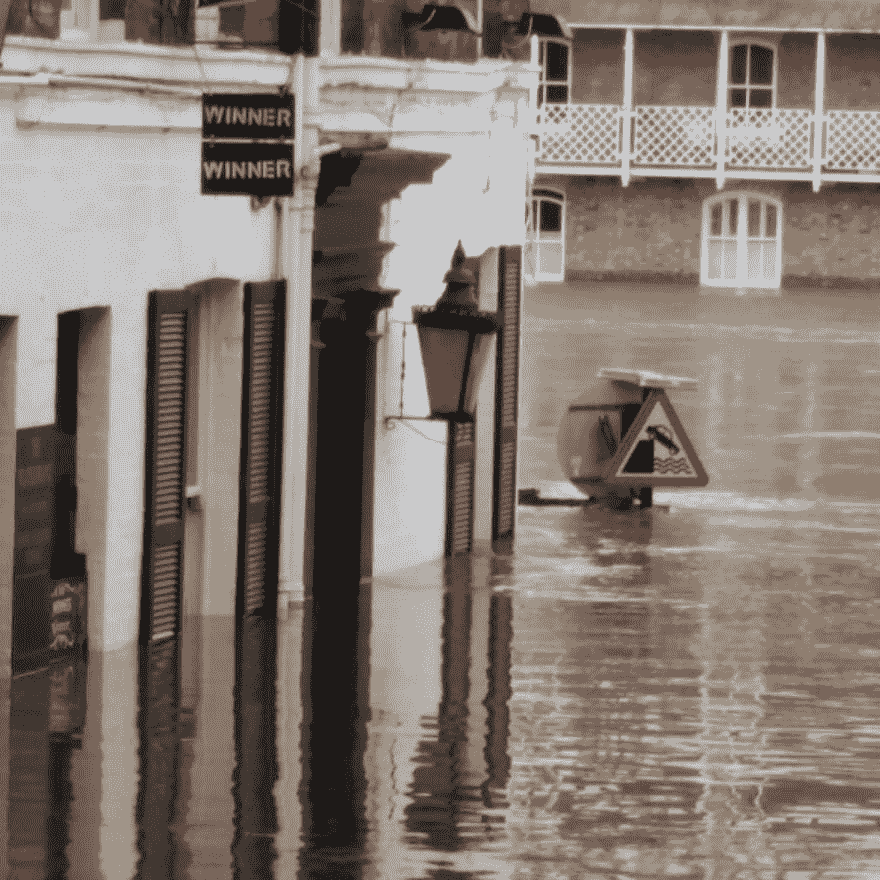

# 灾难规划

> 原文:[https://dev.to/funkysi1701/disaster-planning-2oi7](https://dev.to/funkysi1701/disaster-planning-2oi7)

[T2】](https://res.cloudinary.com/practicaldev/image/fetch/s--5585zBwm--/c_limit%2Cf_auto%2Cfl_progressive%2Cq_auto%2Cw_880/https://storageaccountblog9f5d.blob.core.windows.net/blazor/wp-content/uploads/2016/01/flood.jpg%3Fresize%3D1024%252C1024%26ssl%3D1)

圣诞节期间，约克市经历了近年来最严重的洪灾。如果你想帮忙，约克洪水呼吁组织正在接受捐款。

幸运的是，我没有受到影响，但看到许多我最喜欢的街道都积满了水，真的很难过。水位最高时，成千上万的人不得不撤离家园。

约克的电话交换台位于市中心，随着洪水上涨，这座建筑被淹没。运营该交易所的英国电信竭尽全力试图恢复约克及周边地区的电话和宽带服务，但这导致用户至少 24 小时或更长时间的停机。

在此期间，城市的大部分地区都无法接受顾客的卡支付(因为需要互联网连接)，提款机也因为同样的原因无法工作，最令人担忧的是无法获得紧急服务。

> 任何人都会认为纽约市的电话停机了
> 
> —西蒙·福斯特([@ funky si1701](https://dev.to/funkysi1701))[2015 年 12 月 28 日](https://twitter.com/funkysi1701/status/681439632886738944?ref_src=twsrc%5Etfw)

我绝不是在批评努力工作的工程师，他们在英国电信交易所工作，以恢复城市服务。然而，我不得不问 BT 灾难恢复计划中包含了什么。

作为一名 IT 经理，备份和灾难规划是我需要考虑和计划的事情。最近在我们的互联网连接上的投资意味着我们现在在租用线路上，所以 BTs 停机不会影响我们的网络连接，我不确定电话，但我相信作为一个企业，如果我们需要，我们可以在这段时间继续运行。

我从来没有花足够的时间为灾难做计划，但是我肯定想在这上面花更多的时间，我脑子里确实有一个计划的基础，这可能比英国电信要多。

英国电信是一家大公司，他们运营着几乎整个国家的电话线路，根据维基百科，他们在 170 个国家开展业务。我认为他们可以负担得起有人为灾难恢复做计划。

约克交易所位于一条经常发洪水的河流旁边。公司本可以做些什么来避免这个问题？

1.  将其部分或全部服务迁移到远离河流的位置。
2.  添加通过替代交换重新路由服务的能力。
3.  约克周围的许多城镇和村庄都使用 BT 交换机，当然其中一些也可以配置成使用其他交换机。

在这些恐怖警报和炸弹恐慌的日子里。想象一下，如果约克是伦敦，只要让一个交易所离线，就能让这个首都的通信能力瘫痪。

我确信英国电信正在审视他们做对了什么，做错了什么，如果你正在阅读这篇文章，请看看你自己的灾难恢复政策。不要像 BT 那样被抓出来。