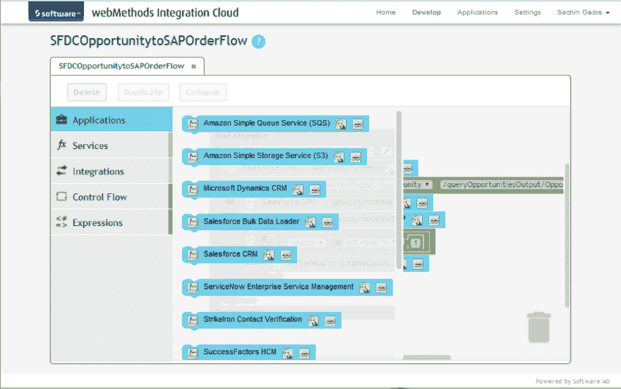
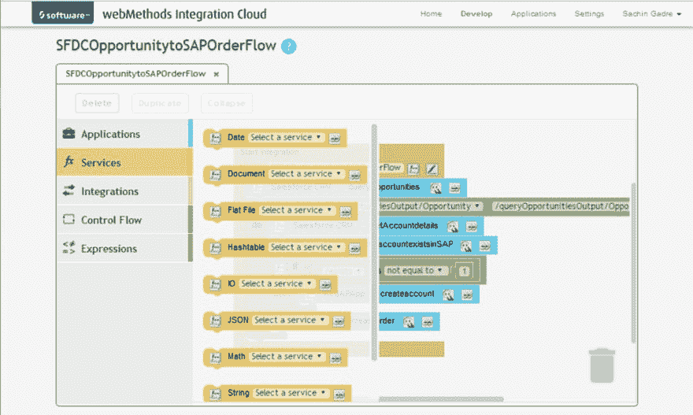
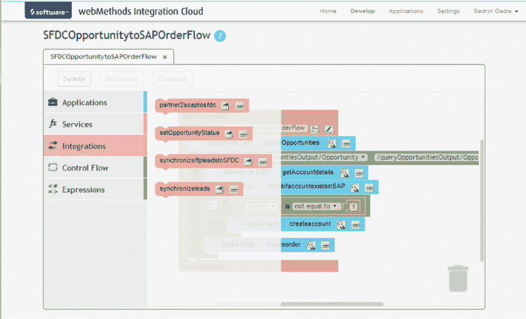
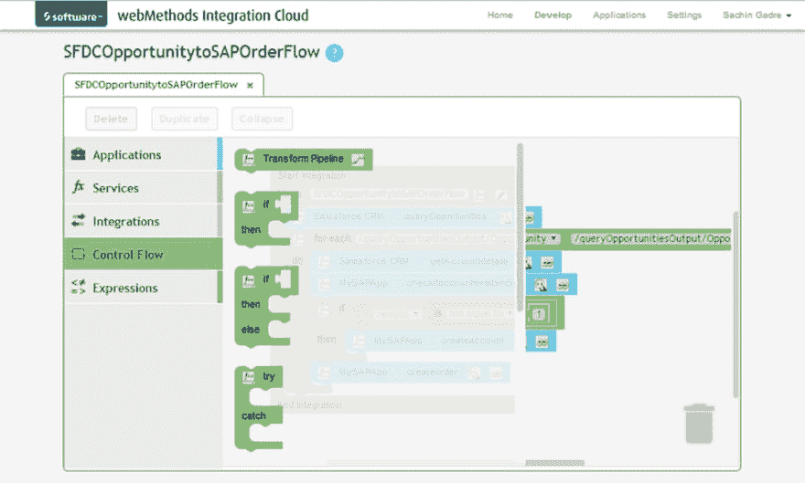
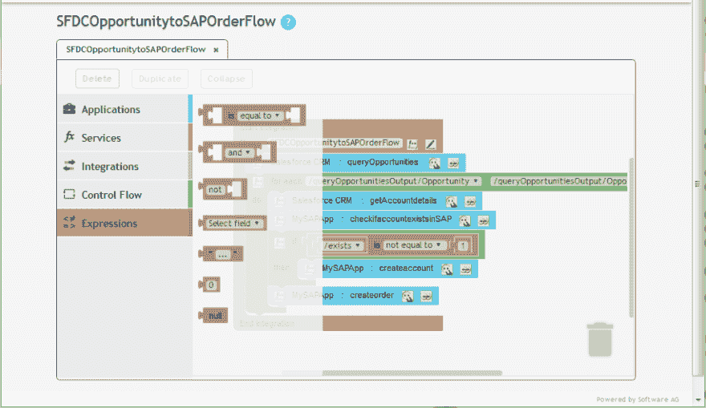

# webMethods 集成云

> 原文:[https://dev . to/tech community/web methods-integration-cloud-1i4h](https://dev.to/techcommunity/webmethods-integration-cloud-1i4h)

**2016 年第一期**

|  | [下载 pdf](http://techcommunity.softwareag.com/ecosystem/download/techniques/2016-issue1/SAG_WebMethods_Integration_Cloud%20_TECHniques_Jan16_WEB.pdf) 

|

# 如今，创作复杂的管弦乐是轻而易举的事情

webMethods Integration Cloud 的目标不仅仅是让混合云和本地集成成为可能，而是让集成变得足够简单，任何人都可以做到。了解如何在 webMethods Integration Cloud 中创建复杂的编排。

## 云用户不是专家

为什么在设计集成应用程序(尤其是基于云的应用程序)的服务时，易用性如此重要？答案与用户有关。

企业公司的集成软件用户通常是专家。这些专家几乎肯定是训练有素的程序员或架构师，在使用几种不同的编程语言和技术方面经验丰富。这很有意义，因为传统上创建集成是一个技术挑战。

从历史上看，对于需要集成到 IT 环境中的每个应用程序或数据源，无论是数据同步还是在记录系统(如 CRM 和 ERP 系统)上构建新的敏捷应用程序，都需要特殊的技能来实现集成。除了连接应用程序和数据之外，专家还需要以一种不会意外损坏任何东西或给 IT 环境带来新问题的方式将它们联系在一起。

当今基于云的应用程序的快速增长以及在它们和内部系统之间创建混合集成的需求增加了集成的复杂性。但它也提供了简化的机会——这种简化不再需要专家来进行集成。

## 需求转向商业买家

webMethods Integration Cloud 是一个集成平台即服务(iPaaS ),它是一个完全托管的解决方案，只需一个基于浏览器的 UI 即可使用，对于非程序员来说非常容易使用。为什么？我们的客户告诉我们，他们需要一个集成工具，可以在不同业务线和技术组织的分布式团队之间共享，并且不需要任何专门的集成知识，甚至不需要编程技能。

在过去几年中，购买技术的最大变化之一是企业购买者而非 IT 购买者的 IT 支出迅速增加。业务团队越来越喜欢购买基于云的应用程序的便利性，这些应用程序提供适当的功能级别，需要很少的配置和设置，不需要资本支出，并且可以比传统软件更快地启动和运行。

这种转变迅速增加了基于云的应用程序与其他系统(如内部记录系统)之间的集成需求。组织正在寻找更好的方法来满足这些新的要求，减少对 IT 的需求，并使业务取得成功。为了实现这一目标，组织正在寻求提供支持自助服务的集成服务，特别是对于没有编码和集成复杂性经验的人。

## 我们的图形化方法

即使在非技术用户中，自助服务集成的驱动力也促使 Software AG 创建了一个受图形编程语言(如 Scratch)影响的高度图形化的用户界面。

什么是 Scratch？Scratch 是一种非常易于使用的编程方法，由麻省理工学院(MIT)媒体实验室的终身幼儿园小组开发。Scratch 很棒，因为它足够强大，可以构建非常复杂的集成流程，但对孩子来说又足够容易使用。

据 Scratch 网站称，“编写计算机程序的能力是当今社会素养的重要组成部分。当人们在 Scratch 中学习编码时，他们学到了解决问题、设计项目和交流想法的重要策略。”

那么 webMethods 集成云是什么样子的呢？它具有高度图形化的拖放式用户界面，可以将简单或复杂的集成拼凑在一起。

使用集成云构建集成时，主要组件是您连接的应用程序、这些应用程序之间的映射和转换，以及将所有步骤联系在一起的标准编排和数据流。

协调集成是指将两个或多个应用程序集成在一起以实现流程自动化或实时同步数据的过程。协调集成使您能够集成应用程序以及管理和监控您的集成。webMethods Integration Cloud 支持涉及多个应用程序端点、复杂路由和涉及多个步骤的集成的高级集成场景。通过使用图形化的拖放工具，您可以创建复杂的、协调的集成，并在集成云环境中运行它们。

让我们看看集成云中可用的组件。

## 集成云组件

集成云为应用程序、开箱即用的服务、控制流和编程表达式提供了简单的图形组件，如图 1 所示。此外，很容易嵌套集成来拼凑多个小的集成，从而轻松重用基本的构建模块，并创建更复杂的编排。

 

**图 1:** webMethods 集成云提供了简单的组件，便于拖放集成。

### 申请

应用程序包括云应用程序、内部应用程序，以及您将连接到 webMethods Integration Cloud 并与之集成的文件和文档。

### 服务

如图 2 所示，服务是现成的实用程序，可以帮助您轻松地执行有用的操作，如数学函数、数据和字符串操作。

 

**图 2:** 服务简化有用的操作。

### 集成

图 3 提供了客户在其集成云实例中配置的集成列表。这些集成可以被拖到托盘上，并作为构建块嵌套在其他集成中，以创建更复杂的集成服务。

 

**图 3:** 集成可以被拖动并嵌套在其他集成内。

### 控制流程

控制流提供了使用通用编程逻辑(如条件布尔表达式、循环结构、if-then 块和数据转换)管理编排流的方法。

 

**图 4:** 控制流用通用编程逻辑管理编排。

### 表情

表达式支持逻辑运算、比较和值的设置，如图 5 所示。例如，提供了诸如“等于”、“不等于”、“小于”和“大于”的表达式。

 

**图 5:** 表达式支持逻辑运算。

尽管这些基于 Scratch 的组件看起来不同于 webMethods 传统的流程编排语言，但在幕后，它仍然是流程。

## 自助集成

集成的易用性和自助服务对于传统集成团队的成功至关重要，尤其是现在需要这么多新的混合集成。您需要一个工具来帮助您的业务用户快速启动和运行他们的项目，即使他们不是集成技术方面的专家。

同样重要的是:整合不是玩具。通常，关键任务数据和服务依赖于集成技术。如果您希望知道运行您的集成的引擎将支持您的集成挑战的复杂性，请确保尝试 webMethods Integration Cloud。

尝试新的集成云用户界面，在[www.webMethodsCloud.com/integration](http://www.webMethodsCloud.com/integration)注册免费试用。