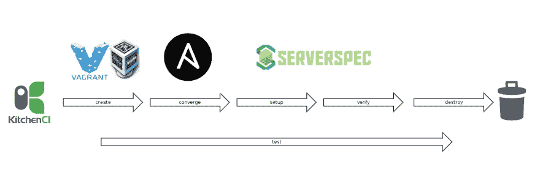

# 测试可行角色

> 原文：<https://dev.to/rndmh3ro/testing-ansible-roles-3213>

我们——在 [dev-sec.io](http://dev-sec.io/) 团队——创建了 Ansible(以及傀儡和主厨)角色，强化了我们的 Linux 服务器的安全性。它们意味着在生产中使用，所以我们试图为几个不同的操作系统提供这些角色，包括 Debian、Ubuntu、RedHat 及其衍生物。

在许多不同的系统上手动测试角色是一项非常耗时的任务:你必须设置一个虚拟机，更新它，安装 Ansible，运行剧本，修复错误，清洗并重复。如果你想在许多不同的操作系统上这样做，手动操作是不可能的。

## 工具

为了使测试自动化，我们使用了大量的程序，这些程序一起在很短的时间内执行所有上述任务！

*   [Test-Kitchen](https://github.com/test-kitchen/test-kitchen)->Test Kitchen 是一个测试工具，用于在一个或多个独立的平台上执行您配置的代码。
*   [流浪者](https://www.vagrantup.com/) - >创建和配置轻量级的、可复制的、可移植的开发环境。
*   [VirtualBox](https://www.virtualbox.org/)->VirtualBox 是一款功能强大的 x86 和 AMD64/Intel64 虚拟化产品，适合企业和家庭使用。
*   为你的由 CFEngine、Puppet、Ansible、Itamae 或其他任何软件配置的服务器进行 rspec 测试。
*   [厨房-负责](https://github.com/neillturner/kitchen-ansible) - >测试厨房的负责人
*   [厨房流浪汉](https://github.com/test-kitchen/kitchen-vagrant) - >厨房流浪汉司机
*   git - >一个快速的、可扩展的、分布式的修订控制系统

为了帮助自动化测试角色，我创建了这篇博文和 [ansible-test-framework](https://github.com/rndmh3ro/ansible-test-framework) 。这个框架提供了必要的文件和配置来轻松设置您的测试环境。它还可以轻松测试您与 travis 的角色。

## 工作流

测试工作流程的阶段如下:

*   创建-创建已定义的实例
*   converge——安装 Ansible 并在实例上运行您的剧本
*   设置——在实例上安装测试实用程序和运行程序
*   验证-运行您在实例上创建的测试
*   销毁-销毁实例

[T2】](https://res.cloudinary.com/practicaldev/image/fetch/s--F6gndECv--/c_limit%2Cf_auto%2Cfl_progressive%2Cq_auto%2Cw_880/https://www.zufallsheld.img/ansible_test_framework_diagram.png)

## 设置

你需要先在本地安装 Git、Ruby、VirtualBox 和 vagger，所有其他必要的组件将会被安装。

安装它们之后，为您想要测试的角色创建一个目录(在下面的例子中称为`ansible_role`)。

**名称目录和角色名称必须相同！**

然后将测试框架 git-clone 到您新创建的目录中，并在其中进行更改。然后删除`.git`-目录，这样你以后就可以把你的角色上传到 Github 了！

```
# basic setup
mkdir ansible_role
git clone --depth=1 https://github.com/rndmh3ro/ansible-test-framework ansible_role/
cd ansible_role/
rm -fr .git 
```

下一步是用 *ansible-galaxy* 创建一个空角色。在您的角色目录中运行这个命令，并用您给目录起的名字替换 *ansible_role* 。

```
# create empty ansible role
ansible-galaxy init -p ../ --force ansible_role 
```

这里使用了*force*-选项，因为目录不是空的，因为您已经将测试框架克隆到其中。

现在必须安装 test-kitchen、serverspec、provisioner、驱动程序及其所有依赖项。幸运的是，这些都可以用 [bundler](http://bundler.io/) 来完成，这是 ruby:
的一个 gem 依赖处理程序

```
# Install software and dependencies
gem install bundler
bundle install 
```

第一个命令安装 bundler。第二个命令使用目录中的 *Gemfile* 并安装所有包及其依赖项。

现在是时候定制您的测试设置了。您必须在两个地方将默认名称 *ansible-test-framework* 替换为您的角色名称(在我的例子中是 *ansible_role* ),即`default.yml`和`.kitchen.yml`。在 *kitchen.yml* 中，替换应该在 *roles_path* 中。在 *default.yml* 中，它是*角色*之后的第一个项目。

您也可以使用此*sed*-命令来替换出现的内容。只需将命令中的 *ansible_role* 替换为您的角色名称。

```
# replace ansible-test-framework with your role-name in:
sed -i 's/ansible-test-framework/ansible_role/g' default.yml .kitchen.yml 
```

## 写角色和测试

现在就写下你的职责吧！这不是指南的一部分。

为您的角色编写测试也不是本指南的一部分，但是这个框架提供了开始编写 serverspec-tests 的必要配置:已经有一个名为 *test_spec.rb* 的文件，您可以在其中编写测试，并且 spec_helper 是为 serverspec 配置的。

要获得更多关于编写测试和使用 serverspec 的帮助，请阅读文档:-[http://kitchen.ci/docs/getting-started/writing-server-test](http://kitchen.ci/docs/getting-started/writing-server-test)-[https://github . com/Neill Turner/kitchen-ansi ble # test-kitchen-server spec](https://github.com/neillturner/kitchen-ansible#test-kitchen-serverspec)

## 测试

当你写完你的角色和测试之后，你就可以开始测试了！有不同的测试方法。您可以测试单台机器、一组机器或同时测试所有机器。请看下面的例子，或者看看测试厨房的[文档](http://kitchen.ci/docs/getting-started/getting-help)。

```
# fast test on one machine
bundle exec kitchen test ansible-latest-ubuntu-1404

# test on all machines in parallel
bundle exec kitchen test -c

# test all ubuntu machines
bundle exec kitchen test ubuntu 
```

在开发角色时，如果某个测试或角色在某个时候失败了，那么总是销毁和重新创建机器会很麻烦。为了避免这种情况，您可以创建并聚合机器。如果角色在收敛过程中失败，您可以简单地再次运行收敛:

```
# for development
bundle exec kitchen create ansible-latest-ubuntu-1404
bundle exec kitchen converge ansible-latest-ubuntu-1404

# ... run fails, change role, converge again

bundle exec kitchen converge ansible-latest-ubuntu-1404 
```

如果您的角色需要很长时间来运行，并且您想要调试一个特定的任务，那么您可以在一个环境变量的帮助下运行 converge，如下所示:

```
ANSIBLE_EXTRA_FLAGS='--start-at-task="ansible_role | name of last working instruction"' bundle exec kitchen converge 
```

将*ansi ble _ role | name of last working instruction*替换为您想要开始的任务的名称，这样您就可以跳过其他任务。

类似地，如果您想跳过某些任务，您可以像这样使用环境变量:

```
ANSIBLE_EXTRA_FLAGS='--skip-tags=beginning' bundle exec kitchen converge 
```

### 特拉维斯测试

默认情况下，该框架还支持使用 Travis-CI 进行测试。您所要做的就是在 Travis 中启用您的存储库，所有对存储库的推送都将通过 Travis 进行测试。注意 Travis 是在 Ubuntu 上测试的，所以相应地写下你的角色！