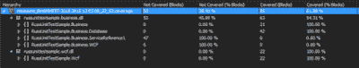
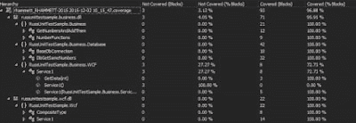

# 单元测试和 Moq 入门-第 4 部分

> 原文:[https://dev . to/krit ner/getting-started-with-unit-testing-and-MOQ-part-4-2l2i](https://dev.to/kritner/getting-started-with-unit-testing-and-moq---part-4-2l2i)

[第 1 部分](http://kritner.blogspot.com/2015/11/getting-started-with-unit-testing-and.html)

[第 2 部分](http://kritner.blogspot.com/2015/12/in-previous-post-i-started-on-project.html)

[第 3 部分](http://kritner.blogspot.com/2015/12/getting-started-with-unit-testing-and.html)

[第 4 部分](http://kritner.blogspot.com/2016/01/getting-started-with-unit-testing-and.html)你在这里

在[的前一篇文章](http://kritner.blogspot.com/2015/12/getting-started-with-unit-testing-and.html)中，我们已经设置了基本的 WCF 项目来进行单元测试。从那以后，我在控制台应用程序中提取了 WCF 服务引用，并将其放在我们的业务项目中。现在业务项目有了 WCF 服务引用，我添加了一个新类来处理 WCF 客户端的出现。

此外，我已经更新了控制台应用程序，以使用 WCF 客户端的新业务对象包装器。

这两个类看起来是这样的:

程序. cs

```
namespace RussUnitTestSample
{
  class Program
  {

      #region consts
      const string CONNECTION\_STRING = "Data Source=192.168.50.4,1515;Initial Catalog=MBES;Persist Security Info=True;Integrated Security=true;";
      #endregion consts

      #region Entry

      static void Main(string[] args)
      {
          GetNumbersAndAddThem obj = new GetNumbersAndAddThem(
              new DbGetSomeNumbers(new BaseDbConnection(CONNECTION\_STRING)),
              new NumberFunctions()
          );

          Console.WriteLine("\n");
          Console.WriteLine(obj.Execute());
          Console.WriteLine("\n");

          Business.WCF.Service1 service = new Business.WCF.Service1();

          Console.WriteLine("\n");
          Console.WriteLine("{0}", service.GetData(42));
          Console.WriteLine("\n");

      }

      #endregion Entry
  }

} 
```

WCF。服务 1

```
namespace RussUnitTestSample.Business.WCF
{

    /// <summary>
    /// Communication with the WCF Service1
    /// </summary>
    public class Service1
    {

        #region Private
        private ServiceReference1.Service1Client \_service;
        #endregion Private

        public Service1()
        {
            this.\_service = new ServiceReference1.Service1Client();
        }

        public string GetData(int value)
        {
            return this.\_service.GetData(value);
        }

    }
} 
```

我将 WCF 服务和客户端从控制台应用程序中移出，以便更容易进行单元测试。我们还没有达到 WCF。Service1 可以进行单元测试，尽管服务本身可以。我已经添加了一个新的 RussUnitTestSample。WCF.Tests 项目添加到我的解决方案中，并为我的 Service1.svc 类(IService1 的实现)添加了以下测试。

提醒一下，IService1.cs 被定义为:

```
// NOTE: You can use the "Rename" command on the "Refactor" menu to change the interface name "IService1" in both code and config file together.
[ServiceContract]
public interface IService1
{

    [OperationContract]
    string GetData(int value);

    [OperationContract]
    CompositeType GetDataUsingDataContract(CompositeType composite);

    // TODO: Add your service operations here
} 
```

我已经基于

服务 1.svc:

```
namespace RussUnitTestSample.Wcf.Tests
{

    /// <summary>
    /// Unit tests for service1
    /// </summary>
    [TestClass]
    [ExcludeFromCodeCoverage]
    public class Service1Tests
    {

        /// <summary>
        /// Get data works as expected with a positive number
        /// </summary>
        [TestMethod]
        public void Service1\_GetData\_PositiveNumber()
        {
            // Arrange
            Wcf.Service1 service = new Wcf.Service1();
            int num = 55;
            var expected = string.Format("You entered: {0}", num);

            // Act
            var result = service.GetData(num);

            // Assert
            Assert.AreEqual(expected, result);
        }

        /// <summary>
        /// Get data works as expected with a negative number
        /// </summary>
        [TestMethod]
        public void Service1\_GetData\_NegativeNumber()
        {
            // Arrange
            Wcf.Service1 service = new Wcf.Service1();
            int num = -42;
            var expected = string.Format("You entered: {0}", num);

            // Act
            var result = service.GetData(num);

            // Assert
            Assert.AreEqual(expected, result);
        }

        /// <summary>
        /// Get data works as expected with zero
        /// </summary>
        [TestMethod]
        public void Service1\_GetData\_Zero()
        {
            // Arrange
            Wcf.Service1 service = new Wcf.Service1();
            int num = 0;
            var expected = string.Format("You entered: {0}", num);

            // Act
            var result = service.GetData(num);

            // Assert
            Assert.AreEqual(expected, result);
        }

        /// <summary>
        /// An exception is thrown when the CompositeType is null
        /// </summary>
        [TestMethod]
        [ExpectedException(typeof(ArgumentNullException))]
        public void Service1\_GetDataUsingDataContract\_ExceptionThrownWhenCompositeTypeNull()
        {
            // Arrange
            Wcf.Service1 service = new Service1();

            // Act
            var result = service.GetDataUsingDataContract(null);
        }

        /// <summary>
        /// When BoolValue is false, do not append "Suffix" to StringValue
        /// </summary>
        [TestMethod]
        public void Service1\_GetDataUsingDataContract\_CompositTypeBoolValueFalse\_DoNotAppendSuffix()
        {
            // Arrange
            Wcf.Service1 service = new Service1();
            string testString = "Test";
            CompositeType ct = new CompositeType()
            {
                BoolValue = false,
                StringValue = testString
            };

            // Act
            var result = service.GetDataUsingDataContract(ct);

            // Assert
            Assert.AreEqual(testString, result.StringValue);
        }

        /// <summary>
        /// When BoolValue is true, append "Suffix" to StringValue
        /// </summary>
        [TestMethod]
        public void Service1\_GetDataUsingDataContract\_CompositTypeBoolValueTrue\_AppendSuffix()
        {
            // Arrange
            Wcf.Service1 service = new Service1();
            string testString = "Test";
            CompositeType ct = new CompositeType()
            {
                BoolValue = true,
                StringValue = testString
            };

            var expected = testString + "Suffix";

            // Act
            var result = service.GetDataUsingDataContract(ct);

            // Assert
            Assert.AreEqual(expected, result.StringValue);
        }

    }
} 
```

代码覆盖率:

[T2】](http://1.bp.blogspot.com/-qPnVOYD-Lnc/VnIG4xWVlaI/AAAAAAAAC0I/frTfQDQgk-g/s1600/00.png)

看一下我们的代码覆盖率，你可以看到目前我们的 RussUnitTestSample 有 100%的覆盖率。Wcf 项目，但是我们对 RussUnitTestSample 的报道。生意从 100 到 54.21。这当然是意料之中的，因为我们已经添加了一个 Wcf 服务引用，以及一个 WCF 客户端的包装。我认为我们可以从技术上对服务引用代码进行单元测试，但是它是自动生成的，所以我想我现在要忽略它。不知道我是否可以将它从代码覆盖中排除。

现在让我们来看看如何着手测试我们的业务。Wcf 客户端包装。

WCF。服务 1

```
namespace RussUnitTestSample.Business.WCF
{

    /// <summary>
    /// Communication with the WCF Service1
    /// </summary>
    public class Service1
    {

        #region Private
        private ServiceReference1.Service1Client \_service;
        #endregion Private

        public Service1()
        {
            this.\_service = new ServiceReference1.Service1Client();
        }

        public string GetData(int value)
        {
            return this.\_service.GetData(value);
        }

    }
} 
```

就目前这个类而言，我们使用的是 Service1Client 而不是接口，所以很难进行单元测试。让我们做一点重构。让我们来看看这个客户端的接口，而不是更新 Service1Client。更新后我们的类看起来像:

```
namespace RussUnitTestSample.Business.WCF
{

    /// <summary>
    /// Communication with the WCF Service1
    /// </summary>
    public class Service1
    {

        #region Private
        private IService1 \_service;
        #endregion Private

        #region ctor

        /// <summary>
        /// Constructor - new up IService1 with client
        /// </summary>
        public Service1()
        {
            this.\_service = new Service1Client();
        }

        /// <summary>
        /// Constructor - takes in implementation of IService1
        /// </summary>
        /// <param name="service">The IService1 implementation
        public Service1(IService1 service)
        {
            if (service == null)
                throw new ArgumentNullException(nameof(service));

            this.\_service = service;
        }

        #endregion ctor

        #region Public methods

        /// <summary>
        /// Call service GetData
        /// </summary>
        /// <param name="value">The value to pass to the WCF service
        /// <returns>The returned value from the WCF service call</returns>
        public string GetData(int value)
        {
            return this.\_service.GetData(value);
        }

        #endregion Public methods

    }
} 
```

既然我们已经有了一个服务接口，我们可以编写一些单元测试:

RussUnitTestSample。business . tests . wcf . service 1 tests . cs

```
namespace RussUnitTestSample.Business.Tests.WCF
{

    /// <summary>
    /// Unit tests for Service1
    /// </summary>
    [TestClass]
    [ExcludeFromCodeCoverage]
    public class Service1Tests
    {

        #region Private
        private Mock<iservice1> \_service;
        #endregion Private

        #region Public methods
        /// <summary>
        /// initialize the mocks
        /// </summary>
        [TestInitialize]
        public void Setup()
        {
            this.\_service = new Mock<iservice1>();
        }

        /// <summary>
        /// Exception thrown when IService implementation is not provided
        /// </summary>
        [TestMethod]
        [ExpectedException(typeof(ArgumentNullException))]
        public void Service1\_NullIService1InConstructor\_ThrowsException()
        {
            // Arrange / Act
            Business.WCF.Service1 service = new Business.WCF.Service1(null);
        }

        /// <summary>
        /// Object properly constructed when implementation of IService1 provided
        /// </summary>
        [TestMethod]
        public void Service1\_ConstructorWithProvidedIService1\_NewsCorrectly()
        {
            // Arrange / Act
            Business.WCF.Service1 service = new Business.WCF.Service1(\_service.Object);

            // Assert
            Assert.IsInstanceOfType(service, typeof(Business.WCF.Service1));
        }

        /// <summary>
        /// Ensure that a string is returned from Service1 when calling GetData
        /// </summary>
        [TestMethod]
        public void Service1\_GetDataTest()
        {
            // Arrange
            this.\_service.Setup(s => s.GetData(It.IsAny<int>())).Returns("test");
            Business.WCF.Service1 service = new Business.WCF.Service1(\_service.Object);

            // Act
            var result = service.GetData(It.IsAny<int>());

            // Assert
            Assert.IsInstanceOfType(result, typeof(string));
        }

        #endregion Public methods

    }
} 
```

我们新的代码覆盖率:

[T2】](http://2.bp.blogspot.com/-mm3xoaxmwgE/VnIG0v6_PjI/AAAAAAAACz8/oNnW1kwH9ik/s1600/01.png)

现在，除了用于 Service1 的默认构造函数之外，我们已经触及了所有内容。我想我以后得想办法实现它。我还添加了一个. runsettings 文件，从代码覆盖中排除“服务引用”文件夹。

发布后的最新代码:

[https://github . com/krit ner/RussUnitTestSample/tree/b 9 C2 f 329 adbc 700688 FB 69943 C4 b 7 b 28 ffd 87 c 4](https://github.com/Kritner/RussUnitTestSample/tree/b9c2f329adbc700688fb69943cc4b7b28ffd87c4)