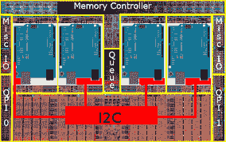

# HM-1X Aid

> 原文：<https://dev.to/ladvien/hm-1x-aid-1h4f>

### 概述

嗯，我有侵入的冲动。这种感觉已经持续了一段时间，可悲的是，有了一份全职工作，还在读研，我就没有时间了。**直到现在！**我的新工作(HMIS 数据库经理)有*的实际*休假时间。我休了将近两周的假(加上圣诞节假期)。最初几天显然是在工作中度过的...**但是！**打开手机和电子邮件后，我可以...抓紧家庭时光。叹气。然后，打扫房间。然后，就烦了。但是只剩几天了，我真的黑进了一些。

几个月前，我在工作电脑上下载了 Visual Studio Express。(嘘。不要告诉老板。)但是我还没有时间写一行代码。这个假期是学习 C#的好时机！

两周后我有了这个怪物，

[https://www.youtube.com/embed/XtrS7ENc1EU](https://www.youtube.com/embed/XtrS7ENc1EU)

它是 HM-10、HM-11 和 HM-15 模块的图形用户界面。亮点，

[HM-1X Aid 下载](https://github.com/Ladvien/HM-1X-Build/raw/master/setup.exe)

可以找到源头，

[HM-1X 援助来源](https://github.com/Ladvien/HM-1X_Aid_v01)

1.  它使用线程来防止任何“睡眠”保持用户界面健康。
2.  IO。串口*应该*允许很多 USB 转 UART 芯片工作。
3.  基本终端应用程序功能(查看 ASCII、HEC、Decimal 等。)比如 RealTerm 等。但是！有一个我渴望已久的终端应用功能。退出时保存设置的能力。第十亿次不再选择 9600 波特。
4.  我在系统中做了很多命令有效性检查。例如，如果您要键入“AT+CON0123* *S* *6789012”通常不是有效的命令，但是“终端”会将“S”转换为“f”
5.  我还将自己对 HM-1X 数据表的理解融入其中。可悲的是，这可能是该计划最大的卖点。
6.  C#是我的新宠。不要评价我:P.

我想我会花一些时间来研究这个小终端所涉及的代码，不为后人，只为我自己参考。

*快速提醒，对于不熟悉我帖子的人:*
*我不是专业人士。这些作品并不伟大。它们只是我理解我到底在做什么的日记*

### 面向对象编程

我最近没怎么发帖了。这是失去 LMR 和贝克上学以来没有时间的结合。但是我确实一直在写代码。重点是学习 OOP 设计。这个 C#程序可能是我第一个真正的面向对象的程序。但是我也一直在用 iOS 的 [Swift](https://developer.apple.com/ios/?cid=wwa-us-kwg-features) 写东西，这也是一种面向对象的语言。

好的，那么 OOP 和其他东西有什么区别呢？还有为什么要学 OOP？我认为机器人使用的微控制器太小了，无法处理面向对象编程？嗯，我了解到每个机器人制造者都已经是面向对象的程序员了。

#### OOP 与过程化编程的区别

我不会通过改写别人的解释来破坏他们。相反，我将列出帮助我理解的内容。

1.  [面向对象编程(维基百科)](https://en.wikipedia.org/wiki/Object-oriented_programming)
2.  [面向对象编程](https://www.youtube.com/watch?v=lbXsrHGhBAU)(视频)
3.  [程序编程](https://www.youtube.com/watch?v=b4n9KYD05jg)(视频)
4.  [Derek Banas 的设计模式系列](https://www.youtube.com/watch?v=vNHpsC5ng_E&list=PLF206E906175C7E07)(Java 中的例子，但对我帮助最大。看到 OOP 的实际应用。)

我相信每个机器人专家都是面向对象的程序员和过程化的程序员。他们创建具有特定功能的对象(PCB、STL 等)。)，保留计划以便复制。他们实例化这些对象(打印 STL，发送 PCB 文件到 OSHPark，等等)。创建的每个对象通常都有特定的用途。对象的设计，例如电机控制器，通常只能通过特定的输入(如 UART 连接)来访问。它的输出由电机控制器本身如何消化输入来控制。机器人制造者可以通过复制设计文件和添加所需的加速度计电路(继承)来决定将加速度计添加到电机控制器。诸如此类。

看起来这个隐喻支持了很多概念，

1.  [抽象](https://en.wikipedia.org/wiki/Abstraction_%28computer_science%29)
2.  [封装](https://en.wikipedia.org/wiki/Encapsulation_%28computer_programming%29)
3.  [多形性](https://en.wikipedia.org/wiki/Polymorphic_code)
4.  [继承](https://en.wikipedia.org/wiki/Inheritance_%28object-oriented_programming%29)

物品很棒。尤其是当他们走路、说话、抓取机器人类的物体时。然而，每个机器人专家都必须用程序在物体内部排列，以可预测的方式移动数据。这意味着，在某种粒度上，对象中充满了小规模的过程化编程。最终，它需要机器人专家，面向对象编程和过程编程。我认为，不管有没有意识到，机器人专家都在不断地实践这两者。

远离嬉皮士的东西；为了我作为机器人建造者的个人发展，我将花时间学习这两者，不管我可能的方便隐喻，因为它们都是计算思维的根源

在应用上，我想知道程序化编程是有效的。微控制器通常具有较小的内存集，代码需要以很小的开销从输入移动到输出(嗯，过程式编程是一种线性风格，一条线是两点之间的最短距离，那里一定有什么)。但我想知道如何将我的机器人连接到大型系统，如树莓派、个人电脑或互联网。为了有效地做到这一点，我需要能够在程序和基于对象的程序之间传递数据。

### 避眠

[T2】](https://res.cloudinary.com/practicaldev/image/fetch/s--evlgHdfW--/c_limit%2Cf_auto%2Cfl_progressive%2Cq_auto%2Cw_880/http://www.frugal-cafe.com/public_html/frugal-blog/frugal-cafe-blogzone/wp-content/uploads/2010/11/coffee-smiley-face-ballistik-coffee-boy-flickr.jpg)

我的程序行走在微控制器世界和大男孩电脑世界之间。如上所述，在某些时候，HM-1X 模块需要将其数据传递给 PC。这是一个两难的问题，最好用一幅图来解释，

[T2】](https://res.cloudinary.com/practicaldev/image/fetch/s--6EgPO_Qc--/c_limit%2Cf_auto%2Cfl_progressive%2Cq_auto%2Cw_880/https://ladvien.com/raw_images/threadingCars.png)

对于 HM-1X Aid，数据通过串行连接传递。当然，正如我上面所说的，我正在使用这些系统。IO.Ports.SerialPorts 框架来处理传入的串行数据。木卫一漂亮的一面。Ports 实际上在一个单独的线程上有 [DataReceivedEvent](https://msdn.microsoft.com/en-us/library/system.io.ports.serialport.datareceived%28v=vs.110%29.aspx) (稍后会有更多关于线程的内容)。该事件由任何 USB 转 [UART](https://en.wikipedia.org/wiki/Universal_asynchronous_receiver/transmitter) 芯片上的 RX 中断触发，允许数据在进入时被处理。

现在，我提到，当从微控制器向上游移动到 PC 时，处理数据的方法可能会从过程化走向面向对象。USB 转 UART 桥就是一个很好的例子。微控制器接收 [UART](https://en.wikipedia.org/wiki/Universal_asynchronous_receiver/transmitter) 数据是这样的，

```
int incomingByte = 0;   // for incoming serial data

void setup() {
        Serial.begin(9600);     // opens serial port, sets data rate to 9600 bps
}

void loop() {
        // send data only when you receive data:
        if (Serial.available() > 0) {
                // read the incoming byte:
                incomingByte = Serial.read();
                // say what you got:
                Serial.print("I received: ");
                Serial.println(incomingByte, DEC);
        }
} 
```

Enter fullscreen mode Exit fullscreen mode

这里，微控制器在 if 语句上循环，以查看 RX 缓冲器中是否有数据可用。每当`loop()`发现有数据可用时，它就会运行一些程序来处理这些数据。这种方法工作正常，你的微控制器的程序只处理串行数据。但是，如果应该处理其他任务，而您的微控制器有一个永无止境的数据流，会发生什么呢？`if(Serial.available() > 0)`之后的任何代码都不会执行，因为可用的串行数据永远不会小于 0。这被称为使用“阻塞”串行数据方法。不知道这个术语是怎么来的，但是我猜“阻塞”来自于这个方法如何阻止程序做其他事情

嗯，当串行数据进来时“立即”处理不是更好吗？这就是中断出现的原因。

`Serial.onReceive()`是一个中断向量，每次接收到串行数据时触发。中断向量调用一个方法，将从串行缓冲器接收的数据复制到`string_buffer`。

```
void MyFunction(){
   int i;
   int length = Serial.available();
   int string_buffer[32];   

   //copy data out of the receive buffer
   for(i = 0; i < length; i++){
      string_buffer[i] = Serial.read();
   }

   //run a string compare function, or otherwise parse the received data
   if(MySpecialStingCompare(string_buffer,"Hello Arduino")){
      Serial.println("Hello World");
   }
}

void setup(){
   Serial.begin(9600);
   Serial.onReceive(MyFunction);
}

void loop(){
   //do nothing
} 
```

Enter fullscreen mode Exit fullscreen mode

这是一种处理串行数据的非阻塞方法。它利用了 Atmel 芯片上被称为[中断向量](https://en.wikipedia.org/wiki/Interrupt_vector_table)的硬件级外设。每当 RX 引脚接收到一系列类似输入数据的低电平信号时，就会触发该中断。

这种方法的优点是使微控制器可以在主循环中做其他事情，并且在接收到新数据时只处理数据*和*。这使得程序不必在每个时钟周期都进行比较。此外，更重要的是，它允许微控制器立即更新对主进程的目的重要的数据；这在对时间敏感的过程中至关重要，例如四轴飞行器的远程控制。

例如，如果我们使用蓝牙设备为我们的四轴飞行器编写一个无线电控制器，它可以与 Arduino Pro Mini 对话。如果我们使用阻塞方法，Arduino 会接收到来自无线电控制器的任何数据，比如，哦，我不知道，“不要撞到那棵树！”Arduino 上的主进程在返回到`Serial.available() > 0`之前不会有这个信息。如果毫秒很重要，那就不酷了。

然而，如果您使用非阻塞、基于中断的串行通信编写相同的无线电控制器，那么无论何时您将信号发送到蓝牙设备，并且该设备将它串行发送到 Arduino，Arduino 将基本上标记它在主进程中的位置，并处理关于它立即崩溃的任何数据。

另一个例子，如果你的 Arduino 有一个液晶显示器，用来显示温度传感器的输出，会发生什么？然而，温度传感器和显示器只是 Arduino 所做工作的一小部分。如果使用阻塞方法改变温度，那么在 Arduino 完成任何任务并返回到`if(Serial.available() > 0)`之前，LCD 不会更新。这将使你的液晶显示器的反应迟钝。

将此与非阻塞方法进行对比(看到我在那里做了什么吗？).在温度传感器上设置一个中断，以便在温度变化时更新 LCD，这将使 LCD 对温度变化做出响应。这就是 3D 打印机如何处理它必须完成的成千上万的任务，同时保持其 LCD 的响应能力。

好东西。

好的，这就是微控制器处理事情的方式——即使有中断，它仍然是一次处理一个任务。我们可以避免微控制器在处理密集型任务时变慢，比如等待接收串行数据，但最终微控制器会一次处理一个任务。那么这和我的 C#程序有什么关系呢？

我们来看看 C#版本的' Serial.onReceive()'

```
string InputData = "";

// Read Data.
private void DataReceivedHandler(object sender, SerialDataReceivedEventArgs e)
{
    // Gets incoming data from open port and passes it to a handler.
    InputData = ComPort.ReadExisting();
    data = "";
    data = InputData;
} 
```

Enter fullscreen mode Exit fullscreen mode

这可能是使用 C#的最简单版本的一个`DataReceivedHandler()`。简而言之，只要收到数据，它就会触发；所以不堵。这个方法，正如我所写的，简单地使用`ComPort.ReadExisting()`从中断缓冲区获取数据，并将其推入`inputData`。很简单，对吧？坦率地说，我相信这是这么多[便便](http://www.sparxeng.com/blog/software/must-use-net-system-io-ports-serialport)使用 IO 的原因之一。端口。串行端口框架。但是木卫一怎么样。端口.串行端口不同于[Arduino HAL](http://hackaday.com/2015/10/20/the-case-for-arduino-in-real-engineering/)T3】？嗯，也许我应该用一个更可信的比较。

但是回到复杂的命令。如果一台计算机向微控制器发送一个命令，并期望得到一个响应，该怎么办？微控制器回复还需要一段时间。与此同时，PC 做什么呢？它可以跑去做其他任务，等待接收器启动。但是，如果其中一项任务需要微控制器提供一些信息，该怎么办呢？简而言之，微控制器支撑着演出，除了等待，别无他法。

我们知道个人电脑需要等待。回到我们在 microntroller 上看到的阻塞和非阻塞方法，C#中唯一可用的选项是非阻塞的，这很好，因为这是我们的最爱。但是真的够了吗？

如果我们的 PC 程序是以串行数据为中心的，这意味着 PC 的进程依赖于微控制器的数据，反之亦然，那么简单地使用非阻塞对我们帮助不大。PC 可以从等待串行数据转移到在 UI 上画一个标签，但是如果标签中的文本是来自微控制器的数据呢？不管我们如何看待它，看起来对我们的程序来说，将 PC 节流到微控制器是最好的。

但是我们的程序到底会慢多少呢？

假设您有以下内容:

| 设备 | 速度 |
| --- | --- |
| Arduino Uno (Atmega328P) | 16 兆赫 |
| 个人电脑 | 2.2ghz |
| UART 转 USB | 9600bps |

我们来找公分母，比较一下。

Arduino:

```
16mhz = 16 * 1,000,000 = 16,000,000
1 to 2 clock cycles for each instruction
1 to 2 / 16,000,000 = 62.5 to 125 nano-seconds  
(Who said Arduinos were slow? Pfft) 
```

Enter fullscreen mode Exit fullscreen mode

PC:

```
2.2ghz = 2.2 * 11,000,000,000 = 2,200,000,000
1 to 2 clock cycles for each instruction
1 to 2 / 2,200,000,000 = .45456 to .90900 nano-seconds
(Oh, I guess it's slow to the PC.) 
```

Enter fullscreen mode Exit fullscreen mode

UART 转 USB:

```
bytes x bits_per_character / bits_per_second
1 byte x 10 / 9600
10 / 9600 = 10416666.66 nano-seconds (~10 milliseconds) 
```

Enter fullscreen mode Exit fullscreen mode

请记住，这是一个字节，所以如果我们发送字符串，“马里奥，你的公主在另一个城堡”(41 个字符)，这将需要大约半秒钟(41 x 10 = 410 毫秒= ~0.5 秒)，如果它是要显示的，这肯定会很明显。嗯，我想我们找到了阻碍，嗯？这意味着，即使我们被限制在 Arduino 的速度，我们可能仍然会得到一个流畅的用户界面，而不会显得笨拙。但是，仅限于 UART 转 USB 好吧，废话。这证实了我的推测，我们将需要抑制 PC、UI、微控制器，几乎整个系统都要考虑 UART 转 USB 的缓慢性。

好的，如果我在这个项目上说服了你，我们就可以问，“抑制这个项目的最好方法是什么？”让我跳一下我是如何在 C#中做到这一点的。

C#和 Arduino 的数据接收方法之间的主要区别是 C#方法发生在一个单独的线程上。如今，大多数电脑都有多个内核，在面向对象编程中，这些内核是通过[线程](https://en.wikipedia.org/wiki/Thread_%28computing%29)来利用的。大多数微控制器只有一个内核(是的，是的，除了 Parrallax)，所以线程在微控制器上并不常见。 [](https://res.cloudinary.com/practicaldev/image/fetch/s--STCZK0Qk--/c_limit%2Cf_auto%2Cfl_progressive%2Cq_auto%2Cw_880/https://ladvien.com/raw_images/quad_core_die_arduino.png) 
现在，我将敢于过分简化我对线程的一点点理解。因为我来自硬件方面，所以我认为线程化的方式是通过 I2C 连接两个 Arduinos。一个 Arduinos 是主设备，另一个是从设备。每当主 Arduino 从 USB 转 UART 获取数据时，主 Arduino 上都会有代码通过 I2C 将一半的数据发送给从 Arduino，通过一些指令，它应该对数据执行一些特定的任务，并将结果发送回主 Arduino。从机处理其一半的数据，而主机处理另一半的数据。如果从机先完成(没有规定他们完成的顺序；它们是异步的)主设备在 I2C 上有一个中断，它看到从设备完成，并告诉他等待发送其结果。主机完成后，会向从机发送完整数据请求。最后，如果主机先完成，那么它会带着只有 8 位 IC 才能给出的难看表情等待从机完成运算。最终，当所有的数据被处理后，主处理器会对其进行处理。这里的每个 Arduino 都是一个处理器，在其上运行的任务是一个线程。

[](https://res.cloudinary.com/practicaldev/image/fetch/s--kcTiIX6E--/c_limit%2Cf_auto%2Cfl_progressive%2Cq_auto%2Cw_880/https://ladvien.com/raw_images/quad_core_die.jpg) 
在 PC 内部，我们也有类似的情况，但不是两个 Arduninos，而是在同一个芯片上有两个处理器。

我喜欢把线程看作我们系统中的一个独立的进程。当然，我们不能把第二个进程称为“主进程”。我们已经有一个了。而电脑不喜欢模棱两可。相反，让我们发挥创造力，把第二个过程称之为狂野、有趣和奇异的事情吧！喜欢...“第二个过程。”

让我来试着解释一下这和 Arduino HAL 有什么不同。在 C#中，第二个进程与主进程非常相似。除了一个巨大的例外:用户界面(UI)运行在主进程上，不能被任何其他进程更新。这非常有意义；你不希望半个按钮显示在你的用户界面上，对吗？取而代之的是，在两个进程都可以访问的空间中保存数据的协议，以及在更新时在共享空间中查找的标志。这就像老式的蜗牛邮件信箱，当你想让送信的人去找一封信时，就要在信箱里升起旗子。

把它带回我的代码。HM-1X 的串行数据接收事件在一个进程上，而我的 UI 在另一个进程上。这意味着，当我的程序串行获取数据时，它会将数据放入共享空间，并让主进程知道数据已被接收。

你们当中可能比我更敏锐的人会注意到一个问题*类似于 Arduino 及其 LCD 的*。如果传入的数据和用户界面不同步，如果用户没有等待串行响应就连续点击发送命令，会发生什么呢？最好的情况是，每次发送命令时，我们都得到一个“OK”。然而，如果是一个更复杂的命令，需要在微控制器和 PC 之间来回切换，那么问题就大了。这就像一只[树懒和一只兔子试图进行对话](https://www.youtube.com/watch?v=yCOPJi0Urq4)。你们中来自 Arduino 世界的人知道这个困境的常见(然而，我认为很糟糕)答案:`delay()`。

Arduino 中的`delay()`基本上是告诉微控制器在你告诉它的时间内什么都不做。等待之后，Arduino 可以检查是否有答案在等待它。有两个主要原因，这是不可避免的。但是让我们来看看 C#中的延迟设置。

```
//Write Data
public void WriteData(string dataToWrite)
{
  ComPort.Write(dataToWrite);
  *System.Threading.Thread.Sleep(5000);*
} 
```

Enter fullscreen mode Exit fullscreen mode

上述代码将数据写入串行端口，并在之后休眠 5 秒钟。这个`System.Threading.Thread.Sleep()`调用实际上会让主线程休眠。这意味着所有的 UI 都将变得没有响应，主线程上可能发生的任何事情都将被阻塞。这与我们的第一个 Arduino 代码集非常相似，但我们不是接收数据，而是编写数据。

这种解决方案的目的是向 UART 转 USB 发送命令，并等待响应。有几个问题，

1.  主线程在等待时关闭。
2.  响应时间必须预先确定。

现在，可以用更好的代码来处理响应时间。然而,“冻结”的用户界面带来了一个问题。我试图通过去掉`System.Threading.Thread.Sleep()`来保持它的简单。

```
//Write Data
public void WriteData(string dataToWrite)
{
  ComPort.Write(dataToWrite);
  DisableUI();
} 
```

Enter fullscreen mode Exit fullscreen mode

在这段代码中，`WriteMethod()`被调用，大部分非关键 UI 元素被禁用。这给用户一种他或她需要等待的印象，而不会使程序看起来冻结。这很有效。我的 RX 方法不仅是中断驱动的，而且是在一个完全不同的线程上。不用担心丢失从 USB 转 UART 接收的重要数据。哦，但是等等，用户界面从来没有被重新启用过。嗯。

没问题。我向我们的`DataReceivedHandler()`添加了一个方法来重新启用 UI

```
string InputData = "";

// Read Data.
private void DataReceivedHandler(object sender, SerialDataReceivedEventArgs e)
{
    // Gets incoming data from open port and passes it to a handler.
    InputData = ComPort.ReadExisting();
    data = "";
    data = InputData;
    enableUI();
} 
```

Enter fullscreen mode Exit fullscreen mode

这太棒了！哦，但是等等，如果有问题并且没有收到响应，那么 UI 就不会被重新启用。别担心，让我们添加一个超时特性。

```
 //Write Data
public void WriteData(string dataToWrite)
{
  ComPort.Write(dataToWrite);
  DisableUI();
  setResponseTimeout(500);
}

// Read Data.
private void DataReceivedHandler(object sender, SerialDataReceivedEventArgs e)
{
    // Gets incoming data from open port and passes it to a handler.
    InputData = ComPort.ReadExisting();
    data = "";
    data = InputData;
    enableUI();
    // Let's disable the timer since we didn't use it.
    HM1Xtimer.Enabled = false;
}

// The consumer interface for the response timer.
public void setResponseTimeout(int responseTime)
{
    responseTimeout = responseTime;
}

// Creates the response timers and attaches the elapse method.
private void HM1XCallbackSetTimer(int milliseconds)
{
    // Create a timer
    HM1Xtimer = new System.Timers.Timer(milliseconds);
    // Hook up the Elapsed event for the timer.
    HM1Xtimer.Elapsed += hm1xCommandTimedCallback;
    HM1Xtimer.AutoReset = false;
    HM1Xtimer.Enabled = true;
}

// This event is fired if the response timer elapses.
private void hm1xCommandTimedCallback(Object source, EventArgs e)
{
    if (data == "")
    {
        waitingOn = hm1xConstants.hm1xEnumCommands.ERROR;
    }
} 
```

Enter fullscreen mode Exit fullscreen mode

耶！这段代码非常聪明，对吧？让我们编译，运行它，并庆祝...狗娘养的。它不会编译。

[T2】](https://res.cloudinary.com/practicaldev/image/fetch/s--GaltGzz9--/c_limit%2Cf_auto%2Cfl_progressive%2Cq_auto%2Cw_880/https://i.ytimg.com/vi/785gNCpvcQM/maxresdefault.jpg)

问题在于`DataReceivedHandler()`方法中的`enableUI()`调用。看起来`DataReceivedHandler()`实际上发生在一个独立于主线程的线程上，主线程是 UI 被维护的地方。这就是《捉鬼敢死队》的格言的重要之处:不要过河！永远不会。我不想解释我不明白的东西，我只想说:不要串线。一个线程不应该更新另一个线程正在处理的内容。相反，应该记录来自一个线程的信息，并通知另一个线程它准备好了。

这些隐喻很好，但是我们如何实现一个线程友好的解决方案呢？

```
 //Write Data
public void WriteData(string dataToWrite)
{
  ComPort.Write(dataToWrite);
  DisableUI();
  setResponseTimeout(500);
}

// Read Data.
private void DataReceivedHandler(object sender, SerialDataReceivedEventArgs e)
{
    // Gets incoming data from open port and passes it to a handler.
    InputData = ComPort.ReadExisting();
    data = "";
    data = InputData;
    enableUI();
    // Let's disable the timer since we didn't use it.
    HM1Xtimer.Enabled = false;

    // Pass data to main thread.
    gotData(sender, data)
}

....

// RX event handler triggered by SerialPort.  Hands off data quick. 
// If you try to update UI from this method, threads tangel.
public void gotData(object sender, string data)
{
    // Incoming data is on another thread UI cannot be updated without crashing.
    this.BeginInvoke(new SetTextCallback(SetText), new object[] { data });
}

// This method happens on main thread.
public void(string text){
  txbMainDisplay.Text = text;
} 
```

Enter fullscreen mode Exit fullscreen mode

这很复杂，我理解得很差。事实上，我写了整篇文章，希望它能帮助我理解这一部分。我认为事情是这样的:

我们创建一个事件，该事件将在每次 USB 转 UART 调用`gotData()`时触发。在`gotData()`调用中，我们使用了 [BeginInvoke](https://msdn.microsoft.com/en-us/library/a06c0dc2%28v=vs.110%29.aspx) 方法。然后`BeginInvoke`在主线程上执行`SetText()`方法。因为命令中的单词 *this* ，我们知道‘SetText’正在被主线程调用。这是起源对象的占位符。这看起来很复杂，但实际上，控制 UART-to-USB 的线程只是在接收到数据时调用主线程上的一个方法，并将接收到的数据传递给它。

仅此而已。使用这种方法，我们可以在每次发送或接收数据时启用和禁用 UI。

再来几个音符，

1.  不需要使用这个方法来禁用 UI。`WriteData()`实际上是在主线程上执行的。在不同的线程上执行的是`DataReceivedEvent()`。
2.  当你处理多个对象时，这个过程变得有点复杂，我就是这么做的。在我的代码`SerialPortsExtended`中，对象处理所有的数据接收和数据发送，所以委托被用来在线程和对象之间来回传递数据。

大概就是这样。让我知道我能试着回答什么问题。