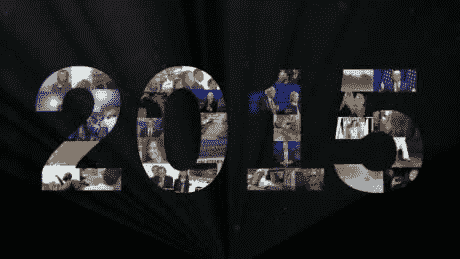

# 2015 年回顾

> 原文：<https://dev.to/funkysi1701/a-look-back-at-2015-107f>

哇！2015 年是多么令人惊奇的一年，随着 2015 年即将结束，我想回顾一下在这令人惊奇的一年里发生了什么是很好的。

[T2】](https://res.cloudinary.com/practicaldev/image/fetch/s--j19HXD0z--/c_limit%2Cf_auto%2Cfl_progressive%2Cq_auto%2Cw_880/https://storageaccountblog9f5d.blob.core.windows.net/blazor/wp-content/uploads/2015/12/151218181153-2015-year-in-review-biggest-stories-wrap-up-orig-00025316-large-169.jpg%3Fw%3D460%26ssl%3D1)

**一月**

我宣布 2015 年将是我的代码年，并以此开始了这一年。嗯，我有几次离开编程，但今年我学到了很多东西。我曾专注于编程的不同领域，但我认为这拓宽了我的知识面。我认为自己现在是一名[程序员](http://www.funkysi1701.com/2015/06/03/im-a-developer-now/)，而在 2015 年初我不是。

**二月**

2015 年的第一次出现在一个播客上。Trekmate 播客[十号前锋](http://www.funkysi1701.com/2015/02/13/ten-forward-episode-135-anti-firbob-is-back-or-simons-desert-island-trek/)是有幸体验我第一次尝试与世界对话的人。这种情况持续了一整年，出现在[上层建筑 2](http://www.funkysi1701.com/2015/07/30/upper-pylon-2-1-x-09-the-passenger/) 、[战斗桥](http://www.funkysi1701.com/2015/10/08/the-hunted-tng-s3-e11-the-battle-bridge/)甚至[科幻华夫饼](http://www.funkysi1701.com/2015/11/12/star-trek-is-back-in-2017/)播客中。

二月底，当伦纳德·尼莫伊离开人世时，这是一个令徒步旅行者悲伤的时刻。

**三月**

三月份，我谈到了我最近与 Azure 流量管理器一起帮助防止停机的努力。我还花了很多时间改进[数据库](http://www.funkysi1701.com/2015/03/05/database-deployment/)，这让我考虑如何更好地部署它。

同样在 3 月，我参加了一个名为 ITBoss 的 IT 网络活动。免费的食物和饮料，以及与 IT 经理同事的讨论。

**四月**

四月有点复杂。我庆祝了我的第二个结婚纪念日，但是由于经济原因，我也告别了我的车。

我摆弄着一个[树莓派](http://www.funkysi1701.com/2015/04/11/the-raspberry-pi-adventure-starts/)，主要是用[相机](http://www.funkysi1701.com/2015/04/15/security-camera-with-raspberry-pi-camera/)。我真的必须抽时间多陪陪它。

**五月**

5 月份，我去了一个名为 Leeds Sharp 的 C#用户组，那里非常有趣，我真的需要更多的时间，在 2016 年再去。这确实导致了我最受欢迎的博客文章之一。

通常开发人员不喜欢在他们的软件中寻找错误，但是当我意识到我的一个数据库中有一个[堆栈溢出](http://www.funkysi1701.com/2015/05/22/overflow/)时，我觉得很有趣，一旦我弄清楚发生了什么，就很容易修复了。

今年 5 月，英国举行了另一次大选，届时将进行投票。

**六月**

六月，我庆祝了我的第 50 篇博客文章。令人惊讶的是，我已经写了 50 篇博文，甚至更多！

利兹·夏普遇到了一个编码挑战，用程序解决数独谜题。没有完成，但做了很好的尝试。

**七月**

7 月是系统管理员日，我和我的员工一起庆祝我们为保持一切正常工作所做的惊人工作。

微软在 7 月发布了 Windows 10，这一最新的操作系统将免费提供一年。

**八月**

八月，随着我儿子詹姆斯的出生，一切都变了。在这段时间里，我从博客和工作中抽出时间和詹姆斯在一起。

詹姆斯出生前，我退出了圣迈克尔·勒贝尔弗雷医院的技术团队。

**九月**

9 月份，我重新开始工作，开始计划如何增加互联网连接来减少中断的机会。

**十月**

十月，我带詹姆斯去了一个爸爸团。这是爸爸第一次在没有妈妈的情况下和詹姆斯在一起，感觉棒极了。

我也庆祝了我成为父亲后的第一个生日，收到詹姆斯的贺卡真是太棒了。詹姆斯也有机会和我的家人在诺丁汉共度时光。

**11 月**

11 月，圣诞节倒计时开始了，詹姆斯第一次以耶稣的身份出现在基督降生的仪式上，并打扮成一个小精灵。

本月公布了激动人心的《星际迷航》新闻，一部新的[电视剧](http://www.funkysi1701.com/2015/11/12/star-trek-is-back-in-2017/)将于 2017 年 1 月播出。还没有其他细节，但非常令人兴奋。

**12 月**

十二月是圣诞节，我们一家人度过了一段美好的圣诞节时光。

不幸的是，圣诞节过后，约克遭受了洪水的袭击，幸运的是，我的家人没有受到影响，但很多人都受到了影响。希望当你读到这篇文章的时候，清理工作已经开始了。

圣诞节前，我花时间倒数代码出现的日子

2016 年会带来什么？

我不知道。随着詹姆斯继续学习和发展，他将有更多的时间和他在一起。我将继续学习和发展我的编码技能。当我继续写博客的时候，请关注这个空间。