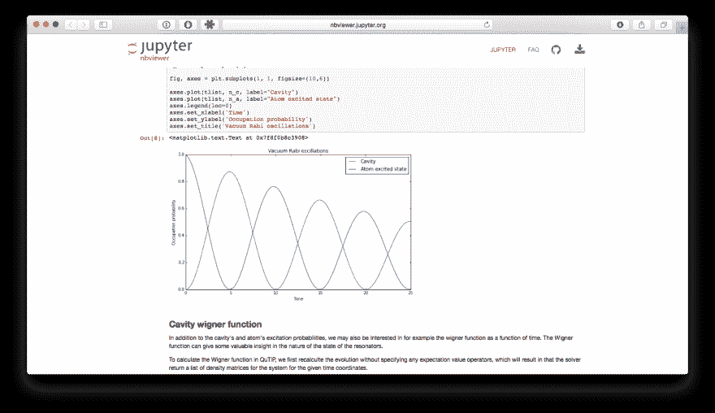

# 未来的孩子们将如何学习科学？

> 原文：<https://dev.to/captainsafia/how-will-the-children-of-the-future-learn-about-science-438e>

*最初发表于[OpenSource.com](https://opensource.com/education/15/11/project-jupyter-science-notebooks)。*

从印刷机的出现到互联网的出现，知识变得越来越丰富和容易获取。但是，当我们走向未来时，我在思考，随着越来越多的人连接到互联网上，随着计算技术的进步，知识将变得多么容易获取，多么具有互动性，多么容易理解。我们分享知识的技术会有什么变化？未来的孩子们将如何学习科学？未来的科学家将如何拓展我们的思维？我想答案是 [Jupyter 笔记本](http://jupyter.org)。

Jupyter 笔记本是交互式 web 应用程序，允许用户创建和共享包含实时代码、等式、可视化和说明性文本的文档。Project Jupyter 是一个开源项目，开发笔记本和其他相关组件。但这个项目最让我兴奋的不是技术，或者神奇的开发团队，或者社区的极端开放性质，而是它改变数百万人理解科学的方式的潜力。最初是一个名为 IPython 的纯 Python 项目，Project Jupyter 是一个扩展项目，允许用其他语言编写交互式笔记本。

[T2】](https://res.cloudinary.com/practicaldev/image/fetch/s--YssC1DTx--/c_limit%2Cf_auto%2Cfl_progressive%2Cq_auto%2Cw_880/http://i.imgur.com/IsHiXjj.png)

随着我们对世界的理解不断扩展，确保我们社会的所有成员都能平等地获取这些知识是非常重要的。这对人类的进步至关重要。开源软件运动所共享的这一理念并不新鲜；自从 17 世纪第一份学术期刊出版供公众阅读以来，它就一直存在。朱庇特笔记本暗示了未来学术期刊的样子，并描绘了一幅充满希望的画面。它们将是交互式的、以可视化为中心的、用户友好的，并且包括作为一等公民的代码和数据。我相信，这些独特的特征将大大有助于通过叙事和代码来弥合科学界和公众之间的理解差距——这一差距一旦弥合，将对我们的社会产生重大影响。

但是到目前为止已经完成的工作仅仅是这个项目的开始。在最近提交给几个非营利组织的拨款提案中，Fernando Perez 和 Brian Granger 概述了该项目的几个大胆愿景，这将允许开发像科学界本身一样协作和严格的软件。我相信，凭借我们专注而充满激情的核心团队、我们作为开源项目成长的意愿以及我们雄心勃勃的愿景，该项目一定会实现这些目标以及更多目标。

如果你想试用 Jupyter 笔记本，请[访问我们的演示页面](https://try.jupyter.org/)。如果你有兴趣为这个项目(以及开放科学的未来)做贡献，请访问我们的 [GitHub 组织](https://github.com/jupyter)，探索我们维护的项目。如果你有兴趣加入关于 Jupyter 的讨论，欢迎[加入我们的邮件列表](https://groups.google.com/forum/#!forum/jupyter)。

朱庇特项目由赫尔姆斯利慈善信托基金、T2 阿尔弗雷德·p·斯隆基金会、T4·戈登和贝蒂·摩尔基金会以及各种企业赞助商提供资金支持。该项目是 501c3 NumFOCUS 基金会的一部分，该基金会是一个非营利组织，支持为科学计算和数据科学开发开源计算工具。该项目的开发得到了几名全职和志愿开发人员的支持，我们一直在寻找可以合作的个人和组织。