# 单元测试和 Moq 入门-第 3 部分

> 原文：<https://dev.to/kritner/getting-started-with-unit-testing-and-moq---part-3-1nhh>

[第 1 部分](http://kritner.blogspot.com/2015/11/getting-started-with-unit-testing-and.html)

[第 2 部分](http://kritner.blogspot.com/2015/12/in-previous-post-i-started-on-project.html)

[第 3 部分](http://kritner.blogspot.com/2015/12/getting-started-with-unit-testing-and.html)你在这里

[第 4 部分](http://kritner.blogspot.com/2016/01/getting-started-with-unit-testing-and.html)

在[之前的帖子](http://kritner.blogspot.com/2015/12/in-previous-post-i-started-on-project.html)中，我们用 moq 设置了第一个测试。所以现在让我们来看看如何创建一些单元测试来配合我们的 [WCF](https://msdn.microsoft.com/en-us/library/ms731082(v=vs.110).aspx) 服务。

我们要做的第一件事，就是创建我们的 WCF 服务。没什么特别的，用 WCF 应用程序创建的默认函数应该足够了。

首先，向 RussUnitTestSample 解决方案添加一个新项目:

右键单击解决方案- >添加- >新项目...

[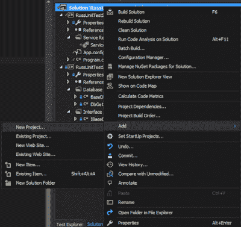T2】](http://4.bp.blogspot.com/-wcI8OAVYPqE/VnIDBRi-lvI/AAAAAAAACxU/PDUlIFw2ZZY/s1600/00.png)

WCF -> Wcf 服务应用。名为 RussUnitTestSample。Wcf

[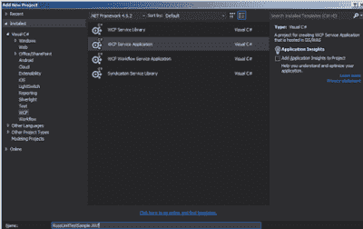T2】](http://4.bp.blogspot.com/-vILtrJq7mAk/VnIDEuFBIQI/AAAAAAAACxg/cKFX-GWOfC4/s1600/01.png)

新添加的项目应该类似于:

[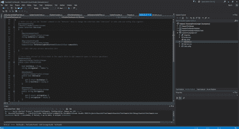T2】](http://4.bp.blogspot.com/-55CquCag-v4/VnIDKgNBvlI/AAAAAAAACxs/kEal6XVQH7g/s1600/02.png)

接下来，我们将配置我们的项目，使其具有多个启动项目(控制台应用程序和 wcf 服务)，此外，我们将添加 WCF 服务作为控制台应用程序中的服务引用。

多个启动项目。右击解决方案- >属性

[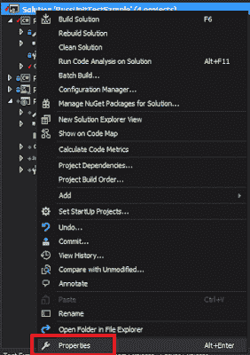T2】](http://2.bp.blogspot.com/-79D3wzDIm78/VnIDQeJM_RI/AAAAAAAACx4/BbgQQwkFjek/s1600/03.png)

选择多个启动项目，更改组合框，以便控制台应用程序和 wcf 应用程序都设置为“start”

[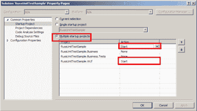T2】](http://4.bp.blogspot.com/-viyGBtNL4BM/VnIDYHxTQAI/AAAAAAAACyQ/KUyq790JTsk/s1600/04.png)

找到 WCF 服务下一次运行的端口。右键单击 WCF 项目->属性

[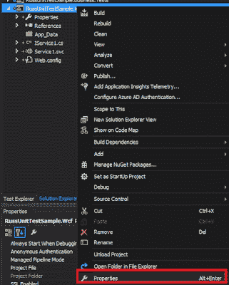T2】](http://2.bp.blogspot.com/-QqPwE855qOE/VnIDc88yugI/AAAAAAAACyc/NLEFu0AMn0M/s1600/05.png)

复制突出显示的 URL，供下一步使用

[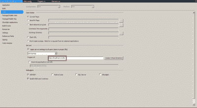T2】](http://3.bp.blogspot.com/-C-Qz3kAj5CE/VnIDfRYhGnI/AAAAAAAACyo/dIdMzXM0Dng/s1600/06.png)

接下来，我们将把 WCF 项目作为服务引用添加到控制台应用程序中。

在控制台应用程序中，右键【引用】- >添加服务引用...

[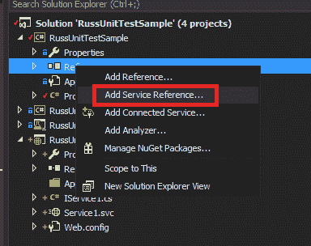T2】](http://1.bp.blogspot.com/-5a03T2pEXR4/VnIDiwxhXwI/AAAAAAAACy0/I6rSWIKGo-M/s1600/07.png)

粘贴之前复制的 URL(localhost:port number/)-> Discover-> Drill into

服务，选择你的接口(IService1)

[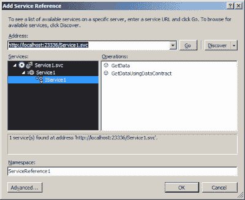T2】](http://1.bp.blogspot.com/-_MkWPi3tHH4/VnIDkhyW5mI/AAAAAAAACzA/3f-apHCPuZ4/s1600/08.png)

您的项目现在应该显示一个新文件夹“Service References ”,并列出服务引用。另外请注意，我的 app.config 文件已经自动签出，因为添加了 WCF 端点信息。

[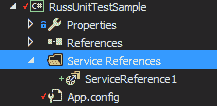T2】](http://2.bp.blogspot.com/--RBfMg6NaeU/VnIDmwrGlAI/AAAAAAAACzM/N-Un83K8urs/s1600/09.png)

下面是添加到配置文件中的内容

[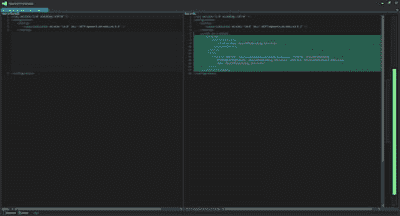T2】](http://4.bp.blogspot.com/-lEriOZSZxc4/VnIDpKuX1HI/AAAAAAAACzY/fspJ5JDgooI/s1600/10.png)

```
<system.serviceModel>
    <bindings>
        <basicHttpBinding>
            <binding name="BasicHttpBinding\_IService1" />
        </basicHttpBinding>
    </bindings>
    <client>
        <endpoint address="http://localhost:23336/Service1.svc" binding="basicHttpBinding"
            bindingConfiguration="BasicHttpBinding\_IService1" contract="ServiceReference1.IService1"
            name="BasicHttpBinding\_IService1" />
    </client>
</system.serviceModel> 
```

现在我们的服务引用都已经添加好了，我们来测试一下吧！修改程序。控制台应用程序的 CS 具有:

```
ServiceReference1.Service1Client client = new ServiceReference1.Service1Client();

Console.WriteLine("\n");
Console.WriteLine("{0}", client.GetData(42));
Console.WriteLine("\n"); 
```

您的 program.cs 现在应该看起来像这样:

```
namespace RussUnitTestSample
{
    class Program
    {

        #region consts
        const string CONNECTION\_STRING = "Data Source=192.168.50.4,1515;Initial Catalog=MBES;Persist Security Info=True;Integrated Security=true;";
        #endregion consts

        #region Entry

        static void Main(string[] args)
        {
            GetNumbersAndAddThem obj = new GetNumbersAndAddThem(
                new DbGetSomeNumbers(new BaseDbConnection(CONNECTION\_STRING)),
                new NumberFunctions()
            );

            Console.WriteLine("\n");
            Console.WriteLine(obj.Execute());
            Console.WriteLine("\n");

            ServiceReference1.Service1Client client = new ServiceReference1.Service1Client();

            Console.WriteLine("\n");
            Console.WriteLine("{0}", client.GetData(42));
            Console.WriteLine("\n");

        }

        #endregion Entry
    }
} 
```

试一试，然后:

[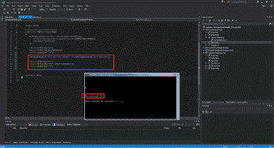T2】](http://4.bp.blogspot.com/-aRv_yZ_saMk/VnIDt3VESfI/AAAAAAAACzk/pBRSmI3QeKk/s1600/11.png)

现在，我们的 WCF 服务被托管，并成功地在控制台应用程序中使用。以前和现在的差异可以在 [GitHub](https://github.com/Kritner/RussUnitTestSample/commit/23c08678d314a3f53df5c28a53ad4ecdeaa108cc) 上找到，注意拉请求中的很多文件都是从 WCF 服务自动生成的。

接下来，我们来看看如何测试它。