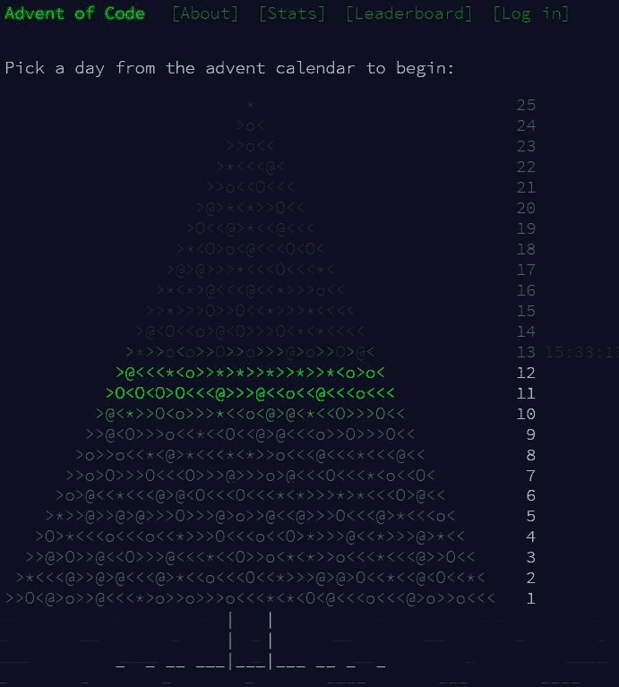

# 圣诞节倒计时开始了

> 原文：<https://dev.to/funkysi1701/the-christmas-count-down-with-code-4371>

12 月份，我们倒数着圣诞节的到来。人们经常在降临节日历上放满巧克力甚至乐高玩具。

但是如果你是一个程序员，你怎么能倒数到圣诞节的日子呢？如果你有一个每天圣诞节主题的编码挑战呢？答案是 www.adventofcode.com。【T2

每天都有新的挑战。到目前为止，挑战都与圣诞节和圣诞老人分发礼物有关。挑战分为两个紧密相连的部分。给你一个随机生成的输入，你需要用一个短字符串或数字给出一个答案。

挑战变得越来越难，有些挑战彻底击败了我(以我有限的编程知识，这并不奇怪)。这些挑战是独立于语言的，所以你可以用 javascript 或 c#来尝试。我一直使用 Visual Studio 和 C#，我的代码可以在 [github](https://github.com/funkysi/AdventSolution) 上看到。

到目前为止，我已经完成了挑战 1 到 6 和 10。部分原因是我发现挑战 7 很难，但我希望再试一次。

在编码应对这些挑战时，我做了大量的重构工作。我从一个简单的控制台应用程序开始，在一个方法中包含了我的大部分代码。随着挑战数量的增加，我开始将每个挑战的代码转移到它自己的类中，使用该挑战特有的方法和属性。我还添加了一个主菜单，这样你就可以选择运行哪个挑战。我的一些回答挑战的代码需要一些时间来运行，所以这比按顺序运行每个挑战节省了很多时间。

这些挑战很好地教会了我关于编码的东西。我必须考虑数据结构，存储这些信息的最佳方式是什么，类和方法以及返回类型，如何将数据输出到屏幕上，如何输入/导入数据。

在我开始下一个挑战之前，让我们先来看看第一个挑战:

```
Santa is trying to deliver presents in a large apartment building, 
but he can’t find the right floor – 
the directions he got are a little confusing. 
He starts on the ground floor (floor 0) 
and then follows the instructions one character at a time.

An opening parenthesis, (, means he should go up one floor, and a closing parenthesis, ), 
means he should go down one floor. 
```

Enter fullscreen mode Exit fullscreen mode

这是一个简单的循环，通过一长串(和)并跟踪你所在的楼层数来计算圣诞老人在哪一层结束。挑战的第二部分询问圣诞老人在输入字符串的哪个点到达地下室(一楼)