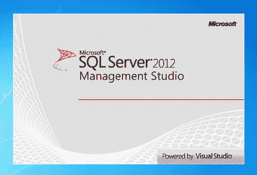

# SQL Server Management Studio

> 原文:[https://dev . to/funky si 1701/SQL-server-management-studio-5013](https://dev.to/funkysi1701/sql-server-management-studio-5013)

我一直使用 SQL Server Management Studio 来编写查询、获取数据和进行一般的 SQL 开发。

[T2】](https://res.cloudinary.com/practicaldev/image/fetch/s--M3fzOhSM--/c_limit%2Cf_auto%2Cfl_progressive%2Cq_auto%2Cw_880/https://i1.wp.com/www.funkysi1701.com/wp-content/uploads/2015/12/sql-server-2012-management-studio-splash-screen.png%3Fresize%3D529%252C360)

我很高兴看到 SQL Server Management Studio (SSMS)的每个新版本所带来的改进。一个很大的改进是智能感知。

该功能通过自动建议表、列名或其他数据库对象，节省了打字并减少了错误。

我被要求编写的一个常见查询是提供一个电子表格，该表格给出满足特定标准的信息。这在 SSMS 很容易做到，您可以编写查询，单击执行，满足条件的行就会显示出来。这些行可以很容易地复制/粘贴到 Excel 或其他电子表格中。

存储在数据库中的一个常见数据项是地址，地址通常包含换行符，以便更好地显示数据。在早期版本的 SSMS 中，当您复制和粘贴时，这些换行符会被忽略，数据在 SSMS 中的显示与在 Excel 中的显示相同。然而，在最近的版本中，这些换行符被复制到你的电子表格中，使得你很难看出哪些数据与哪些数据相对应。

现在我不知道这应该被描述为引入一个 bug 还是修复一个。我可以很容易地反驳双方。如果您的数据包含换行符，并且您复制了该数据，它应该在目标中包含换行符，但是如果它包含换行符，它在 Excel 中显示得很糟糕。

直到最近，我一直使用的修复方法是在我的查询中使用下面的 TSQL 命令。

> 选择 REPLACE(REPLACE(@str，CHAR(13)，")，CHAR(10)，")

此命令用空字符串替换任何换行符。Char(10)和 Char(13)都是必需的，因为可以有不同类型的换行符。如果您正在从头开始编写脚本，这很好，但是如果您正在运行存储过程或者您的查询有很多列，这就不好了。

答案是使用 Visual Studio 运行您的 SQL 查询。在 Visual Studio 中，您可以通过服务器资源管理器编写和运行查询，生成的结果不包含换行符。我只是刚刚发现了这个解决方案，但是到目前为止，它已经工作了，而且非常容易做到，另外，因为我在 Visual Studio 中做了大部分开发工作，所以我不必打开 SSMS 来测试我的查询。

帖子[SQL Server Management Studio](https://www.funkysi1701.com/2015/12/03/line-breaks-stored-in-sql-server/)最先出现在 [Funky Si 的技术讲座](https://www.funkysi1701.com)上。