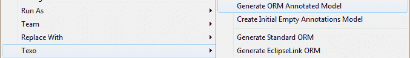
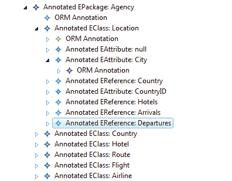
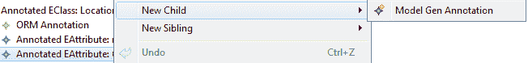
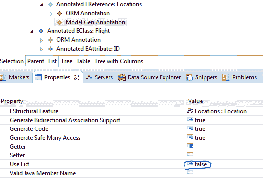

# 对 Texo 模型实体使用 Hibernate

> 原文:[https://dev . to/shanalikhan/use-hibernate-with-texo-model-entities-4ip 1](https://dev.to/shanalikhan/use-hibernate-with-texo-model-entities-4ip1)

[Hibernate](http://hibernate.org/orm/) 是 Java 中最好的 [ORM](https://en.wikipedia.org/wiki/Object-relational_mapping) 。它提供了一个包装器。NET 也称为 NHiberate。但是当你有很多实体需要手动创建并在它们之间创建一个引用时，这可能会很困难。最全面的任务是手动开发它们之间的关系。是的，还有数据库方法，它从数据库中生成所有的东西，我们目前假设模型优先方法，然后将数据库与它连接。

Eclipse 提供了许多工具来通过一个简单的可视化工具生成简单的 POJO 类。Texo 是 Eclipse 中从 EMF ecore 模型生成实体的优秀插件之一。当您通过 XML 文件中的映射将 texo 生成的实体与 hibernate 连接时。它会弹出一个错误

> 未能创建 sessionFactory 对象。Java . lang . classcastexception:Java . util . ArrayList 不能转换为 java.util.Set

因为 Texo 生成列表类型的实体，hibernate 会给出一个错误。我们可以把所有的集合对象生成为一个集合来解决这个问题。

> 要解决这个问题，我们必须生成 ORM 注释模型，并将所有集合属性“使用列表”属性设置为 false

[T2】](https://res.cloudinary.com/practicaldev/image/fetch/s--VvDr9MX_--/c_limit%2Cf_auto%2Cfl_progressive%2Cq_auto%2Cw_880/http://shanalikhan.github.io/img/texo_hibernate1.png)

[T2】](https://res.cloudinary.com/practicaldev/image/fetch/s--jQqsXbJg--/c_limit%2Cf_auto%2Cfl_progressive%2Cq_auto%2Cw_880/http://shanalikhan.github.io/img/texo_hibernate2.png)

[T2】](https://res.cloudinary.com/practicaldev/image/fetch/s--eY0v6UHp--/c_limit%2Cf_auto%2Cfl_progressive%2Cq_auto%2Cw_880/http://shanalikhan.github.io/img/texo_hibernate3.png)

[T2】](https://res.cloudinary.com/practicaldev/image/fetch/s--tH_PINZL--/c_limit%2Cf_auto%2Cfl_progressive%2Cq_auto%2Cw_880/http://shanalikhan.github.io/img/texo_hibernate4.png)