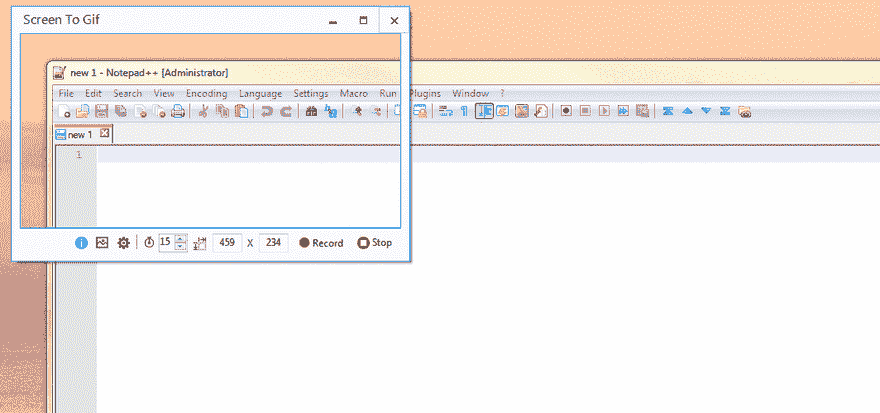

# 伟大的工具聚光灯:用 ScreenToGif 制作动画

> 原文:[https://dev . to/seankilleen/great-tool-spot light-animate-it-with screentogif-44g](https://dev.to/seankilleen/great-tool-spotlight-animate-it-with-screentogif-44g)

在这个博客上，我经常用截图来说明教程。这导致了很长的博客文章，我从来没有感觉到完整的内容，因为它们不是动画。我避免尝试捕捉动画，因为根据我的经验，这样做的软件有问题或者过于复杂，并且增加了更多的负担。

嗯，不会再有了。多亏了一个同事的建议，我找到了 [ScreenToGif](https://screentogif.codeplex.com/) 。这是一个快速/无痛的下载&安装。

它也可以通过巧克力商店买到。跑起来，你很快就会拥有它。

这个怎么演示？我做的有点过火了。:)下面是一个截屏的 gif 图，它捕捉了一个窗口，作为一个小教程。

[T2】](https://res.cloudinary.com/practicaldev/image/fetch/s--07H8t82t--/c_limit%2Cf_auto%2Cfl_progressive%2Cq_66%2Cw_880/https://SeanKilleen.cimg/post-images/ScreenToGif_Tutorial.gif)

这个应用程序构建得很好，实现了它的主要目标，而且相对来说没什么问题。最棒的是，它是免费和开源的！我强烈建议将它添加到您的工具箱中。

如果你有任何问题或类似的工具，请在评论中告诉我。

[伟大的工具聚焦:用 ScreenToGif 制作动画](https://SeanKilleen.com/2015/11/great-tool-spotlight-animate-it-with-screen-to-gif/)最初由 Sean Killeen 于 2015 年 11 月 10 日在 SeanKilleen.com[发表。](https://SeanKilleen.com)