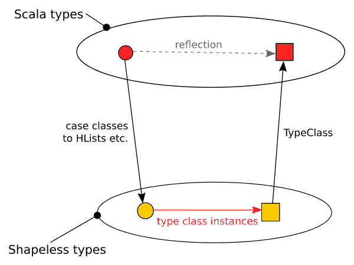

# 用无形的方式解决问题

> 原文:[https://dev . to/lepo virta/solving-problems-in-a-a-generic-way-using-shapelless-54be](https://dev.to/lepovirta/solving-problems-in-a-generic-way-using-shapeless-54be)

有没有想过如何在不依赖运行时反射的情况下，以一种通用的方式处理 Scala 的 case 类和密封特征？传统上，泛型程序是在反射 API 的帮助下编写的。然而，由于反射通常是在运行时完成的，它牺牲了类型安全，并引入了不必要的查找。有没有一种方法可以在不牺牲类型安全或效率的情况下在 Scala 中创建泛型解决方案？

在本文中，我将演示如何利用异构结构创建通用解决方案。具体来说，我将使用由[无形的](https://github.com/milessabin/shapeless)库提供的结构。为了解决这个问题，我只需要使用 HLists、余积和来自 Shapeless 库的类型类实例派生，这将在本文中介绍。

首先，我将演示一个例子，在这个例子中，泛型编程对于解决这个问题非常有用。之后，我将展示如何解决异构结构的特定示例，同时解释底层概念。最后，我将使用为异构结构创建的解决方案来创建标准 Scala 类型的解决方案。

## 问题

假设我们刚刚继承了一个 Scala 库，它包含一个大型代数数据类型(ADT ),由不可变的 case 类、密封特征和各种 Scala 值和集合类型组成。ADT 不包含任何开放特征，所以任何子层次结构中所有可能的子类型在编译时都是已知的。

我们的任务是实现一个计算 ADT 的任何对象的深度的程序。为了简单起见，在计算 case 类的深度时，我们将只包括 case 类构造函数和 copy 构造函数字段。例如，`Int`这样的值是一个级别的深度，而`case class Coordinate(x: Int, y: Int)`是两个级别的深度。类似地，Scala 的`Vector`等集合的最大深度是其元素深度加 1。类型`Vector[(Int, String)]`的深度计算如下图所示。图像的左侧显示了中间显示的树中每个级别的类型，而右侧显示了每个级别的深度。

[![Depth progression for  raw `Vector[(Int, String)]` endraw ](img/efda1e359266baded98fec157e0dfbda.png)T2】](https://res.cloudinary.com/practicaldev/image/fetch/s--VMEMqZfb--/c_limit%2Cf_auto%2Cfl_progressive%2Cq_auto%2Cw_880/https://lepovirta.org/posimg/sample_depth.png)

解决这个问题的一种方法是通过类型类。我们将创建一个用于计算对象深度的类型类，并为 ADT 中存在的每个类型添加一个该类型类的实例。每个实例依赖于其字段的类型类实例来计算自己的深度。解决方案类似于创建一个用于计算对象深度的特征，但是类型类可以在现有类型上实现，而不需要操作源代码。深度计算的类型类别可定义如下:

```
trait Depth[T] {
  def depth(t: T): Int
} 
```

<svg width="20px" height="20px" viewBox="0 0 24 24" class="highlight-action crayons-icon highlight-action--fullscreen-on"><title>Enter fullscreen mode</title></svg> <svg width="20px" height="20px" viewBox="0 0 24 24" class="highlight-action crayons-icon highlight-action--fullscreen-off"><title>Exit fullscreen mode</title></svg>

方法`depth`计算给定对象`t`的深度。下面是一些现有类型的类型类的实例:

```
implicit def stringDepth: Depth[String] = new Depth[String] {
  override def depth(t: String): Int = 1
}

implicit def intDepth: Depth[Int] = new Depth[Int] {
  override def depth(t: Int): Int = 1
}

implicit def listDepth[T](implicit elementDepth: Depth[T]): Depth[List[T]] = new Depth[List[T]] {
  override def depth(t: List[T]): Int = {
    if (t.isEmpty) 1
    else t.map(elementDepth.depth).max + 1
  }
} 
```

<svg width="20px" height="20px" viewBox="0 0 24 24" class="highlight-action crayons-icon highlight-action--fullscreen-on"><title>Enter fullscreen mode</title></svg> <svg width="20px" height="20px" viewBox="0 0 24 24" class="highlight-action crayons-icon highlight-action--fullscreen-off"><title>Exit fullscreen mode</title></svg>

值类型的类型类实例实现起来很简单。诸如字符串和整数之类的值类型总是一级深度，而不管值是什么，因此该方法在它们的实例中总是返回 1。同样的规则也可以应用于其他值类型。

列表类型的深度实例依赖于其类型参数`elementDepth`的深度实例。换句话说，只有当其类型参数在范围内也有深度类型类的实例时，才能使用该实例。depth 方法使用`elementDepth`来计算所有列表元素的深度，并选择最大的深度计数。

相同的模式可以应用于 case 类和密封特征。case 类的类型类实例依赖于其字段的类型类实例来计算其深度。类似地，密封特征的类型类实例依赖于其子类型的类型类实例。

以下示例包含一个示例 ADT 和用于计算 ADT 深度的实例。为了突出处理 case 类和密封特征中的常见模式，故意使其冗长。一个更实用的解决方案是用实际值代替明显产生静态值的计算。

```
case class Coordinate(x: Int, y: Int)

sealed trait Shape
case class Circle(radius: Int, center: Coordinate) extends Shape
case class Rectangle(corner1: Coordinate, corner2: Coordinate) extends Shape
case class Triangle(corner1: Coordinate, corner2: Coordinate, corner3: Coordinate) extends Shape

case class Surface(name: String, shape1: Shape, shape2: Shape)

implicit def coordinateDepth(implicit iDepth: Depth[Int]): Depth[Coordinate] = new Depth[Coordinate] {
  override def depth(t: Coordinate): Int = {
    iDepth.depth(t.x) max iDepth.depth(t.y)
    max + 1
  }
}

implicit def rectangleDepth(implicit coordDepth: Depth[Coordinate]): Depth[Rectangle] = new Depth[Rectangle] {
  override def depth(t: Rectangle): Int = {
    val max = coordDepth.depth(t.corner1) max coordDepth.depth(t.corner2)
    max + 1
  }
}

implicit def circleDepth(implicit iDepth: Depth[Int], coordDepth: Depth[Coordinate]): Depth[Circle] = new Depth[Circle] {
  override def depth(t: Circle): Int = {
    iDepth.depth(t.radius) max coordDepth.depth(t.center) + 1
  }
}

implicit def triangleDepth(implicit coordDepth: Depth[Coordinate]): Depth[Triangle] = new Depth[Triangle] {
  override def depth(t: Triangle): Int = {
    val max = coordDepth.depth(t.corner1) max coordDepth.depth(t.corner2) max coordDepth.depth(t.corner2)
    max + 1
  }
}

implicit def shapeDepth(implicit cdepth: Depth[Circle], rdepth: Depth[Rectangle], tdepth: Depth[Triangle]): Depth[Shape] = new Depth[Shape] {
  override def depth(t: Shape): Int = {
    t match {
      case c: Circle => cdepth.depth(c)
      case r: Rectangle => rdepth.depth(r)
      case t: Triangle => tdepth.depth(r)
    }
  }
}

implicit def surfaceDepth(implicit sdepth: Depth[String], shapeDepth: Depth[Shape]): Depth[Surface] = new Depth[Surface] {
  override def depth(t: Surface): Int = {
    val max = sdepth.depth(t.name) max shapeDepth.depth(t.shape1) max shapeDepth.depth(t.shape2)
    max + 1
  }
} 
```

<svg width="20px" height="20px" viewBox="0 0 24 24" class="highlight-action crayons-icon highlight-action--fullscreen-on"><title>Enter fullscreen mode</title></svg> <svg width="20px" height="20px" viewBox="0 0 24 24" class="highlight-action crayons-icon highlight-action--fullscreen-off"><title>Exit fullscreen mode</title></svg>

手动编写实例很快变得单调乏味。即使只有一个密封特征和五个 case 类，我们已经有超过四十行的深度计算代码。既然我们已经知道了编写实例的模式，我们是否可以用代码来表达这个模式，并为所有的 case 类和密封特征派生出实例，以避免我们自己编写样板文件？

## 从案例类到产品

让我们看看表达案例类和密封特征的其他方法。我们的目标是研究如何用一种更通用的方式来表达它们。然后，这些泛型表达式可以潜在地用于编写覆盖所有 case 类和密封特征的类型类实例。

Scala 中的 Case 类具有与元组相似的特征，也就是说，它们都是多个字段和乘积的组合。通过将 Case 类中的每个字段表示为元组中的一个字段，可以将 case 类转换为元组。例如，`Surface` case 类可以表示为元组类型`(String, Shape, Shape)`。由于不同案例类的字段数量不同，因此每个字段数量都需要有一个元组类型。

我们可以进一步减少只使用两个字段的元组来表达所有 case 类所需的类型数量。元组中的第一个字段包含来自 case 类的字段，而第二个字段包含另一个包含更多字段的元组。例如，`Surface` case 类可以表示为嵌套元组类型`(String, (Shape, (Shape, Unit)))`。单元类型在这里用于终止元组嵌套。

Shapeless 包含一种类似于嵌套元组的产品数据类型:异构列表(`HList`)。HList 本质上是一个列表类型，它的每个字段都有类型信息。它有两个子类型:cons 类型`::[+A, +T <: HList]`和 nil 类型`HNil`。cons 类型由一个字段和另一个 HList 组成，而 nil 类型表示一个空 HList。`Surface`可以用 HList 格式表示为`::[String, ::[Shape, ::[Shape, HNil]]`，也可以用中缀格式表示为`String :: Shape :: Shape :: HNil`。

为了定义覆盖所有 HLists 的深度类型类实例，我们必须逐个字段地分解任务。例如，如果我们可以为`HNil`和`Shape`定义一个实例，我们也应该能够为`Shape :: HNil`定义一个实例。使用这个实例，我们可以进一步为`Shape :: Shape :: HNil`定义一个实例，甚至进一步为`String :: Shape :: Shape :: HNil`定义一个实例。

通过分解任务，只需两个实例就可以为所有 HLists 定义类型类实例。我们没有定义一个可以计算所有字段深度的实例，而是定义一个只计算一个字段深度的实例，并依赖另一个实例来计算其余字段的深度。实例最终选择计算出的两个深度中最高的一个。

```
implicit val hnilDepth: Depth[HNil] = new Depth[HNil] {
  override def depth(t: HNil): Int = 0
}

implicit def hlistConsDepth[F, R <: HList](implicit fdepth: Depth[F], rdepth: Depth[R]): Depth[F :: R] = new Depth[F :: R] {
  override def depth(t: F :: R) = {
    val head = fdepth.depth(t.head) + 1
    val tail = rdepth.depth(t.tail)
    val d = head max tail
    d
  }
} 
```

<svg width="20px" height="20px" viewBox="0 0 24 24" class="highlight-action crayons-icon highlight-action--fullscreen-on"><title>Enter fullscreen mode</title></svg> <svg width="20px" height="20px" viewBox="0 0 24 24" class="highlight-action crayons-icon highlight-action--fullscreen-off"><title>Exit fullscreen mode</title></svg>

类型参数`F`表示 HList 中第一个字段的类型，而类型参数`R`表示 HList 的其余部分。

使用隐式依赖关系，HList cons 实例可以在所有子列表中重用自己。如果 HList 包含一个以上的字段，隐式依赖关系`Depth[R]`将解析到相同的 HList cons 实例，该实例将对其自己的列表的剩余部分重复相同的解析。如果列表中只有一个字段，依赖项将解析为 HNil 的实例。

## 从封闭性状到联产品

Scala 的密封特性本质上是副产品。密封的特性值不能是不同类型的多个值的组合，而只能是多个值中的一个。Scala 中的类型`Either[L, R]`是密封特征的一个简单例子。它可以是值`Left[L]`或`Right[R]`，两者都包含一个值。

类似于 case 类可以表示为嵌套元组，密封特征可以表示为嵌套元组。通过嵌套任一类型，可以扩展不同选择的数量。例如，`Shape`密封特征可以表示为`Either[Circle, Either[Rectangle, Either[Triangle, Unit]]]`，其中单元类型表示选择的结束。因此，如果选择是一个`Rectangle`，那么嵌套元组的值就是`Right(Left(Rectangle(...)))`。

Shapeless 还包含一种用于联产品的数据类型。无形型`Coproduct`由 cons 型`:+:[+H, +T <: Coproduct]`和 nil 型`CNil`组成。cons 类型可以是类型`Inl`或`Inr`。`Inl`相当于嵌套的要么中的左值:它总是包含实际的选择。类似地，`Inr`相当于嵌套的任一项中的右值:它包含余积的其余部分。例如，密封的特征`Shape`可以表示为`Circle :+: Rectangle :+: Triangle :+: CNil`。

用于为 HList 定义类型类实例的相同策略也可以应用于余产品的情况。它有空情况的实例，`CNil`和一次只能处理一个可能选择的一般情况。

```
implicit val cnilDepth: Depth[CNil] = new Depth[CNil] {
  override def depth(t: CNil): Int = 0
}

implicit def coproductConsDepth[L, R <: Coproduct](implicit ldepth: Depth[L], rdepth: Depth[R]): Depth[L :+: R] = new Depth[L :+: R] {
  override def depth(t: L :+: R): Int = t match {
    case Inl(l) => ldepth.depth(l)
    case Inr(r) => rdepth.depth(r)
  }
} 
```

<svg width="20px" height="20px" viewBox="0 0 24 24" class="highlight-action crayons-icon highlight-action--fullscreen-on"><title>Enter fullscreen mode</title></svg> <svg width="20px" height="20px" viewBox="0 0 24 24" class="highlight-action crayons-icon highlight-action--fullscreen-off"><title>Exit fullscreen mode</title></svg>

根据值是否包含选择，联产品 cons 实例只应用两个实例中的一个，而不是使用所有的隐式依赖关系。如果余积包含一个选择(左值)，则应用实例`fdepth`。否则，将改为使用余积的实例。剩余部分的实例被解析为同一个实例或`CNil`实例。

## 用于派生类型类实例的类型类

前面展示的类型类实例适用于所有的`HLists`和`Coproducts`类型，但是我们希望它们适用于实际的 case 类和密封特征。幸运的是，Shapeless 包含一个结构`TypeClass`，它可以自动为所有 case 类和密封特征派生出正确的类型类实例。

```
object Depth extends TypeClassCompanion[Depth] {

  object typeClass extends TypeClass[Depth] {
    override def emptyProduct = new Depth[HNil] {
      override def depth(t: HNil): Int = 0
    }

    override def product[F, R <: HList](sh: Depth[F], sr: Depth[R]) = new Depth[F :: R] {
      def depth(t: F :: R) = {
        val head = sh.depth(t.head) + 1
        val tail = sr.depth(t.tail)
        head max tail
      }
    }

    override def emptyCoproduct = new Depth[CNil] {
      override def depth(t: CNil): Int = 0
    }

    override def coproduct[L, R <: Coproduct](sl: => Depth[L], sr: => Depth[R]) = new Depth[L :+: R] {
      def depth(lr: L :+: R) = lr match {
        case Inl(l) => sl.depth(l)
        case Inr(r) => sr.depth(r)
      }
    }

    override def project[F, G](instance: => Depth[G], to: F => G, from: G => F) = new Depth[F] {
      def depth(f: F) = instance.depth(to(f))
    }
  }
} 
```

<svg width="20px" height="20px" viewBox="0 0 24 24" class="highlight-action crayons-icon highlight-action--fullscreen-on"><title>Enter fullscreen mode</title></svg> <svg width="20px" height="20px" viewBox="0 0 24 24" class="highlight-action crayons-icon highlight-action--fullscreen-off"><title>Exit fullscreen mode</title></svg>

深度类型类实例由对象`typeClass`提供。所有派生的实例都基于对象提供的重写方法来实现深度计算。产品和联产品方法遵循前面所示的相同策略。

此外，我们还需要为方法`project`指定一个实现。它定义了在我们有另一个类型的类型类实例的情况下，我们如何为一个类型派生一个类型类实例，以及在两个类型之间转换值的方法(类型之间的同构)。在我们的例子中，该方法的实现非常简单:我们只需创建深度类型类的另一个实例，以利用同构属性。

我们现在有一种方法来计算任何 case 类和密封特征的深度。对于该类别之外的情况(例如值类型、传统类、集合类型)，我们可以指定特定类型的类实例来计算深度。

我们没有试图直接表达标准 Scala 类型问题的解决方案，而是使用 Shapeless 的 product 和 coproduct 类型对解决方案进行建模，并使用 type class 实例派生将解决方案带回 Scala 类型。下图演示了这个过程。

[T2】](https://res.cloudinary.com/practicaldev/image/fetch/s---2mk2rer--/c_limit%2Cf_auto%2Cfl_progressive%2Cq_auto%2Cw_880/https://lepovirta.org/posimg/type_universes.png)

## 结论

在本文中，我展示了如何为 ADT 创建通用解决方案，而不依赖于昂贵的运行时特性，比如反射。我们通过利用编译器在编译时解析用于解决方案的所有代码的能力，获得了类型安全和比反射更高的效率。这是由 Shapeless 的自动类型类实例派生功能实现的。实例派生依赖于表示产品和联产品的特定方式，这也将在本文中讨论。

本文展示的泛型编程风格为编写样板自由代码开辟了各种可能性。除了我们的玩具示例之外，该特性还可以用于实现几乎任何类型的通用单向转换。更多的例子，请查看如何为[字符串转换](https://github.com/milessabin/shapeless/blob/master/examples/src/main/scala/shapeless/examples/shows.scala)和[幺半群](https://github.com/milessabin/shapeless/blob/master/examples/src/main/scala/shapeless/examples/monoids.scala)派生类型类。

虽然 Shapeless 为产品和余产品上的泛型编程提供了一个很好的、干净的抽象，但它确实有一些实际问题。当创建一个基于类型类的通用解决方案时，你必须特别注意边缘情况，比如 Scala 值和集合。如果您遗漏了 ADT 中使用的某个类型的类型类实例，编译器不会告诉您遗漏了哪个特定实例。发现可能已经在类型类实例派生中涵盖的特殊情况也很重要。例如，可以为 Scala `List`自动派生一个实例，但是在许多情况下，比如在我们的深度计算中，该实例的结果将与预期的不同。

自动类型类实例派生只是许多无形特性中的一个。它包括许多其他结构，用于减少样板文件，同时仍然保持代码类型安全。一个这样的特性是可扩展记录，它允许重用现有的字段以特别的方式创建新的记录类型。这使得对包含特定字段的任何新记录应用依赖于这些字段的函数成为可能。